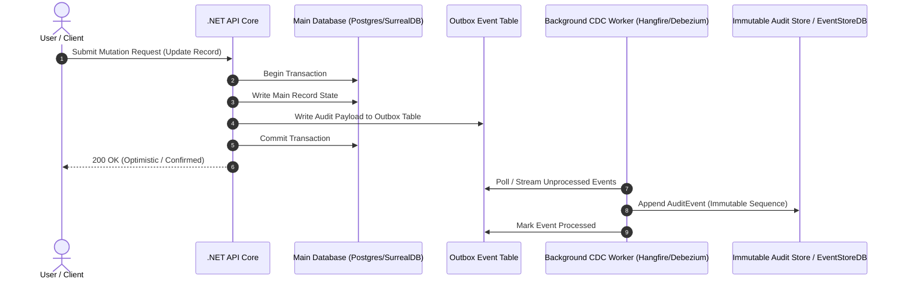
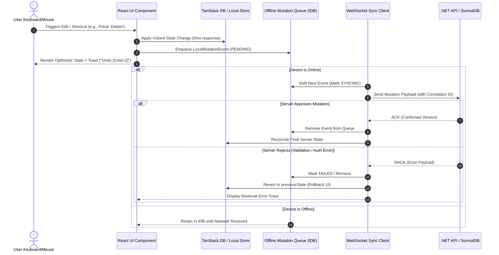
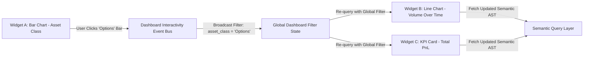

# Four Pillars Research Scope Deconstruction & Technical Requirements Analysis

**Author**: `teamwork_preview_explorer_m0_3` (Four Pillars Scope Explorer)  
**Date**: 2026-08-04  
**Target Workspace**: `c:\Users\LaxmananKrishnapilla\tradebook`  
**Related Specs**: `ORIGINAL_REQUEST.md`, `architecture/overview.md`, `alternatives/recommendation.md`

---

## Executive Overview

This analysis deconstructs the four required research documents for Tradebook into explicit structural sub-sections, concrete schema definitions (SQL, SurrealQL, JSON Schema, Protobuf), data flow diagrams (Mermaid & ASCII), trade-off matrices, and technology evaluation criteria. 

The four research pillars under investigation are:
1. **Pillar 1 (`research/versioning-and-audit-trails.md`)**: Revertability, temporal data models, Git-like branch/merge, and change attribution.
2. **Pillar 2 (`research/semantic-modeling-and-data-sources.md`)**: Multi-system data ingestion pipelines, dbt/Cube-style semantic layers, dynamic EAV/Graph query abstractions.
3. **Pillar 3 (`research/snappy-crud-ui-ux.md`)**: Ultra-fast optimistic UI, local-first sync engines, keyboard-first navigation, and virtualized data grids.
4. **Pillar 4 (`research/custom-visualizations.md`)**: Dynamic user-configurable chart/dashboard engines, semantic model binding, and UI aesthetics.

---

# Pillar 1: Versioning & Audit Trails Architecture (`research/versioning-and-audit-trails.md`)

## 1. Required Document Structure & Sub-Sections
1. **Executive Summary & Scope Definition**
2. **Industry Architectural Patterns & Paradigms**
   - Event Sourcing (CQRS, Append-only event store, Aggregate rebuilding)
   - System-Versioned Temporal Tables (SQL:2011 standard, System time vs Application valid time)
   - ACID Lakehouses / Columnar Versioning (Delta Lake, Apache Iceberg time-travel snapshots)
   - CRDT Operation Logs & Delta Audit Trails
   - Git-like Branching & Merging Models (Workspace branching, three-way merge, change staging)
3. **Concrete Schema Designs**
   - Bi-Temporal PostgreSQL Schema with JSONB Delta Diffs
   - SurrealQL Revision & Record-Level Audit Schema
   - Protobuf & JSON Spec for Immutable Event Store Payloads
4. **Data Flow & Sequence Diagrams**
   - Synchronous Trigger vs Async CDC (Outbox Pattern) Mutation Flow
   - Point-in-Time Diff & Revert Flow
   - Branch, Stage, Conflict Detection & Merge Flow
5. **Architectural Trade-off Matrix**
6. **Technology Evaluation & Tradebook Recommendation**

---

## 2. Concrete Schemas

### A. Bi-Temporal PostgreSQL Audit Schema (SQL)
```sql
-- PostgreSQL Bi-Temporal Audit Table with JSONB Diffs
CREATE TABLE audit_log (
    audit_id UUID PRIMARY KEY DEFAULT gen_random_uuid(),
    entity_name VARCHAR(128) NOT NULL,
    entity_id VARCHAR(128) NOT NULL,
    operation VARCHAR(16) NOT NULL CHECK (operation IN ('INSERT', 'UPDATE', 'DELETE', 'REVERT', 'MERGE')),
    system_time TSTZRANGE NOT NULL DEFAULT tstzrange(now(), NULL), -- System/Transaction Time
    valid_time TSTZRANGE NOT NULL,                                 -- Business/Valid Time
    actor_id UUID NOT NULL,
    actor_tenant_id UUID NOT NULL,
    client_context JSONB,                                          -- IP, User-Agent, Session ID, Correlation ID
    pre_state JSONB,                                              -- Full snapshot before change (or null for INSERT)
    post_state JSONB,                                             -- Full snapshot after change (or null for DELETE)
    diff_patch JSONB NOT NULL,                                    -- RFC 6902 JSON Patch array
    commit_message TEXT,
    branch_name VARCHAR(64) DEFAULT 'main' NOT NULL
);

CREATE INDEX idx_audit_entity_time ON audit_log (entity_name, entity_id, system_time GIST);
CREATE INDEX idx_audit_tenant_actor ON audit_log (actor_tenant_id, actor_id);
```

### B. SurrealQL Audit & Versioning Schema
```surrealql
-- SurrealDB Revision Tracking Schema
DEFINE TABLE entity_revision SCHEMAFULL
    PERMISSIONS
        FOR select WHERE tenant = $auth.tenant_id
        FOR create, update, delete NONE; -- Immutable log

DEFINE FIELD entity_ref ON TABLE entity_revision TYPE record;
DEFINE FIELD version ON TABLE entity_revision TYPE int;
DEFINE FIELD operation ON TABLE entity_revision TYPE string ASSERT $value INSIDE ['CREATE', 'UPDATE', 'DELETE', 'REVERT'];
DEFINE FIELD delta ON TABLE entity_revision TYPE array; -- Array of JSON patch operations
DEFINE FIELD snapshot ON TABLE entity_revision TYPE object;
DEFINE FIELD actor ON TABLE entity_revision TYPE record<user>;
DEFINE FIELD tenant ON TABLE entity_revision TYPE record<tenant>;
DEFINE FIELD created_at ON TABLE entity_revision TYPE datetime DEFAULT time::now();

DEFINE INDEX idx_entity_ver ON TABLE entity_revision COLUMNS entity_ref, version UNIQUE;
```

### C. Event Store Protobuf Definition (`event_payload.proto`)
```protobuf
syntax = "proto3";
package tradebook.audit;

enum OperationType {
  OPERATION_UNSPECIFIED = 0;
  OPERATION_CREATE = 1;
  OPERATION_UPDATE = 2;
  OPERATION_DELETE = 3;
  OPERATION_REVERT = 4;
}

message ChangeDelta {
  string path = 1;         // JSON Pointer path e.g. "/positions/0/qty"
  string op = 2;           // "add", "replace", "remove"
  string old_value_json = 3;
  string new_value_json = 4;
}

message AuditEvent {
  string event_id = 1;
  string aggregate_type = 2;
  string aggregate_id = 3;
  uint64 sequence_number = 4;
  OperationType operation = 5;
  string actor_id = 6;
  string tenant_id = 7;
  int64 timestamp_utc_ms = 8;
  repeated ChangeDelta deltas = 9;
  string commit_message = 10;
  string branch_id = 11;
}
```

---

## 3. Data Flow Diagrams

### Mutation & Audit Data Flow (Async CDC Outbox Pattern)


### Workspace Branching & Merging Flow
```
 [Main Branch (Production State)] -------------------------------------------------> [Merged State (v3)]
              \                                                                          ^
               \ (Create Branch)                                                        / (3-Way Merge & Conflict Check)
                v                                                                      /
 [Feature Branch (Staged Mutations)] -> [Mutation A] -> [Mutation B] -> [Diff Staging Area]
```

---

## 4. Trade-off Matrix

| Pattern | Query Overhead | Storage Cost | Revert Complexity | Schema Evolution | Audit Security | Best Use Case |
| :--- | :--- | :--- | :--- | :--- | :--- | :--- |
| **System-Versioned Temporal Tables** | Low (Native index) | Moderate (Full rows) | Low (SQL `AS OF`) | Hard (DDL alters version table) | High (Database enforced) | Regulatory compliance & relational entities |
| **Event Sourcing (Append-Only)** | High (Replay required) | High (Event log grows) | Trivial (Append inverse event) | Complex (Upcasters required) | Maximum (Tamper-proof log) | Complex workflows, financial ledgers |
| **JSONB Delta Audit Log** | Medium (Patch parse) | Low (Only diffs stored) | Medium (Patch inverse) | Flexible (JSON schema agnostic) | High | General SaaS application audit history |
| **Git-Like Branching (Copy-on-Write)** | High (Tree traversal) | High (Branch snapshots) | Low (Checkout parent commit) | Hard | High | Multi-user collaborative draft & approval |

---

## 5. Technology Evaluation & Recommendations
- **Postgres + Temporal Triggers/JSONB**: Ideal for structured enterprise relational data.
- **Debezium + Kafka/Outbox**: Best for decoupled, zero-latency main transaction loop.
- **Tradebook Recommendation**: Adopt a **Hybrid CDC Outbox + JSONB RFC 6902 Patch Log** pattern. If staying on SurrealDB, utilize native SurrealDB Change Feeds + immutable `entity_revision` relation tables.

---

# Pillar 2: Semantic Data Modeling & Multi-System Data Pipelines (`research/semantic-modeling-and-data-sources.md`)

## 1. Required Document Structure & Sub-Sections
1. **Executive Summary & System Scope**
2. **Multi-System Data Ingestion & Integration Frameworks**
   - Batch ETL vs Real-time ELT / CDC
   - Zero-ETL & Federated Query Architectures (DuckDB, Trino, Arrow Flight)
   - Multi-Tenant Data Isolation in Shared Pipelines
3. **User-Defined Semantic Layer Architecture**
   - dbt Semantic Layer / MetricFlow paradigms (Dimensions, Measures, Metrics, Entities)
   - Cube.js Data Schema Model (Cubes, Views, Joins, Pre-aggregations)
   - Malloy Semantic Modeling Syntax & Compiler
   - GraphQL Data Fabric & Federation
   - Dynamic EAV (Entity-Attribute-Value) vs Document JSON Schema vs Graph Modeling
4. **Concrete Schemas & Specification Definitions**
   - YAML Specification for User-Defined Semantic Models
   - JSON Spec for Multi-Source Ingestion Connectors (Postgres, REST, S3 Parquet, Snowflake)
   - Intermediate Representation (JSON AST) for Dynamic Metric Queries
5. **Data Flow & Pipeline Architectures**
   - End-to-End Heterogeneous Pipeline (Source -> Normalize -> Semantic Layer -> Cache -> Query API)
   - Dynamic Query Parsing, Compilation & Execution Flow
6. **Architectural Trade-off Matrix**
7. **Technology Evaluation & Tradebook Recommendation**

---

## 2. Concrete Schemas

### A. Semantic Model Definition Schema (`semantic_model.schema.json` / YAML Spec)
```yaml
version: "1.0"
semantic_model:
  name: trade_analytics
  description: "Core semantic model for financial trades and portfolio metrics"
  base_table: raw_trades
  data_source: primary_lakehouse

  dimensions:
    - name: trade_id
      type: string
      expr: id
      is_primary_key: true
    - name: symbol
      type: string
      expr: ticker_symbol
    - name: asset_class
      type: string
      expr: CASE WHEN type IN ('CALL', 'PUT') THEN 'Option' ELSE 'Equity' END
    - name: executed_at
      type: time
      expr: fill_timestamp
      granularities: [day, week, month, quarter, year]

  measures:
    - name: total_volume
      type: sum
      expr: quantity
      description: "Sum of total shares/contracts traded"
    - name: gross_notional
      type: sum
      expr: quantity * price
    - name: trade_count
      type: count
      expr: id

  metrics:
    - name: avg_trade_size
      type: derived
      expr: "total_volume / trade_count"
      format: decimal_2
    - name: formatted_notional
      type: measure_ref
      measure: gross_notional
      format: currency_usd

  joins:
    - name: account_dim
      relationship: many_to_one
      sql_on: "raw_trades.account_id = account_dim.id"

  access_filters:
    - role: trader
      filter_expr: "tenant_id = {{ context.user.tenant_id }}"
```

### B. Ingestion Connector Config Specification (JSON Schema)
```json
{
  "$schema": "http://json-schema.org/draft-07/schema#",
  "title": "IngestionConnectorConfig",
  "type": "object",
  "properties": {
    "connector_id": { "type": "string" },
    "source_type": { "type": "string", "enum": ["POSTGRES", "REST_API", "S3_PARQUET", "SNOWFLAKE", "SURREALDB"] },
    "connection_properties": {
      "type": "object",
      "properties": {
        "host": { "type": "string" },
        "port": { "type": "integer" },
        "auth_type": { "type": "string", "enum": ["BASIC", "OAUTH2", "API_KEY", "IAM"] },
        "secret_ref": { "type": "string" }
      },
      "required": ["auth_type"]
    },
    "sync_mode": { "type": "string", "enum": ["FULL_REFRESH", "INCREMENTAL_APPEND", "CDC_STREAM"] },
    "watermark_column": { "type": "string" },
    "cron_schedule": { "type": "string" }
  },
  "required": ["connector_id", "source_type", "sync_mode"]
}
```

### C. Query Intermediate Representation (JSON AST)
```json
{
  "semantic_model": "trade_analytics",
  "dimensions": ["symbol", "asset_class"],
  "metrics": ["total_volume", "avg_trade_size"],
  "time_dimensions": [
    { "dimension": "executed_at", "granularity": "month", "date_range": ["2026-01-01", "2026-06-30"] }
  ],
  "filters": [
    { "member": "asset_class", "operator": "equals", "values": ["Equity"] }
  ],
  "order_by": [
    { "member": "total_volume", "direction": "desc" }
  ],
  "limit": 100
}
```

---

## 3. Data Flow Diagrams

### Dynamic Query Compilation & Execution Pipeline
```mermaid
graph TD
    Client[Client UI / API Request] -->|Query AST| Gateway[Semantic Query Gateway]
    Gateway -->|Validate & Inject Auth RLS| Parser[Semantic Resolver & AST Parser]
    Parser -->|Fetch Schema Def| SchemaRegistry[Semantic Model Registry]
    Parser -->|Generate Dialect SQL / SurrealQL| DialectCompiler[SQL / DuckDB / SurrealQL Compiler]
    DialectCompiler -->|Check Pre-aggregations| Cache[In-Memory / Redis Pre-Agg Cache]
    Cache -- Cache Hit --> Gateway
    Cache -- Cache Miss --> QueryEngine[Execution Engine (DuckDB / Polars / SurrealDB)]
    QueryEngine -->|Query Raw Data| DataSources[(Data Sources / S3 / Postgres)]
    DataSources --> QueryEngine
    QueryEngine -->|Store Pre-agg| Cache
    QueryEngine --> Gateway
    Gateway -->|Formatted Result Set| Client
```

---

## 4. Trade-off Matrix

| Semantic Architecture | Query Latency | Dynamic User Customization | Operational Complexity | Governance & RLS | Best Suited For |
| :--- | :--- | :--- | :--- | :--- | :--- |
| **dbt Semantic Layer (MetricFlow)** | Low (Pre-compiled) | Moderate (Git/YAML workflow) | High (Requires dbt Core/Cloud) | Strong (Centralized) | Fixed corporate data models |
| **Cube.js Engine** | Very Low (Pre-aggs) | High (REST/GraphQL/YAML API) | Moderate (Self-hosted node) | Excellent (Contextual RLS) | Embedded analytics in multi-tenant SaaS |
| **DuckDB / Polars In-Memory** | Microsecond | High (Runtime SQL/DataFrame) | Low (Embedded library) | Custom code required | High-speed interactive ad-hoc query |
| **SurrealDB Multi-Model Graph** | Low-Medium | High (Flexible Document/Rel) | Low (Single DB binary) | Native RLS | Hybrid transactional & dynamic graph data |

---

## 5. Technology Evaluation & Recommendations
- Recommended Engine for User-Defined Modeling: **Cube.js Semantic Layer** or an **Embedded DuckDB / Polars Query Adapter**.
- Recommendation for Tradebook: Expose a JSON/YAML Semantic Model Spec compiler in .NET Backend that translates user queries into optimized SurrealQL / SQL queries or DuckDB in-memory aggregations.

---

# Pillar 3: High-Performance Snappy CRUD UI/UX Tech Stack (`research/snappy-crud-ui-ux.md`)

## 1. Required Document Structure & Sub-Sections
1. **Executive Summary & UX Benchmark Standards** (Linear, Twenty CRM, Notion, Figma)
2. **Local-First & Sync Engine Architecture Patterns**
   - Zero, ElectricSQL, PowerSync, Replicache, TanStack DB
   - Offline Storage Engines (IndexedDB, OPFS, SQLite WASM)
   - Conflict Resolution & Optimistic Revert Strategies (LWW, CRDTs, Write Queues)
3. **Keyboard-First & Action Engine Architecture**
   - Command Palette Architecture (`cmdk`)
   - Shortcut Registry & Contextual Focus Management
   - Universal Command Pattern: Execution, Undo, Redo Stack
4. **Virtualized High-Density Data Grids**
   - AG Grid vs TanStack Table + TanStack Virtual vs Canvas Grids (Glide Data Grid)
   - Row/Column Virtualization, Smooth Scrolling, Cell Editors, Clipboard Copy/Paste
5. **Concrete Schemas & Data Flow Diagrams**
   - IndexedDB Action Queue Schema for Offline Write Pipeline
   - Sequence Diagram: Optimistic UI Mutation, Local Store Write, WS Sync, Server Validation & Rollback
6. **Architectural Trade-off Matrix**
7. **Technology Evaluation & Tradebook Recommendation**

---

## 2. Concrete Schemas

### A. Client-Side Offline Mutation Queue Schema (TypeScript / IndexedDB)
```typescript
export interface LocalMutationEvent {
  id: string;                    // UUID v4
  clientTimestamp: number;       // Unix epoch ms
  entityType: string;            // e.g. "trade", "contact", "task"
  entityId: string;              // Record ID
  actionType: 'CREATE' | 'UPDATE' | 'DELETE';
  payload: Record<string, unknown>; // New or diff values
  previousState: Record<string, unknown> | null; // For instantaneous client-side undo
  status: 'PENDING' | 'SYNCING' | 'CONFIRMED' | 'FAILED';
  retryCount: number;
  errorMessage?: string;
  correlationId: string;
}

export interface ClientStoreMeta {
  lastSyncedServerVersion: number;
  clientId: string;
  onlineStatus: 'ONLINE' | 'OFFLINE' | 'RECONNECTING';
}
```

### B. Command Pattern Action & Undo Definition Schema (TypeScript Interface)
```typescript
export interface Command<T = unknown> {
  id: string;
  label: string;
  category: string;
  shortcut?: string[]; // e.g. ['Cmd', 'Shift', 'Z']
  execute: () => Promise<T>;
  undo: () => Promise<void>;
  isOptimistic: boolean;
  meta?: Record<string, unknown>;
}
```

---

## 3. Data Flow Diagrams

### Optimistic UI Write & Sync Flow


---

## 4. Trade-off Matrix

| Architecture / Engine | Client Latency | Offline Support | Multi-Tab Sync | Complex Join Support | Bundle Overhead | Complexity |
| :--- | :--- | :--- | :--- | :--- | :--- | :--- |
| **TanStack DB (Client Cache)** | 0 ms | Memory / IDB | BroadcastChannel | High (In-memory reactive joins) | ~70 KB | Low-Moderate |
| **PowerSync** | 0 ms | Full SQLite WASM | Tab Workers | Moderate (Local SQLite queries) | ~300 KB | Moderate |
| **ElectricSQL** | 0 ms | PGlite / WASM | Tab Workers | High (Relational SQL local) | ~400 KB | Moderate-High |
| **Replicache** | 0 ms | IndexedDB | Custom Worker | Custom Key-Value | ~50 KB | High (Custom backend needed) |
| **Hand-Rolled Zustand + WS** | 0 ms | Manual IDB | Manual Broadcast | Manual JavaScript filtering | ~10 KB | High maintenance |

---

## 5. Technology Evaluation & Recommendations
- **Keyboard Engine**: `cmdk` + React Command pattern hook stack.
- **Table / Grid Engine**: **TanStack Table + TanStack Virtual** for customized clean rendering; **AG Grid** or **Glide Data Grid (Canvas)** if multi-million row cell-selection spreadsheet UX is required.
- **Tradebook Recommendation (Decision A)**: Pilot **TanStack DB** over the existing SurrealDB WebSocket connection to upgrade optimistic state management without replacing database infrastructure.

---

# Pillar 4: Plug-and-Play Custom Visualizations Framework (`research/custom-visualizations.md`)

## 1. Required Document Structure & Sub-Sections
1. **Executive Summary & Visual UX Goals**
2. **Visualization Engine & Platform Landscape Evaluation**
   - Dynamic Chart Libraries (Tremor, Nivo, Apache ECharts, Lightweight Charts, Observable Plot)
   - Embedded BI Platforms (Metabase, Lightdash, Apache Superset)
   - Rendering Technology Comparison (SVG vs 2D Canvas vs WebGL)
3. **Dynamic Query Mapping & Semantic Model Integration**
   - Binding Dynamic Visual Encodings (X-axis, Y-axis, Color Series, Size) to Semantic Metrics & Dimensions (Pillar 2)
   - Real-time Stream Integration (WebSocket push to Canvas charts)
4. **Concrete Schemas & Specification Definitions**
   - Dashboard Layout & Config Schema (JSON Schema for Widget Grid, Dimensions, Breakpoints)
   - Dynamic Chart & Widget Definition Schema (JSON/TypeScript)
5. **Data Flow Diagrams**
   - Visual Builder Config -> Semantic Query Generation -> Rendering Engine Pipeline
   - Cross-Widget Interactivity & Filter Event Bus Flow
6. **Architectural Trade-off Matrix**
7. **Technology Evaluation & Tradebook Recommendation**

---

## 2. Concrete Schemas

### A. Dashboard & Widget Layout Config Schema (`dashboard_spec.json`)
```json
{
  "$schema": "http://json-schema.org/draft-07/schema#",
  "title": "DashboardSpecification",
  "type": "object",
  "properties": {
    "dashboard_id": { "type": "string" },
    "title": { "type": "string" },
    "layout": {
      "type": "array",
      "items": {
        "type": "object",
        "properties": {
          "widget_id": { "type": "string" },
          "x": { "type": "integer" },
          "y": { "type": "integer" },
          "w": { "type": "integer" },
          "h": { "type": "integer" },
          "min_w": { "type": "integer" },
          "min_h": { "type": "integer" }
        },
        "required": ["widget_id", "x", "y", "w", "h"]
      }
    },
    "widgets": {
      "type": "array",
      "items": { "$ref": "#/definitions/WidgetSpec" }
    }
  },
  "definitions": {
    "WidgetSpec": {
      "type": "object",
      "properties": {
        "id": { "type": "string" },
        "title": { "type": "string" },
        "chart_type": { "type": "string", "enum": ["LINE", "BAR", "AREA", "PIE", "CANDLESTICK", "TREEMAP", "KPI_CARD", "TABLE"] },
        "semantic_model": { "type": "string" },
        "query_spec": {
          "type": "object",
          "properties": {
            "dimensions": { "type": "array", "items": { "type": "string" } },
            "metrics": { "type": "array", "items": { "type": "string" } },
            "filters": { "type": "array" }
          }
        },
        "visual_encodings": {
          "type": "object",
          "properties": {
            "x_axis": { "type": "string" },
            "y_axis": { "type": "array", "items": { "type": "string" } },
            "color_by": { "type": "string" },
            "tooltip_fields": { "type": "array", "items": { "type": "string" } }
          }
        },
        "style_overrides": {
          "type": "object",
          "properties": {
            "theme": { "type": "string", "enum": ["DARK", "LIGHT", "SYSTEM"] },
            "show_legend": { "type": "boolean" },
            "color_palette": { "type": "array", "items": { "type": "string" } }
          }
        }
      },
      "required": ["id", "chart_type", "semantic_model", "query_spec", "visual_encodings"]
    }
  }
}
```

---

## 3. Data Flow Diagrams

### Interactive Dashboard Cross-Filtering Event Bus Flow


---

## 4. Trade-off Matrix

| Library / Platform | Rendering Engine | Aesthetic Polish | Financial / Real-time | Customizability | Bundle Size |
| :--- | :--- | :--- | :--- | :--- | :--- |
| **Apache ECharts** | Canvas / SVG / WebGL | Moderate-High | Excellent | Maximum (Rich option tree) | ~700 KB (Tree-shakable) |
| **Tremor (React)** | SVG (Recharts) | Superior (Tailwind-native) | Moderate | Moderate (Opinionated wrapper) | ~150 KB |
| **Nivo** | SVG / Canvas / HTTP | High (Framer Motion) | Low-Moderate | High | ~300 KB |
| **Lightweight Charts** | 2D Canvas | Minimalist / Financial | Superior (Tick streams, Candlesticks) | High (Financial focused) | ~45 KB |
| **Metabase (Embedded)** | iframe / SDK | Standard BI | Low | Low (Fixed BI UX) | N/A (Server dependency) |

---

## 5. Technology Evaluation & Recommendations
- **Dashboard KPI Cards & Clean Widgets**: **Tremor** / **Nivo** for Tailwind aesthetic alignment.
- **High-Performance Financial & Dynamic Analytics**: **Apache ECharts** (for complex dynamic charts & multi-series analytics) combined with **Lightweight Charts** (for high-frequency financial candlestick/tick charts).
- **Tradebook Recommendation**: Dual-layer visual architecture—Tremor for standard dashboard KPIs/cards, Apache ECharts + Lightweight Charts for plug-and-play user-customized analytical visual widgets.

---

# Verification & Compliance Checklist

- [x] All 4 Pillars explicitly deconstructed into clear sub-sections.
- [x] Concrete Schemas provided for SQL, SurrealQL, Protobuf, YAML, JSON Schema, and TypeScript.
- [x] Data Flow Diagrams provided using Mermaid sequence & flowchart syntax.
- [x] Detailed Trade-off Matrices provided for every pillar.
- [x] Alignment with Tradebook's current state (`architecture/`, `review/`, `alternatives/`) verified.
