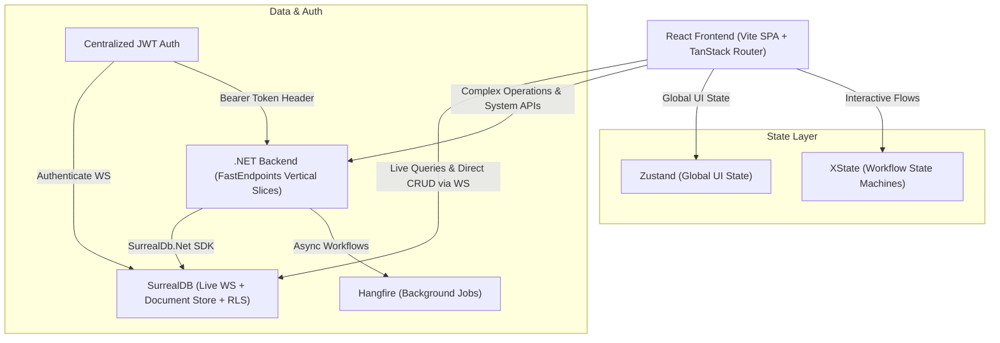

# System Architecture Overview — ⚠️ LEGACY (Iteration 1, superseded by `architecture/master-architecture-blueprint.md`)

Part of Tradebook architecture plan.

Architecture Implementation Plan: Highly Interactive WebApp Stack

Synthesizes architectural decisions from design session. High-performance, real-time, hybrid web app: React (Vite + TanStack Router), SurrealDB, .NET Vertical Slice backend.

---

## 1. Overall System Architecture



---

## 2. Technical Stack Delineation & Package Matrix

### A. Frontend Stack (CSR SPA)
* Build/framework: React 19 + Vite SPA (no TanStack Start SSR — lean, fast client execution).
* Routing: `@tanstack/react-router` (strictly typed, code-split routes).
* State management:
  * `zustand`: app-wide UI state (session, theme, layout toggles, modals).
  * `xstate` (`@xstate/react`): state machines for complex multi-step workflows (canvas editors, wizards, drag-drop).
  * `surrealdb` JS SDK: server state sync via WS subscriptions (`surreal.live()`).
* UI & styling: `tailwindcss` v4 + `clsx` + `tailwind-merge` + `lucide-react`; `@radix-ui/*` primitives via **ShadCN UI**.
* Animations & FX: `framer-motion`/`motion` — layout animations, page transitions, micro-interactions. **Aceternity UI** & **Animate UI** — glow effects, background beams, glare cards, hero effects.
* Canvas & virtualization: `@xyflow/react` (React Flow) — interactive node-based diagrams/canvases. `@tanstack/react-virtual` — virtualized lists/tables, minimal memory overhead.
* Drag-and-drop: `@dnd-kit/core`, `@dnd-kit/sortable` — app UI DnD (sidebars, sortable lists, kanban). *Rule*: React Flow handles canvas node dragging natively; sidebar-to-canvas drop bridged via HTML5 drag events / dnd-kit drop zones.

---

### B. Backend Stack (.NET 9 Vertical Slice Architecture)
* Framework: ASP.NET Core Web API (.NET 9).
* Endpoint pattern: `FastEndpoints` (Request-Endpoint-Response / REPR, replaces controller/MediatR boilerplate).
* Validation: `FluentValidation` in FastEndpoints pipeline.
* DB driver: `SurrealDb.Net` (official C# SDK — direct SurrealDB ops, migrations, system queries).
* Background jobs: `Hangfire` (Postgres/Redis/Memory storage) — reliable queues, retries, scheduled tasks.
* Docs: `FastEndpoints.Swagger` / `Scalar` — auto-gen OpenAPI.

---

### C. Database & Security Model (SurrealDB)
* Access: frontend connects direct to SurrealDB over WebSockets (`ws://` / `wss://`).
* Auth: centralized JWT from .NET Auth endpoint. React calls `surreal.authenticate(jwtToken)` on connect.
* Record-Level Security (RLS), enforced in SurrealDB schema:
  ```surrealql
  DEFINE TABLE project SCHEMAFULL
      PERMISSIONS
          FOR select WHERE tenant = $auth.tenant_id AND (owner = $auth.id OR $auth.role = 'admin')
          FOR create, update, delete WHERE tenant = $auth.tenant_id AND owner = $auth.id;
  ```
