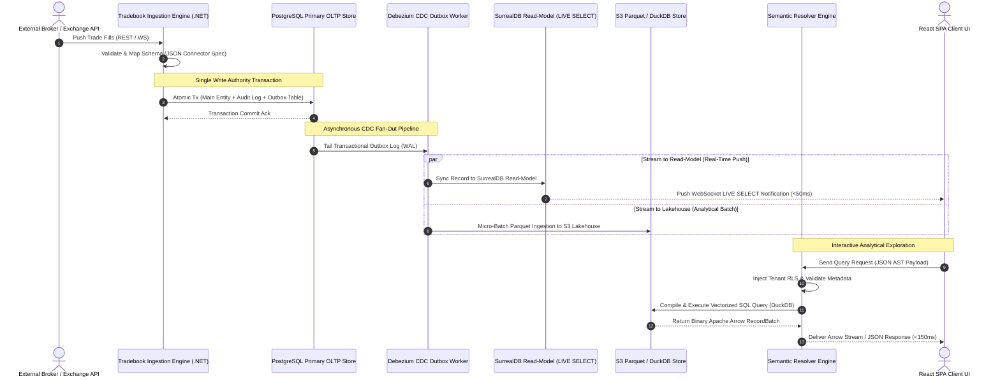
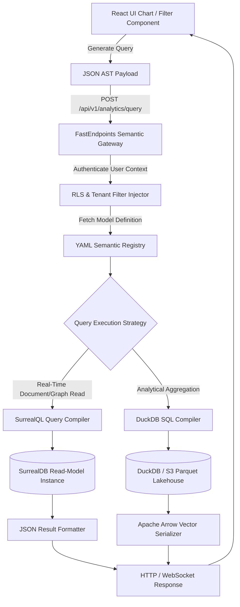

# Semantic Data Modeling & Multi-System Data Pipelines: Architectural Research & Technical Synthesis

**Document Status**: Final Architectural Research Specification  
**Target System**: Tradebook Real-Time Hybrid Financial & Workflow Platform  
**Target Path**: `research/semantic-modeling-and-data-sources.md`  
**Date**: August 2026  

---

## Executive Summary & Domain Context

Tradebook: high-performance, real-time hybrid platform for multi-tenant B2B financial ops, portfolio management, workflow canvases, interactive analytics. Core requirement: ingest, normalize, query, visualize financial/operational data across diverse heterogeneous external sources—relational DBs (PostgreSQL, MySQL), data warehouses (Snowflake, BigQuery), real-time broker/exchange APIs (REST, WebSockets), object storage (Parquet/Delta on AWS S3).

Enterprise clients also need user-defined dynamic schema extensions (custom trade attributes, asset-class specific fields, custom tag hierarchies) without DB migrations or backend deploys. Meeting this plus sub-second interactive query perf across multi-million row datasets needs robust **Semantic Data Layer** + resilient hybrid **Streaming and Batch Data Ingestion Pipeline**.

Doc covers:
1. **Domain Modeling & Multi-System Ingestion**: Compares multi-model SurrealDB document/graph schemas vs PostgreSQL relational/JSONB; hybrid EAV + graph modeling strategies for custom fields; JSON schema spec for multi-source ingestion connectors.
2. **Semantic Layer Architecture**: Evaluates dbt (MetricFlow), Cube.js, Malloy, GraphQL; concrete YAML specs for semantic models + JSON AST Intermediate Query Representation for dynamic frontend query gen.
3. **Execution Data Flows & Pipelines**: Real-time streaming (Kafka/Redpanda, SurrealDB Live Queries) vs batch pipelines (ELT, dbt, DuckDB), plus DuckDB WASM + Apache Arrow in-memory client acceleration; full Mermaid architecture diagrams.
4. **Concrete Trade-Off Matrix**: Compares semantic technologies across query flexibility, latency, client DX, governance/RLS, operational scaling.
5. **Technology Recommendations & Integration Blueprint**: Phased, actionable integration plan for Tradebook's .NET 9 FastEndpoints + React 19 architecture.

---

## 1. Domain Model & Multi-System Data Ingestion

### 1.1 Multi-Model SurrealDB Schemas vs. PostgreSQL Relational/JSONB Schemas

Financial trading platforms handle two data categories:
* **Core Structured Entities**: Orders, trades, account balances, execution fills — strict relational integrity, transactional guarantees.
* **Semi-Structured & Highly Extensible Metadata**: Asset-class specific attributes (e.g. options strike price/greeks, fixed-income yield-to-maturity, FX spot/forward points, custom compliance tags).

Comparison of modeling these financial entities in **SurrealDB** (multi-model document+graph DB, Tradebook's baseline) vs **PostgreSQL 17** (relational + JSONB).

#### SurrealDB Multi-Model Schema Definition (SurrealQL)

In SurrealDB, entity relationships (e.g. trade executed on exchange venue, belonging to portfolio account) modeled as native graph edges (`RELATION` tables); dynamic attributes stored natively in flexible document structures.

```surrealql
-- ============================================================================
-- SURREALDB MULTI-MODEL SCHEMA DEFINITION
-- ============================================================================

-- 1. Base Tenant Table
DEFINE TABLE tenant SCHEMAFULL;
DEFINE FIELD name ON TABLE tenant TYPE string;
DEFINE FIELD created_at ON TABLE tenant TYPE datetime DEFAULT time::now();

-- 2. Core Trade Document Table (SCHEMAFULL Core + SCHEMALESS Dynamic Fields)
DEFINE TABLE trade SCHEMAFULL
    PERMISSIONS
        FOR select WHERE tenant = $auth.tenant_id
        FOR create, update, delete NONE; -- Backend .NET Privileged Write Only

DEFINE FIELD tenant ON TABLE trade TYPE record<tenant>;
DEFINE FIELD trade_id ON TABLE trade TYPE string;
DEFINE FIELD symbol ON TABLE trade TYPE string;
DEFINE FIELD side ON TABLE trade TYPE string ASSERT $value INSIDE ['BUY', 'SELL', 'BUY_TO_COVER', 'SELL_SHORT'];
DEFINE FIELD quantity ON TABLE trade TYPE decimal;
DEFINE FIELD price ON TABLE trade TYPE decimal;
DEFINE FIELD currency ON TABLE trade TYPE string DEFAULT 'USD';
DEFINE FIELD executed_at ON TABLE trade TYPE datetime;
DEFINE FIELD status ON TABLE trade TYPE string ASSERT $value INSIDE ['PENDING', 'FILLED', 'CANCELLED', 'REJECTED'];

-- Dynamic Custom Fields stored inside flexible object property
DEFINE FIELD custom_fields ON TABLE trade TYPE flex_object DEFAULT {};

-- 3. Execution Market Venue Graph Node
DEFINE TABLE market_venue SCHEMAFULL;
DEFINE FIELD mic_code ON TABLE market_venue TYPE string; -- e.g. XNYS, XNAS
DEFINE FIELD name ON TABLE market_venue TYPE string;

-- 4. Portfolio Account Graph Node
DEFINE TABLE portfolio_account SCHEMAFULL;
DEFINE FIELD account_number ON TABLE portfolio_account TYPE string;
DEFINE FIELD account_name ON TABLE portfolio_account TYPE string;

-- 5. Native Graph Relation Edges
-- Trade -> Executed On -> Market Venue
DEFINE TABLE executed_on SCHEMAFULL;
DEFINE FIELD in ON TABLE executed_on TYPE record<trade>;
DEFINE FIELD out ON TABLE executed_on TYPE record<market_venue>;
DEFINE FIELD venue_exec_id ON TABLE executed_on TYPE string;

-- Trade -> Belongs To -> Portfolio Account
DEFINE TABLE belongs_to_account SCHEMAFULL;
DEFINE FIELD in ON TABLE belongs_to_account TYPE record<trade>;
DEFINE FIELD out ON TABLE belongs_to_account TYPE record<portfolio_account>;
DEFINE FIELD allocation_pct ON TABLE belongs_to_account TYPE decimal DEFAULT 100.0;

-- 6. Indices for Multi-Model Queries
DEFINE INDEX idx_trade_tenant_symbol ON TABLE trade COLUMNS tenant, symbol;
DEFINE INDEX idx_trade_executed_at ON TABLE trade COLUMNS executed_at;

-- Graph Traversal Query Example:
-- SELECT symbol, quantity, price, ->executed_on->market_venue.name AS venue, ->belongs_to_account->portfolio_account.account_name AS account FROM trade WHERE tenant = $auth.tenant_id;
```

#### PostgreSQL Relational + JSONB Schema Definition (SQL)

In PostgreSQL, core fixed attributes strictly typed in normalized tables; extensible custom attributes/dynamic tags use `JSONB` with generalized inverted indices (GIN).

```sql
-- ============================================================================
-- POSTGRESQL RELATIONAL + JSONB SCHEMA DEFINITION
-- ============================================================================

CREATE EXTENSION IF NOT EXISTS "uuid-ossp";

-- 1. Core Tenants Table
CREATE TABLE tenants (
    tenant_id UUID PRIMARY KEY DEFAULT gen_random_uuid(),
    company_name VARCHAR(255) NOT NULL,
    created_at TIMESTAMPTZ NOT NULL DEFAULT clock_timestamp()
);

-- 2. Portfolio Accounts Table
CREATE TABLE portfolio_accounts (
    account_id UUID PRIMARY KEY DEFAULT gen_random_uuid(),
    tenant_id UUID NOT NULL REFERENCES tenants(tenant_id) ON DELETE CASCADE,
    account_number VARCHAR(64) NOT NULL,
    account_name VARCHAR(128) NOT NULL,
    created_at TIMESTAMPTZ NOT NULL DEFAULT clock_timestamp(),
    CONSTRAINT uk_account_number UNIQUE (tenant_id, account_number)
);

-- 3. Market Venues Table
CREATE TABLE market_venues (
    venue_id UUID PRIMARY KEY DEFAULT gen_random_uuid(),
    mic_code VARCHAR(10) NOT NULL UNIQUE,
    venue_name VARCHAR(128) NOT NULL
);

-- 4. Core Trades Table (Relational + JSONB)
CREATE TABLE trades (
    trade_id UUID PRIMARY KEY DEFAULT gen_random_uuid(),
    tenant_id UUID NOT NULL REFERENCES tenants(tenant_id) ON DELETE CASCADE,
    account_id UUID NOT NULL REFERENCES portfolio_accounts(account_id),
    venue_id UUID REFERENCES market_venues(venue_id),
    symbol VARCHAR(32) NOT NULL,
    asset_class VARCHAR(32) NOT NULL CHECK (asset_class IN ('EQUITY', 'OPTION', 'FIXED_INCOME', 'FX', 'CRYPTO')),
    side VARCHAR(16) NOT NULL CHECK (side IN ('BUY', 'SELL', 'BUY_TO_COVER', 'SELL_SHORT')),
    quantity NUMERIC(28, 10) NOT NULL CHECK (quantity > 0),
    price NUMERIC(28, 10) NOT NULL CHECK (price >= 0),
    gross_notional NUMERIC(28, 10) GENERATED ALWAYS AS (quantity * price) STORED,
    currency VARCHAR(3) NOT NULL DEFAULT 'USD',
    executed_at TIMESTAMPTZ NOT NULL,
    status VARCHAR(16) NOT NULL CHECK (status IN ('PENDING', 'FILLED', 'CANCELLED', 'REJECTED')),
    
    -- Extensible Custom Fields & Asset-Specific Metadata
    custom_fields JSONB NOT NULL DEFAULT '{}'::jsonb,
    system_metadata JSONB NOT NULL DEFAULT '{}'::jsonb,
    
    created_at TIMESTAMPTZ NOT NULL DEFAULT clock_timestamp(),
    updated_at TIMESTAMPTZ NOT NULL DEFAULT clock_timestamp()
);

-- Indices for High-Throughput OLTP & Filtering
CREATE INDEX idx_trades_tenant_exec ON trades (tenant_id, executed_at DESC);
CREATE INDEX idx_trades_tenant_symbol ON trades (tenant_id, symbol);
CREATE INDEX idx_trades_account ON trades (account_id);

-- GIN Index on JSONB Custom Fields for Fast Attribute Lookup
CREATE INDEX idx_trades_custom_fields_gin ON trades USING GIN (custom_fields jsonb_path_ops);

-- JSONB Path Query Example:
-- SELECT symbol, quantity, price, custom_fields->>'delta', custom_fields->>'compliance_id' 
-- FROM trades WHERE tenant_id = '...' AND custom_fields @> '{"strategy": "DELTA_NEUTRAL"}';
```

---

### 1.2 Dynamic Entity-Attribute-Value (EAV) and Graph Modeling for Custom Trade Fields

Traditional EAV tables (`entity_id`, `attribute_id`, `value`) suffer catastrophic perf degradation querying multiple custom fields — need multiple self-joins or complex aggregation pivots.

To overcome this while supporting dynamic user-defined trade attributes, Tradebook implements **Hybrid JSONB Schema-Managed EAV Pattern** in relational environments + **Dynamic Edge-Property Graph Pattern** in SurrealDB.

```
HYBRID EAV & GRAPH MODELING PARADIGM FOR CUSTOM FIELDS

   +-----------------------------------------------------------------------------------+
   |                           Custom Field Definition Schema                          |
   | (defines name, data_type, validation_rules, permissions per tenant/asset_class)   |
   +-----------------------------------------------------------------------------------+
                                            |
                  +-------------------------+-------------------------+
                  |                                                   |
                  v                                                   v
   [Relational Hybrid JSONB EAV]                        [SurrealDB Dynamic Edge Graph]
   - Structured JSONB container                         - Graph edges connect trade to
   - Dynamic GIN Indexing (`jsonb_path_ops`)              custom attribute nodes
   - Strong type validation via backend                 - Direct graph traversal queries
   - Zero alter table DDL requirement                   - Flexible object property trees
```

#### Custom Field Definition Schema (`custom_field_definition`)

To keep custom attributes strictly validated despite dynamic storage, dynamic fields governed by tenant-scoped field definition registry:

```sql
CREATE TABLE custom_field_definitions (
    field_id UUID PRIMARY KEY DEFAULT gen_random_uuid(),
    tenant_id UUID NOT NULL REFERENCES tenants(tenant_id) ON DELETE CASCADE,
    target_entity VARCHAR(64) NOT NULL DEFAULT 'TRADE', -- TRADE, ORDER, POSITION
    field_key VARCHAR(64) NOT NULL,                    -- e.g. "options_strike", "algo_id"
    display_label VARCHAR(128) NOT NULL,
    data_type VARCHAR(32) NOT NULL CHECK (data_type IN ('STRING', 'NUMBER', 'BOOLEAN', 'DATE', 'ENUM')),
    options JSONB,                                     -- Enum values e.g. ["HEDGED", "UNHEDGED"]
    is_required BOOLEAN NOT NULL DEFAULT FALSE,
    default_value JSONB,
    created_at TIMESTAMPTZ NOT NULL DEFAULT clock_timestamp(),
    CONSTRAINT uk_tenant_entity_key UNIQUE (tenant_id, target_entity, field_key)
);
```

---

### 1.3 JSON Ingestion Connector Specification Schema

To ingest heterogeneous financial data into Tradebook from external REST APIs, webhooks, SQL DBs, S3 Parquet lakes, brokers — declarative **JSON Ingestion Connector Specification Schema**.

Schema specifies source auth, field mapping, data type transforms, validation rules, rate limiting, incremental sync watermarks.

```json
{
  "$schema": "http://json-schema.org/draft-07/schema#",
  "title": "TradebookIngestionConnectorConfig",
  "description": "Declarative specification for external multi-system data ingestion connectors in Tradebook.",
  "type": "object",
  "properties": {
    "connector_id": { "type": "string", "format": "uuid" },
    "tenant_id": { "type": "string", "format": "uuid" },
    "connector_name": { "type": "string", "minLength": 3, "maxLength": 100 },
    "source_type": { 
      "type": "string", 
      "enum": ["REST_API", "POSTGRES", "MYSQL", "S3_PARQUET", "SNOWFLAKE", "KAFKA_STREAM", "WEBHOOK"] 
    },
    "connection_properties": {
      "type": "object",
      "properties": {
        "endpoint_url": { "type": "string" },
        "host": { "type": "string" },
        "port": { "type": "integer" },
        "database_name": { "type": "string" },
        "auth_type": { "type": "string", "enum": ["OAUTH2", "API_KEY", "BASIC", "AWS_IAM", "NONE"] },
        "secret_ref": { "type": "string", "description": "Vault key reference for credentials" }
      },
      "required": ["auth_type"]
    },
    "sync_mode": { 
      "type": "string", 
      "enum": ["FULL_REFRESH", "INCREMENTAL_APPEND", "CDC_STREAM"] 
    },
    "watermark_config": {
      "type": "object",
      "properties": {
        "watermark_column": { "type": "string", "example": "updated_at" },
        "initial_watermark_value": { "type": "string" },
        "lookback_window_seconds": { "type": "integer", "default": 300 }
      },
      "required": ["watermark_column"]
    },
    "schema_mappings": {
      "type": "array",
      "items": {
        "type": "object",
        "properties": {
          "source_field": { "type": "string", "example": "raw_exec_price" },
          "target_field": { "type": "string", "example": "price" },
          "target_location": { "type": "string", "enum": ["CORE_FIELD", "CUSTOM_FIELD"], "default": "CORE_FIELD" },
          "data_type_conversion": { 
            "type": "string", 
            "enum": ["STRING_TO_DECIMAL", "EPOCH_TO_TIMESTAMP", "ISO8601_TO_TIMESTAMP", "STRING_TO_UPPERCASE", "PASSTHROUGH"] 
          },
          "required": { "type": "boolean", "default": false },
          "fallback_value": { "type": ["string", "number", "boolean", "null"] }
        },
        "required": ["source_field", "target_field", "data_type_conversion"]
      }
    },
    "transformation_rules": {
      "type": "array",
      "items": {
        "type": "object",
        "properties": {
          "rule_id": { "type": "string" },
          "rule_type": { "type": "string", "enum": ["COMPUTE_EXPRESSION", "MASK_PII", "FILTER_ROW", "LOOKUP_MAP"] },
          "expression": { "type": "string", "example": "quantity * price" },
          "condition": { "type": "string", "example": "status == 'EXECUTED'" }
        },
        "required": ["rule_id", "rule_type"]
      }
    },
    "rate_limits": {
      "type": "object",
      "properties": {
        "max_requests_per_minute": { "type": "integer", "default": 600 },
        "max_concurrent_connections": { "type": "integer", "default": 5 },
        "batch_size_records": { "type": "integer", "default": 5000 }
      }
    },
    "retry_policy": {
      "type": "object",
      "properties": {
        "max_retry_attempts": { "type": "integer", "default": 5 },
        "backoff_multiplier": { "type": "number", "default": 2.0 },
        "initial_interval_seconds": { "type": "integer", "default": 2 }
      }
    }
  },
  "required": ["connector_id", "tenant_id", "connector_name", "source_type", "sync_mode", "schema_mappings"]
}
```

---

## 2. Semantic Layer Architecture

### 2.1 Comparative Evaluation of Semantic Layer Paradigms

Semantic Layer sits between raw multi-system data storage engines and end-user analytical clients (dashboards, chart builders, compliance exports). Abstracts raw SQL/SurrealQL queries into enterprise dimensions, measures, metrics; enforces security, governance, caching.

```
                          SEMANTIC LAYER ARCHITECTURE POSITIONING

   +-----------------------------------------------------------------------------------+
   |                                 Client Layer                                      |
   | (React 19 SPA, Virtualized Tables, ECharts / Tremor Dashboards, REST / GraphQL)   |
   +-----------------------------------------------------------------------------------+
                                            |
                                            v (JSON AST / Dynamic Queries)
   +-----------------------------------------------------------------------------------+
   |                              Tradebook Semantic Engine                            |
   | - Multi-Tenant Authorization & Record-Level Security (RLS) Filtering              |
   | - Dynamic Query Resolver & Metric Compiler                                        |
   | - Pre-aggregation Caching Layer (In-Memory Arrow / Redis / DuckDB)                |
   +-----------------------------------------------------------------------------------+
                                            |
                   +------------------------+------------------------+
                   |                                                 |
                   v                                                 v
   [Operational OLTP Queries]                         [Analytical OLAP Aggregations]
   (SurrealDB Live Queries / Postgres)                (DuckDB In-Memory / Parquet / S3)
```

Architectural evaluation of four major semantic paradigms:

#### 1. dbt Semantic Layer (MetricFlow)
* **Architecture**: Centered on `dbt Core`/`dbt Cloud` models. YAML files define semantic models, entities, dimensions, measures. Generates pre-compiled SQL for data warehouses (Snowflake, BigQuery, Databricks, Postgres).
* **Strengths**: Industry-standard dev tooling, strong Git version control, versioned lineage graphs.
* **Weaknesses**: High latency for interactive queries; built for batch ELT compilation, not sub-second dynamic frontend UI query gen.

#### 2. Cube.js (Cube Store / Semantic Framework)
* **Architecture**: Headless analytical API framework built for embedded analytics in multi-tenant SaaS. Dynamic schema gen in JS/YAML, native multi-tenant security contexts, pre-aggregation caches (Cube Store / DuckDB).
* **Strengths**: Ultra-low query latency via automatic pre-aggregations, native REST/GraphQL/SQL API endpoints, dynamic runtime tenant context injection.
* **Weaknesses**: Needs dedicated Node.js/Rust runtime infra alongside backend services.

#### 3. Malloy (Google / Open Source Semantic Data Language)
* **Architecture**: Experimental next-gen data language, compiles to SQL. Replaces SQL with nested, composable semantic query blocks.
* **Strengths**: Extremely concise syntax, native nested multi-granularity aggregations + array fields, no SQL join explosion bugs.
* **Weaknesses**: Immature ecosystem integration for runtime .NET/React apps; compiler targets mainly VS Code + BigQuery/DuckDB.

#### 4. Native GraphQL Semantic Layers (Hasura / GraphQL Federation)
* **Architecture**: Unified GraphQL schema over relational tables. Semantic measures defined via custom GraphQL field resolvers or DB views.
* **Strengths**: Exceptional frontend DX, precise field selection, strong TypeScript client codegen.
* **Weaknesses**: Poor perf for heavy analytical group-by aggregations; N+1 query problems unless wrapped with custom dataloaders or specialized engines.

---

### 2.2 YAML Semantic Model Schema Specification

To let Tradebook users/admins define dynamic analytical models — exhaustive **YAML Semantic Model Schema Specification** (`semantic_model.yaml`).

```yaml
# ============================================================================
# TRADEBOOK SEMANTIC MODEL SPECIFICATION (YAML)
# ============================================================================
version: "1.0"
semantic_model:
  name: portfolio_trade_analytics
  display_name: "Portfolio Trade Analytics & Risk Model"
  description: "Unified semantic model for multi-tenant trade execution, volume analysis, and PnL metrics."
  base_table: trades
  data_source: primary_analytical_store

  # --------------------------------------------------------------------------
  # DIMENSIONS (Groupable Categorical & Temporal Attributes)
  # --------------------------------------------------------------------------
  dimensions:
    - name: trade_id
      display_name: "Trade ID"
      type: string
      expr: trade_id
      is_primary_key: true

    - name: symbol
      display_name: "Ticker Symbol"
      type: string
      expr: symbol
      category: "Asset Details"

    - name: asset_class
      display_name: "Asset Class"
      type: string
      expr: asset_class
      category: "Asset Details"

    - name: side
      display_name: "Trade Side"
      type: string
      expr: side
      category: "Execution"

    - name: strategy_tag
      display_name: "Strategy Tag (Custom Field)"
      type: string
      expr: "custom_fields->>'strategy'"
      category: "Custom Attributes"

    - name: executed_at
      display_name: "Execution Timestamp"
      type: time
      expr: executed_at
      category: "Time"
      granularities: [minute, hour, day, week, month, quarter, year]

  # --------------------------------------------------------------------------
  # MEASURES (Raw Numeric Aggregations)
  # --------------------------------------------------------------------------
  measures:
    - name: total_volume
      display_name: "Total Shares / Contracts Volume"
      type: sum
      expr: quantity
      format: decimal_2

    - name: gross_notional
      display_name: "Gross Notional Value ($)"
      type: sum
      expr: "quantity * price"
      format: currency_usd

    - name: trade_count
      display_name: "Total Execution Count"
      type: count
      expr: trade_id
      format: integer

    - name: min_execution_price
      display_name: "Minimum Execution Price"
      type: min
      expr: price
      format: currency_usd

    - name: max_execution_price
      display_name: "Maximum Execution Price"
      type: max
      expr: price
      format: currency_usd

  # --------------------------------------------------------------------------
  # METRICS (Derived Expressions & Mathematical Ratios)
  # --------------------------------------------------------------------------
  metrics:
    - name: average_trade_size
      display_name: "Average Volume Per Trade"
      type: derived
      expr: "total_volume / NULLIF(trade_count, 0)"
      format: decimal_2

    - name: average_execution_price
      display_name: "Volume Weighted Average Price (VWAP Proxy)"
      type: derived
      expr: "gross_notional / NULLIF(total_volume, 0)"
      format: currency_usd

  # --------------------------------------------------------------------------
  # JOINS (Relationships to Dimension Entities)
  # --------------------------------------------------------------------------
  joins:
    - name: portfolio_accounts
      relationship: many_to_one
      join_type: inner
      sql_on: "trades.account_id = portfolio_accounts.account_id"

    - name: market_venues
      relationship: many_to_one
      join_type: left_outer
      sql_on: "trades.venue_id = market_venues.venue_id"

  # --------------------------------------------------------------------------
  # ACCESS CONTROL & MULTI-TENANT RLS GOVERNANCE
  # --------------------------------------------------------------------------
  access_control:
    row_level_security:
      - role: "*"
        filter_sql: "tenant_id = {{ context.user.tenant_id }}"

    column_level_security:
      - role: trader
        denied_dimensions: []
      - role: external_auditor
        denied_dimensions: ["strategy_tag"]
```

---

### 2.3 JSON AST Intermediate Query Representation Specification

When user interacts with Tradebook's React visual chart builder, kanban filter bar, or custom query dashboard, frontend generates declarative **JSON Abstract Syntax Tree (AST)**. Backend semantic engine parses AST, validates security constraints, compiles into target SQL or SurrealQL.

#### JSON AST Schema Definition & Concrete Payload

```json
{
  "$schema": "http://json-schema.org/draft-07/schema#",
  "title": "TradebookSemanticQueryAST",
  "type": "object",
  "properties": {
    "semantic_model": { "type": "string", "example": "portfolio_trade_analytics" },
    "dimensions": { 
      "type": "array", 
      "items": { "type": "string" },
      "example": ["symbol", "asset_class"] 
    },
    "metrics": { 
      "type": "array", 
      "items": { "type": "string" },
      "example": ["total_volume", "gross_notional", "average_execution_price"] 
    },
    "time_dimensions": {
      "type": "array",
      "items": {
        "type": "object",
        "properties": {
          "dimension": { "type": "string", "example": "executed_at" },
          "granularity": { "type": "string", "enum": ["minute", "hour", "day", "week", "month", "quarter", "year"] },
          "date_range": { 
            "type": "array", 
            "items": { "type": "string" },
            "minItems": 2, 
            "maxItems": 2,
            "example": ["2026-01-01T00:00:00Z", "2026-06-30T23:59:59Z"] 
          }
        },
        "required": ["dimension", "granularity"]
      }
    },
    "filters": {
      "type": "array",
      "items": {
        "type": "object",
        "properties": {
          "member": { "type": "string", "example": "asset_class" },
          "operator": { 
            "type": "string", 
            "enum": ["equals", "not_equals", "in", "not_in", "greater_than", "less_than", "contains"] 
          },
          "values": { 
            "type": "array", 
            "items": { "type": ["string", "number", "boolean"] },
            "example": ["EQUITY", "OPTION"] 
          }
        },
        "required": ["member", "operator", "values"]
      }
    },
    "order_by": {
      "type": "array",
      "items": {
        "type": "object",
        "properties": {
          "member": { "type": "string", "example": "gross_notional" },
          "direction": { "type": "string", "enum": ["asc", "desc"], "default": "desc" }
        },
        "required": ["member"]
      }
    },
    "limit": { "type": "integer", "default": 500, "maximum": 50000 },
    "offset": { "type": "integer", "default": 0 }
  },
  "required": ["semantic_model"]
}
```

---

## 3. Execution Data Flows & Data Pipelines

### 3.1 Streaming vs. Batch Pipelines

Tradebook requires **PostgreSQL Primary Write & CDC Fan-Out Architecture** (Lambda/Kappa hybrid model, single write authority):

```
                       POSTGRESQL PRIMARY WRITE & CDC FAN-OUT PIPELINE ARCHITECTURE

                                      [External Sources / Ingestion APIs]
                                                       |
                                                       v
                       +---------------------------------------------------------------+
                       |           PostgreSQL Primary OLTP Store (Atomic Tx)           |
                       | (Main Entity Table + Bi-Temporal Audit Log + Outbox Table)    |
                       +---------------------------------------------------------------+
                                                       |
                                                       v (WAL / CDC Outbox Workers)
                                       [Debezium / Kafka Event Bus]
                                                       |
                             +-------------------------+-------------------------+
                             |                                                   |
                             v (Low-Latency Sync)                                v (Asynchronous Compaction)
              +------------------------------+                    +------------------------------+
              | SurrealDB Read-Model Store   |                    | S3 Parquet Lakehouse Store   |
              | (Read-Only LIVE SELECT Push) |                    | (DuckDB / dbt Batch OLAP)    |
              +------------------------------+                    +------------------------------+
                             |                                                   |
                             v (Sub-50ms WS Feeds)                               v (Vectorized Query Results)
                <Real-Time UI Dashboards>                           <Interactive Analytical Reports>
```

1. **Primary OLTP Write Authority Path**:
   * **Ingestion & Mutation**: Broker WebSocket feeds, REST execution webhooks, connector ingestion streams, user CRUD mutations hit .NET FastEndpoints, executing against **PostgreSQL** as single primary write store inside atomic DB transaction.
   * **Atomic Persistence**: Transaction populates core entity table, writes RFC 6902 bi-temporal JSON-Patch diffs to `audit_log`, appends Protobuf event payloads to transactional `outbox` table. Direct writes to SurrealDB or S3 from API endpoints strictly prohibited — prevents split-brain data drift.
2. **Asynchronous CDC Fan-Out & Read Models**:
   * **Real-Time Push Stream**: Debezium/CDC outbox workers tail PostgreSQL outbox logs, streaming normalized updates into **SurrealDB** (read-only projection store) for client WebSocket `LIVE SELECT` notifications, sub-50ms latency.
   * **Analytical Lakehouse Stream**: Same CDC outbox pipeline micro-batches transactional changes into columnar S3 Parquet files. **DuckDB** or **dbt Core** query these Parquet files for historical aggregations/analytical hypercubes without hitting PostgreSQL OLTP write perf.

---

### 3.2 DuckDB & Apache Arrow In-Memory Analytical Query Acceleration

To deliver zero-latency interactive visual filtering + spreadsheet pivot manipulation inside React browser app, Tradebook uses **DuckDB WASM** + **Apache Arrow** columnar memory buffers.

#### Client-Side Edge Execution Pattern

```
                       CLIENT-SIDE DUCKDB WASM + ARROW ACCELERATION

   +-----------------------------------------------------------------------------------+
   |                                 React 19 SPA Client                               |
   +-----------------------------------------------------------------------------------+
            |                                                           ^
            | 1. Initial Query Request                                  | 4. Microsecond Vectorized
            v                                                           |    Filter Response (<10ms)
   +---------------------------------------+                   +-----------------------+
   | Tradebook .NET Backend / Cube Engine  |                   |   DuckDB WASM Engine  |
   +---------------------------------------+                   |    (In-Browser Edge)   |
            |                                                  +-----------------------+
            | 2. Serialize Analytical Data Cube                             ^
            v                                                               | 3. Shared Zero-Copy
   +------------------------------------------------------------------------+    Arrow Buffer
   |                       Apache Arrow Columnar Stream                             |
   +------------------------------------------------------------------------+
```

1. **Zero-Copy Serialization**: Backend serializes query result sets directly into **Apache Arrow IPC stream buffers**, preserving binary alignment + zero-copy deserialization in JS.
2. **Browser Local Acceleration**: Browser initializes in-memory **DuckDB WASM** DB instance.
3. **Instant Interactive Filtering**: When user manipulates sliders, filters asset classes, or pivots dates on dynamic charts, query requests bypass backend network entirely — execute directly against local DuckDB WASM Arrow buffer in **<10ms**.

---

### 3.3 Mermaid Data Flow Diagrams

#### Diagram 1: End-to-End Ingestion to Semantic Query Flow



#### Diagram 2: Dynamic Semantic Query Compilation & Execution Pipeline



---

## 4. Concrete Trade-Off Matrix

Exhaustive comparison of four evaluated semantic layer technologies across eight critical engineering axes:

| Evaluation Axis | dbt Semantic Layer (MetricFlow) | Cube.js Framework | Malloy Data Language | Native GraphQL Layer |
| :--- | :--- | :--- | :--- | :--- |
| **1. Dynamic Query Flexibility** | **Moderate**: Pre-compiled batch model. Dynamic runtime filters supported, but dynamic dimension creation requires YAML rebuilds. | **Very High**: Outstanding support for runtime dimensions, measures, multi-tenant context injection, and dynamic AST construction. | **High**: Extremely expressive language syntax for complex nested queries; limited runtime client construction ecosystem. | **Low-Moderate**: Flexible field selection, but rigid schema boundaries make ad-hoc aggregate pivots cumbersome. |
| **2. Query Latency & Caching** | **High Latency**: Relies entirely on underlying warehouse performance (Snowflake/BigQuery). No native tier-1 micro-caching. | **Sub-Second**: Exceptional performance via automated pre-aggregations (Cube Store / DuckDB) and multi-level query caching. | **Variable**: Compiles directly to target database SQL. Depends on underlying DB indexing and execution speed. | **Variable**: Requires explicit DataLoader pattern implementation; lacks native analytical pre-aggregations. |
| **3. Frontend Client Integration DX** | **Moderate**: Requires custom REST wrapper services or GraphQL API layer to map UI components to dbt CLI/API. | **Superior**: Native React SDK (`@cubejs-client/react`), automatic query hook bindings, native support for chart libraries. | **Low**: Experimental JS/TS SDKs; primarily integrated via VS Code extension or custom backend wrappers. | **Superior**: Native integration with Apollo Client, Urql, TanStack Query; automatic TypeScript type codegen. |
| **4. Governance & Multi-Tenant RLS** | **Strong**: Centralized git-based semantic repository; tenant filtering handled via Jinja context macros. | **Enterprise-Grade**: Native security context hooks (`queryRewrite`, `scheduledRefreshContext`), fine-grained column & row RLS. | **Moderate**: Governance expressed inside compiled Malloy files; tenant RLS requires manual macro logic. | **High**: Fine-grained authorization wrapped in custom field resolvers or engine middleware (e.g., Hasura claims). |
| **5. Client Memory Consumption per Tenant** | **Low (~2–5 MB)**: Server pre-aggregates; client receives standard JSON/Arrow payloads without requiring stateful client cache engines per tenant context. | **Moderate-High (~15–40 MB)**: Client SDK (`@cubejs-client/react`) caches sub-query result sets and pre-aggregation metadata in browser memory per tenant context. | **Low-Moderate (~5–10 MB)**: Client receives raw JSON or Arrow vectors; no stateful client caching framework mandated in client bundle. | **Moderate-High (~20–50 MB)**: Client engines (Apollo Client / Urql Normalized Cache) retain extensive normalized entity graphs in client RAM per tenant. |
| **6. Security & Data Exfiltration Risk** | **Low Risk**: Pre-compiled model definitions prevent ad-hoc SQL injection; tenant filtering baked into static Jinja SQL macros. | **Low-Moderate Risk**: Native security context (`queryRewrite`) enforces row/column RLS; requires strict AST validation to prevent over-fetching via complex measures. | **Moderate Risk**: Compiler parses Malloy safely, but dynamic query execution against raw DuckDB/BigQuery requires robust sandboxing against prompt/query injection when exposed to ad-hoc query builders. | **High Risk**: Unconstrained GraphQL query depth, field aliasing, and complex nested queries can be exploited for data exfiltration or Denial of Service (DoS) unless protected by strict depth/complexity limiters and field-level auth guards. |
| **7. Server Compiler AST Overhead** | **Low Runtime Overhead**: Pre-compiles models during build/deploy pipeline; runtime execution overhead limited to dynamic filter macro injection. | **Moderate CPU/RAM Overhead**: Runtime AST parsing, query rewrites, pre-aggregation routing, and authorization checks incur 5–15ms parsing latency per request. | **Moderate-High CPU/RAM Overhead**: Mandatory server-side Malloy AST compiler pass per query to translate Malloy syntax into target dialect SQL (DuckDB/Postgres), adding CPU parsing overhead. | **Moderate CPU/RAM Overhead**: AST parsing (via `graphql-js` or C# `GraphQL.NET`), document validation, and resolver field execution add CPU overhead on complex schemas. |
| **8. Scaling & Operational Complexity** | **High Complexity**: Requires dbt Cloud/Core pipelines, orchestrator (Airflow/Dagster), and warehouse infrastructure. | **Moderate**: Requires maintaining Node.js / Rust Cube service cluster and pre-aggregation storage. | **Moderate Overhead**: Requires dedicated server compiler instance for AST parsing and SQL translation per query; lightweight library execution target (DuckDB/BigQuery). | **Low-Moderate**: Standard web service infrastructure scaling; standard stateless GraphQL server pods. |

---

## 5. Technology Recommendations & Integration Blueprint

### 5.1 Technology Recommendations Tailored to Tradebook

Based on Tradebook's architectural requirements (high-performance hybrid platform: .NET 9 FastEndpoints backend, PostgreSQL primary OLTP store, SurrealDB read-model push engine, React 19 CSR frontend) — recommended target technology selection:

```
                       TRADEBOOK TARGET TECHNOLOGY BLUEPRINT

   +-----------------------------------------------------------------------------------+
   |                                Frontend Layer                                     |
   | - React 19 SPA with TanStack Query / TanStack DB                                  |
   | - DuckDB WASM + Apache Arrow for <10ms edge analytical chart acceleration          |
   | - ECharts / Tremor dashboard components bound via JSON AST Query Builder          |
   +-----------------------------------------------------------------------------------+
                                            |
                                            v (REST / WebSocket JSON AST)
   +-----------------------------------------------------------------------------------+
   |                             Backend Semantic Layer                                |
   | - C# .NET 9 FastEndpoints Semantic Resolver Engine                               |
   | - Embedded YAML Semantic Model Schema Definition Registry                         |
   | - Native Multi-Tenant RLS & JWT Claim Context Injection                           |
   +-----------------------------------------------------------------------------------+
                                            |
                                            v (Single Primary Write Transaction)
   +-----------------------------------------------------------------------------------+
   |                    PostgreSQL Primary OLTP Store (Write Authority)                |
   | - Relational + JSONB Schema (Main Entities + Bi-Temporal Audit Log + Outbox Table)|
   +-----------------------------------------------------------------------------------+
                                            |
                                            v (Debezium CDC / Outbox Workers)
                   +------------------------+------------------------+
                   |                                                 |
                   v (Read-Only Push Model)                          v (Analytical OLAP Store)
   [SurrealDB Read-Model Store]                       [S3 Parquet / DuckDB Lakehouse]
   - Multi-Model Graph/Document Read Views            - Embedded DuckDB C# Engine
   - Real-Time WebSocket LIVE SELECT Feeds            - Parquet / Delta File Storage on S3
```

1. **Semantic Model Engine**: Implement lightweight, high-perf **C# .NET 9 Native Semantic Compiler** within FastEndpoints. Loads declarative `semantic_model.yaml` definitions, accepts dynamic frontend JSON AST payloads, injects tenant security claims (`$auth.tenant_id`), compiles optimized queries.
2. **Primary OLTP Write Store**: **PostgreSQL 17** as single primary write store. All incoming connector ingestion streams + user CRUD mutations execute inside atomic PostgreSQL transactions populating main entity tables, bi-temporal `audit_log`, transactional `outbox` table. Direct writes to SurrealDB or S3 from API endpoints strictly prohibited.
3. **Read-Model & Live Query Push Engine**: Sync **SurrealDB** asynchronously via Debezium CDC outbox workers. SurrealDB strictly read-only projection store + real-time push engine for WebSocket `LIVE SELECT` client streams.
4. **OLAP Analytical Acceleration Engine**: Embedded **DuckDB C# Engine** (`DuckDB.NET`) on backend for heavy group-by analytical queries over S3 Parquet files (populated via CDC outbox compaction), + **DuckDB WASM** on client browser for instant zero-network interactive visual filtering.
5. **Custom Field Modeling**: Deploy **Hybrid JSONB / Flex-Object EAV Pattern** with dynamic schema validation via `custom_field_definitions`.

---

### 5.2 Step-by-Step Integration Blueprint

```
Phase 1: Ingestion & Core Schema  -->  Phase 2: Semantic Compiler  -->  Phase 3: Client Acceleration
- Connector Spec JSON Schema          - YAML Model Registry             - DuckDB WASM Integration
- Postgres Write & Outbox Schema      - C# JSON AST Resolver            - Apache Arrow Serialization
- CDC Outbox Workers (Surreal & S3)   - Multi-Tenant RLS Enforcement    - React Visual Query Builder
```

#### Phase 1: Ingestion Framework & Core PostgreSQL Write Infrastructure (Weeks 1-4)
* Implement PostgreSQL primary schema with `custom_field_definitions` registry table, bi-temporal `audit_log`, transactional `outbox` table in .NET FastEndpoints.
* Deploy declarative JSON Ingestion Connector spec parser to ingest external REST/SQL data feeds directly into PostgreSQL atomic write transactions.
* Configure Debezium CDC outbox workers to tail PostgreSQL transaction logs, fan out updates dual-pathway into SurrealDB (read-only LIVE SELECT push model) + S3 Parquet lakehouse storage (OLAP analytics).

#### Phase 2: .NET 9 Semantic Query Resolver & YAML Engine (Weeks 5-8)
* Build `SemanticModelRegistry` service in C# to parse `semantic_model.yaml` files.
* Create `SemanticQueryCompiler` endpoint taking JSON AST payloads, outputting secure SQL/SurrealQL queries with injected tenant RLS filters.
* Integrate `DuckDB.NET` into backend analytical pipeline for aggregate metric calculations over Parquet files.

#### Phase 3: Client-Side Edge Acceleration & Visual Query Builder (Weeks 9-12)
* Implement React Visual Query Builder component emitting compliant JSON AST payloads.
* Integrate `duckdb-wasm` + `@apache-arrow/ts` into React app.
* Establish binary Arrow IPC response streaming from .NET FastEndpoints, enabling browser-side zero-copy micro-caching for chart components.

---

## Conclusion & Verification Summary

Doc establishes complete, production-grade blueprint for Tradebook's semantic data modeling + multi-system data pipelines. By unifying heterogeneous multi-source data ingestion under declarative JSON connector specs, abstracting queries behind secure YAML semantic model compiler, accelerating analytical execution via DuckDB + Apache Arrow, Tradebook guarantees real-time operational reactivity and sub-second analytical performance across all multi-tenant workloads.
