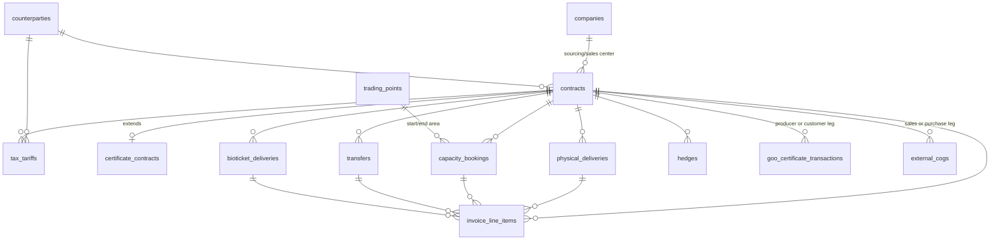

# Tradebook Entity Model — Authoritative Domain Data Specification

**Document Status**: Authoritative Entity & Domain Model  
**Target System**: Tradebook — BioGem Energy Trading & Certificate Platform  
**Source**: Reverse-engineered and verified against the operational Excel workbooks in `Tradebook_LAX/` (`Tradebook_Bioticket.xlsx`, `Tradebook_Certificates_v2.xlsx`, `Tradebook_Masterdata.xlsx`, `Tradebook_Physical.xlsm`, `Tradebook_Reports_V2_SF_integration.xlsx`)  
**Author**: Extracted from operational workbooks (Bioticket, Certificates_v2, Masterdata, Physical, Reports)  
**Date**: August 6, 2026  
**Version**: 2.0 — Authoritative, Excel-verified definition

> This document is the **single source of truth for Tradebook's domain model**. Every DDL in
> `architecture/master-architecture-blueprint.md` and every implementation task in `tasks/`
> MUST derive its tables, columns, enums, and relationships from this specification.

---

## 1. Business Domain Context

Tradebook is a **renewable energy certificate and physical gas trading platform** for **BioGem AS / BioGem AG** — a company that sources, trades, and sells:

1. **Guarantees of Origin (GoO)** — renewable energy certificates (REGO/GoO) from producers across Scandinavia and Europe
2. **Physical Bio-Gas (Biomethane)** — physical gas contracted via producers and sold to end customers
3. **Biotickets** — biomethane tickets used in sustainability reporting (traded in **tonnes**, priced **EUR/Ton**)
4. **Gas Capacity Bookings** — cross-border pipeline and network capacity reservations

The system integrates with **Salesforce (SF)**, **DENA** (German registry), **AIB** (European registry), and national gas networks (GTF/Denmark, ETF/Germany, JEZ/Sweden).

### 1.1 Workbook → Business Process Map

| Workbook | Sheets | Business Process | Primary Domain Tables |
| :--- | :--- | :--- | :--- |
| `Tradebook_Masterdata.xlsx` | `ContractOverview`, `Counterparties`, `References`, `Ref Report status` | Single source for contract & counterparty master data, reference/enum lists | `contracts`, `counterparties`, `companies`, reference tables |
| `Tradebook_Certificates_v2.xlsx` | `Sourcing`, `Sales`, `Prices`, `Contract Overview*`, `Helper` | GoO certificate sourcing & sales book | `physical_deliveries` (book_type=Sourcing/Sales), `certificate_contracts`, `market_prices` |
| `Tradebook_Physical.xlsm` | `Sourcing`, `Sales`, `Capacity Booking`, `Transfer`, `Tax`, `Hedge`, `Prices`, `Shippingfix`, `Total`, `Balance*` | Physical gas book: deliveries, capacity, transfers, tariffs, hedges | `physical_deliveries`, `capacity_bookings`, `transfers`, `tax_tariffs`, `hedges`, `market_prices`, `trading_points` |
| `Tradebook_Bioticket.xlsx` | `Sourcing`, `Sales`, `Contract Overview*` | Biomethane ticket (Ton) book | `bioticket_deliveries`, `contracts` (product_type=Tickets) |
| `Tradebook_Reports_V2_SF_integration.xlsx` | `Fact_Transactions`, `EXTERNAL COGS`, pivot sheets | SF certificate transaction reconciliation, COGS reporting | `goo_certificate_transactions`, `external_cogs`, `invoice_line_items` |

### 1.2 Contract naming convention

```
New (canonical, Salesforce-aligned): {CounterpartyShorthand}{CountryDialCode}.{ContractTypeCode}.{YYmm}.{QualityCode}{SubsidyFlag}
Example: ARLA45.SC.2601.ETSS  = Arla, Country=DK(45), Sales Certificate, Feb 2026, ETS quality, Subsidized

Legacy: {Shorthand}.{DialCode}.{Product|TradingArea}.{ContractNo}.{Year}[.Quality][.SUB]
Examples: NRGD.45.GAS.GTF.EEX.MON | ARLA.45.ETS.001.2024 | CRSB.45.001.CO2E | SETX.41.800.TS.001.2024

Instance (per delivery month): {ContractName}-{DeliveryMonthNo}-{Year}
Example: BFEX45.BT.2301.CO2E-9-2023  (delivery Sept 2023)  |  NRGD.49.GAS.THE.CBC.MON-1-2024
```

---

## 2. Core Domain Entities

### 2.1 `companies` — Trading Centers / Internal Legal Entities

Represents BioGem's own legal entities acting as sourcing and sales centers. Sourced from the `Company Shorthand` / `Sourcing Center` / `Sales Center` columns in the Contract Overview sheets.

| Column | Type | Notes |
|--------|------|-------|
| `id` | UUID PK | |
| `shorthand` | VARCHAR(10) UNIQUE | e.g. `BGEM AS`, `BGEM AG`, `NRGD-DK`, `NRGD` |
| `name` | VARCHAR(200) | Full legal name |
| `country_code` | CHAR(2) | ISO 3166-1 alpha-2 |
| `country_dial_code` | SMALLINT | e.g. `45` (DK), `46` (SE), `41` (CH), `49` (DE) |
| `vat_rate` | NUMERIC(5,4) | e.g. `0.25` |
| `default_currency` | CHAR(3) | ISO 4217 e.g. `DKK`, `EUR`, `SEK`, `CHF` |
| `is_active` | BOOLEAN | |
| `created_at` | TIMESTAMPTZ | |
| `updated_at` | TIMESTAMPTZ | |

---

### 2.2 `counterparties` — External Trading Partners

Sourced from `Masterdata` → `Counterparties` (columns: `Counterparty_name`, `Shorthand`, `review_note`).

| Column | Type | Notes |
|--------|------|-------|
| `id` | UUID PK | |
| `name` | VARCHAR(200) UNIQUE | Full legal name e.g. `Arla Foods amba` |
| `shorthand` | VARCHAR(20) UNIQUE | e.g. `ARLA`, `MAPE`, `SGSW` |
| `segment` | segment_enum | `Utilities`, `Transport`, `Traders`, `Producers`, `Industry`, `Intercompany`, `Public`, `Storage`, `Market`, `OTC`, `Plant`, `Other` |
| `country_code` | CHAR(2) | |
| `country_dial_code` | SMALLINT | |
| `vat_applicable` | BOOLEAN | |
| `salesforce_account_id` | VARCHAR(50) | SF `Account.Id` e.g. `0010700000nOXw9AAG` |
| `review_note` | TEXT | Internal notes on counterparty (column `review_note` in Masterdata) |
| `is_active` | BOOLEAN | |
| `created_at` | TIMESTAMPTZ | |
| `updated_at` | TIMESTAMPTZ | |

---

### 2.3 `contracts` — Master Trading Contracts

Central entity. One contract = one bilateral agreement with a counterparty for a commodity. Sourced from the unified **Contract Overview** definition used identically across `Masterdata` → `ContractOverview`, `Certificates_v2` → `Contract Overview_2`, and `Bioticket` → `Contract Overview_v2`.

| Column | Type | Notes |
|--------|------|-------|
| `id` | UUID PK | |
| `contract_name` | VARCHAR(100) UNIQUE NOT NULL | Canonical e.g. `ARLA45.SC.2601.ETSS` |
| `company_shorthand` | VARCHAR(10) | e.g. `ARLA`, `MAPE` |
| `country_code` | CHAR(2) | |
| `country_dial_code` | SMALLINT | |
| `contract_number` | SMALLINT | Sequential per counterparty per year (col `No. Of Contract`) |
| `year_of_contract` | SMALLINT | e.g. `2024`, `2025` |
| `counterparty_id` | UUID FK -> counterparties | |
| `contract_suffix` | VARCHAR(20) | e.g. `BGEM AS`, `BGEM AG` |
| `sourcing_center` | UUID FK -> companies NULLABLE | e.g. `BGEM AS`, `NRGD-DK` |
| `sales_center` | UUID FK -> companies NULLABLE | e.g. `BGEM AS`, `JEZ`, `OZD` |
| `balancing_group` | VARCHAR(50) | e.g. `NRGD`, `BGEM` |
| `network_point` | VARCHAR(50) | Gas network delivery point |
| `receiving_shipper` | VARCHAR(50) | |
| `external_contract_ref` | VARCHAR(100) | Registry/legacy reference (col `External Contract`) |
| `product_type` | product_type_enum | `GoO`, `Gas`, `GoO+Gas`, `GoO+Gas+Shipping`, `Tickets` |
| `action` | action_enum | `Buy`, `Sell`, `Intercompany`, `Swap` |
| `goo_quality` | goo_quality_enum NULLABLE | `RED`, `ETS`, `OZD`, `NMS`, `EWG`, `ISCC`, `NOQ`, `GEG`, `RTFO`, `BHG` |
| `feedstock_quality` | VARCHAR(100) | e.g. `Certified Manure`, `Waste & residue`, `Specified`, `Crop`, `Undef` |
| `gas_quality` | VARCHAR(50) | e.g. `Green`, `Grey` |
| `subsidy_status` | subsidy_status_enum NULLABLE | `SUB`, `UNS`, `None` |
| `subsidy_type` | VARCHAR(50) | e.g. `DK_UPG`, `None` |
| `vat_type` | VARCHAR(50) | `Applicable`, `None`, `0` |
| `counterparty_segment` | segment_enum | |
| `signing_date` | DATE | |
| `price_mechanism_goo` | price_mech_enum NULLABLE | `FIXED`, `VARIABLE` |
| `fixed_price_goo_eur_mwh` | NUMERIC(12,6) NULLABLE | |
| `broker_fee_eur_mwh` | NUMERIC(12,6) NULLABLE | |
| `price_mechanism_gas` | gas_price_mech_enum NULLABLE | `FIXED`, `VARIABLE`, `EGSI ETF`, `TTF`, `WITHIN-DAY MKT` |
| `fixed_price_gas_eur_mwh` | NUMERIC(12,6) NULLABLE | |
| `price_mechanism_ticket` | price_mech_enum NULLABLE | |
| `fixed_price_ticket_eur_ton` | NUMERIC(12,6) NULLABLE | |
| `invoicing_mechanism` | invoicing_mech_enum | `Weekdays`, `Calender day`, `Running month + X` |
| `payment_mechanism` | payment_mech_enum | `Weekdays`, `Calender day` |
| `days_to_invoice_after_delivery` | SMALLINT | |
| `days_to_payment_after_invoice` | SMALLINT | |
| `delivery_type` | delivery_type_enum NULLABLE | `Fixed`, `Variable` |
| `campaign` | VARCHAR(100) | e.g. `Tenders` |
| `certification_quality` | VARCHAR(100) | |
| `includes_goo` | BOOLEAN | |
| `includes_gas` | BOOLEAN | |
| `includes_ticket` | BOOLEAN | |
| `contract_type` | contract_type_enum | `External`, `Intercompany` |
| `comment` | TEXT | |
| `sf_contract_name` | VARCHAR(100) | Salesforce contract name |
| `old_contract_name` | VARCHAR(100) | Legacy name (`Old_contractName` mapping) |
| `is_active` | BOOLEAN DEFAULT true | |
| `created_at` | TIMESTAMPTZ | |
| `updated_at` | TIMESTAMPTZ | |

---

### 2.4 `certificate_contracts` — GoO/ETS Certificate-Specific Attributes

Extension of `contracts` for certificate-specific metadata (columns that only appear in `Certificates_v2` → `Contract Overview`).

| Column | Type | Notes |
|--------|------|-------|
| `id` | UUID PK | |
| `contract_id` | UUID FK -> contracts UNIQUE | |
| `goo_quality` | goo_quality_enum | `RED`, `ETS`, `OZD`, `NMS`, `EWG`, `ISCC`, `NOQ`, `GEG`, `RTFO`, `BHG` |
| `feedstock_quality` | VARCHAR(100) | |
| `certification_quality` | VARCHAR(100) | |
| `customer_segment` | segment_enum | |
| `created_at` | TIMESTAMPTZ | |
| `updated_at` | TIMESTAMPTZ | |

---

### 2.5 `physical_deliveries` — Monthly Gas / GoO+Gas Delivery Records

One record per contract per supply month — the core operational line of gas and hybrid (GoO+Gas) books. Mirrors the `Sourcing` and `Sales` sheets of `Tradebook_Physical.xlsm` and `Tradebook_Certificates_v2.xlsx`. A `book_type` discriminates Sourcing (Buy) vs Sales (Sell) vs Intercompany legs.

| Column | Type | Notes |
|--------|------|-------|
| `id` | UUID PK | |
| `contract_id` | UUID FK -> contracts | |
| `contract_instance_id` | VARCHAR(120) | `{ContractName}-{DeliveryMonthNo}-{Year}` e.g. `BGEM45.SG.2001.NOQS-1-2024` |
| `book_type` | book_type_enum | `Sourcing`, `Sales`, `Intercompany` |
| `supply_month` | DATE | First of month |
| `year` | SMALLINT | Derived from supply_month |
| `status` | report_status_enum | `Completed - Payment Received/Sent`, `In Progress - Invoice Received/Sent`, `Pending - No Invoice`, `Cancelled`, `Awaiting` |
| `trader_comment` | TEXT | |
| `balancing_group` | VARCHAR(50) | |
| `trading_area` | VARCHAR(20) | e.g. `GTF` |
| `capacity_mw` | NUMERIC(15,6) | |
| `volume_nominated_mwh` | NUMERIC(15,6) | |
| `volume_realised_mwh` | NUMERIC(15,6) | |
| `volume_corr1_mwh` | NUMERIC(15,6) | 1st correction |
| `volume_corr2_mwh` | NUMERIC(15,6) | 2nd correction |
| `volume_intercompany_mwh` | NUMERIC(15,6) | |
| `volume_mwh` | NUMERIC(15,6) | Final settled volume |
| `price_mechanism` | gas_price_mech_enum | `FIXED`, `VARIABLE`, `EGSI ETF`, `TTF`, `WITHIN-DAY MKT` |
| `start_day` | DATE | Gas day start |
| `start_hour` | TIME | Typically `06:00:00` |
| `end_day` | DATE | Gas day end |
| `end_hour` | TIME | |
| `start_datetime` | TIMESTAMPTZ | |
| `end_datetime` | TIMESTAMPTZ | |
| `hours` | NUMERIC(6,2) | |
| `delivery_type` | delivery_type_enum | `Fixed`, `Variable` |
| `product` | product_type_enum | `Gas`, `GoO+Gas`, `GoO`, `GoO+Gas+Shipping` |
| `country` | VARCHAR(100) | |
| `contract_type` | contract_type_enum | `External`, `Intercompany` |
| `cost_eur_mwh` | NUMERIC(12,6) | Sourcing cost (also recorded on Sales lines) |
| `revenue_eur` | NUMERIC(15,2) | Sales revenue |
| `handling_fee_eur_mwh` | NUMERIC(12,6) | |
| `handling_fee_eur` | NUMERIC(15,2) | |
| `broker_fee_eur_mwh` | NUMERIC(12,6) | |
| `broker_fee_eur` | NUMERIC(15,2) | |
| `tax_eur_mwh` | NUMERIC(12,6) | |
| `tax_eur` | NUMERIC(15,2) | |
| `tso_tariff_eur_mwh` | NUMERIC(12,6) | Transmission System Operator |
| `tso_tariff_eur` | NUMERIC(15,2) | |
| `dso_tariff_eur_mwh` | NUMERIC(12,6) | Distribution System Operator |
| `dso_tariff_eur_day` | NUMERIC(12,6) | |
| `dso_tariff_eur` | NUMERIC(15,2) | |
| `fixed_extra_eur` | NUMERIC(15,2) | |
| `adm_fee_eur_mwh` | NUMERIC(12,6) | Administration fee |
| `adm_fee_eur` | NUMERIC(15,2) | |
| `bal_fee_eur_mwh` | NUMERIC(12,6) | Balancing fee |
| `bal_fee_eur` | NUMERIC(15,2) | |
| `shipping_cost_eur_mwh` | NUMERIC(12,6) | |
| `shipping_cost_eur` | NUMERIC(15,2) | |
| `extra_eur` | NUMERIC(15,2) | |
| `extra_note` | TEXT | |
| `subtotal_eur` | NUMERIC(15,2) | Subtotal Revenue / Expenses |
| `agg_tax_eur` | NUMERIC(15,2) | Aggregated tax |
| `agg_tariff_eur` | NUMERIC(15,2) | Aggregated tariff |
| `vat_pct` | NUMERIC(5,4) | |
| `vat_eur` | NUMERIC(15,2) | |
| `invoice_amount_eur` | NUMERIC(15,2) | |
| `quality` | VARCHAR(50) | `Green`, `Grey` |
| `certification_quality` | VARCHAR(100) | |
| `client_type` | client_type_enum NULLABLE | `End Consumer`, `Traders`, `Intercompany`, `Energinet Balgas`, `Storage` |
| `counterparty_segment` | segment_enum | |
| `sending_shipper` | VARCHAR(50) | Sourcing leg |
| `receiving_shipper` | VARCHAR(50) | Sales leg |
| `shipper_code` | VARCHAR(50) | e.g. `DS81` |
| `sourcing_center` | VARCHAR(50) | |
| `sales_center` | VARCHAR(50) | |
| `delivery_month` | DATE | |
| `booking_month` | DATE | |
| `document_no` | VARCHAR(50) | Fakturanummer |
| `invoice_date` | DATE | |
| `payment_date_forecast` | DATE | |
| `payment_date_manual` | DATE | |
| `payment_date` | DATE | |
| `bilagsdato` | DATE | |
| `payment_diff_days` | SMALLINT | |
| `comment` | TEXT | |
| `created_at` | TIMESTAMPTZ | |
| `updated_at` | TIMESTAMPTZ | |

---

### 2.6 `capacity_bookings` — Cross-Border Pipeline Capacity Bookings

Gas pipeline/network capacity reservations at border points (`Tradebook_Physical.xlsm` → `Capacity Booking`).

| Column | Type | Notes |
|--------|------|-------|
| `id` | UUID PK | |
| `contract_id` | UUID FK -> contracts | Base contract e.g. `NRGD.49.GAS.THE.CBC.MON` |
| `contract_instance_id` | VARCHAR(120) | e.g. `NRGD.49.GAS.THE.CBC.MON-1-2024` |
| `supply_month` | DATE | |
| `balancing_group` | VARCHAR(50) | |
| `counterparty_id` | UUID FK -> counterparties NULLABLE | Sheet may contain `No counterparty found` |
| `price_mechanism` | capacity_price_mech_enum | `GTF/THE - Yearly`, `GTF/THE - Monthly`, `THE/GTF - Yearly`, `THE/GTF - Monthly` |
| `start_area` | VARCHAR(20) | e.g. `GTF`, `THE` |
| `end_area` | VARCHAR(20) | e.g. `THE`, `GTF` |
| `ship_fix` | VARCHAR(50) | Shipping fix route e.g. `GTF-ELLUND-THE` |
| `border_point` | VARCHAR(100) | e.g. `ELLUND` |
| `start_day` | DATE | |
| `start_hour` | TIME | |
| `end_day` | DATE | |
| `end_hour` | TIME | |
| `start_datetime` | TIMESTAMPTZ | |
| `end_datetime` | TIMESTAMPTZ | |
| `hours` | NUMERIC(6,2) | |
| `capacity_mw` | NUMERIC(15,6) | |
| `capacity_price_eur_mwh` | NUMERIC(12,6) | |
| `capacity_cost_eur` | NUMERIC(15,2) | |
| `weighted_cost_eur` | NUMERIC(15,2) | |
| `comments` | TEXT | |
| `invoicing_mechanism` | invoicing_mech_enum | |
| `payment_mechanism` | payment_mech_enum | |
| `days_to_invoice_after_delivery` | SMALLINT | |
| `days_to_payment_after_invoice` | SMALLINT | |
| `invoice_date` | DATE | |
| `payment_date` | DATE | |
| `payment_week` | SMALLINT | |
| `payment_month` | SMALLINT | |
| `payment_year` | SMALLINT | |
| `created_at` | TIMESTAMPTZ | |
| `updated_at` | TIMESTAMPTZ | |

---

### 2.7 `transfers` — Internal Gas Zone Transfers

Cross-border pipeline transfers between balancing zones (`Tradebook_Physical.xlsm` → `Transfer`).

| Column | Type | Notes |
|--------|------|-------|
| `id` | UUID PK | |
| `contract_id` | UUID FK -> contracts | |
| `contract_instance_id` | VARCHAR(120) | |
| `supply_month` | DATE | |
| `balancing_group` | VARCHAR(50) | |
| `counterparty_id` | UUID FK -> counterparties | |
| `trading_area` | VARCHAR(20) | e.g. `GTF/THE` |
| `capacity_mw` | NUMERIC(15,6) | |
| `booked_capacity_mw` | NUMERIC(15,6) | |
| `volume_mwh` | NUMERIC(15,6) | |
| `transfer_balancing_effect` | NUMERIC(15,6) | |
| `balancing_effect_mwh` | NUMERIC(15,6) | |
| `commitment_date` | DATE | |
| `signing_date` | DATE | |
| `start_day` | DATE | |
| `start_hour` | TIME | |
| `end_day` | DATE | |
| `end_hour` | TIME | |
| `start_datetime` | TIMESTAMPTZ | |
| `end_datetime` | TIMESTAMPTZ | |
| `hours` | NUMERIC(6,2) | |
| `delivery_type` | delivery_type_enum | |
| `price_mechanism` | gas_price_mech_enum | |
| `transport_cost_eur_mwh` | NUMERIC(12,6) | |
| `capacity_cost_eur_mwh` | NUMERIC(12,6) | |
| `transport_cost_eur` | NUMERIC(15,2) | |
| `capacity_cost_eur` | NUMERIC(15,2) | |
| `extras_eur` | NUMERIC(15,2) | |
| `extra_note` | TEXT | |
| `subtotal_amount_eur` | NUMERIC(15,2) | |
| `vat_pct` | NUMERIC(5,4) | |
| `vat_eur` | NUMERIC(15,2) | |
| `invoicing_amount_eur` | NUMERIC(15,2) | |
| `quality` | VARCHAR(50) | e.g. `Green` |
| `receiving_shipper` | VARCHAR(50) | |
| `shipper_code` | VARCHAR(50) | |
| `client_type` | client_type_enum | |
| `comments` | TEXT | |
| `trader_comment` | TEXT | |
| `status` | report_status_enum | |
| `document_no` | VARCHAR(50) | |
| `invoice_date` | DATE | |
| `payment_date_forecast` | DATE | |
| `payment_week` | SMALLINT | |
| `payment_month` | SMALLINT | |
| `payment_year` | SMALLINT | |
| `payment_date_manual` | DATE | |
| `payment_date` | DATE | |
| `bilagsdato` | DATE | |
| `match_mwh` | NUMERIC(15,6) | |
| `match_eur` | NUMERIC(15,2) | |
| `corr1_mwh` | NUMERIC(15,6) | |
| `corr2_mwh` | NUMERIC(15,6) | |
| `corr3_mwh` | NUMERIC(15,6) | |
| `created_at` | TIMESTAMPTZ | |
| `updated_at` | TIMESTAMPTZ | |

---

### 2.8 `bioticket_deliveries` — Biomethane Ticket Monthly Records

Biomethane tickets traded in **tonnes** at **EUR/Ton** (`Tradebook_Bioticket.xlsx` → `Sourcing` / `Sales`). Structurally identical to `physical_deliveries` but with tonne-based volumes and per-ton pricing.

| Column | Type | Notes |
|--------|------|-------|
| `id` | UUID PK | |
| `contract_id` | UUID FK -> contracts | e.g. `BFEX45.BT.2301.CO2E` (Buy Ticket), `CRSB45.ST.2401.CO2E` (Sales Ticket) |
| `contract_instance_id` | VARCHAR(120) | e.g. `BFEX45.BT.2301.CO2E-9-2023` |
| `book_type` | book_type_enum | `Sourcing`, `Sales` |
| `contract_month` | DATE | |
| `start_day` | DATE | |
| `end_day` | DATE | |
| `volume_nominated_ton` | NUMERIC(15,6) | |
| `volume_realised_ton` | NUMERIC(15,6) | |
| `volume_ton` | NUMERIC(15,6) | |
| `cost_eur_ton` | NUMERIC(12,6) | Sourcing cost / price |
| `revenue_eur` | NUMERIC(15,2) | Sales revenue |
| `extra_eur` | NUMERIC(15,2) | |
| `extra_note` | TEXT | |
| `subtotal_eur` | NUMERIC(15,2) | Subtotal Revenue / Expenses |
| `vat_pct` | NUMERIC(5,4) | |
| `vat_eur` | NUMERIC(15,2) | |
| `invoice_amount_eur` | NUMERIC(15,2) | |
| `counterparty_segment` | segment_enum | |
| `sourcing_center` | VARCHAR(50) | |
| `sales_center` | VARCHAR(50) | |
| `product` | VARCHAR(50) | `Tickets` |
| `country` | VARCHAR(100) | |
| `contract_type` | contract_type_enum | `EXTERNAL`, `Intercompany` |
| `invoicing_mechanism` | invoicing_mech_enum | |
| `payment_mechanism` | payment_mech_enum | |
| `days_to_invoice_after_delivery` | SMALLINT | |
| `days_to_payment_after_invoice` | SMALLINT | |
| `invoice_date` | DATE | |
| `payment_date_forecast` | DATE | |
| `year` | SMALLINT | |
| `delivery_month` | DATE | |
| `booking_month` | DATE | |
| `document_no` | VARCHAR(50) | |
| `payment_date_manual` | DATE | |
| `payment_date` | DATE | |
| `status` | report_status_enum | |
| `trader_comment` | TEXT | |
| `comment` | TEXT | |
| `created_at` | TIMESTAMPTZ | |
| `updated_at` | TIMESTAMPTZ | |

---

### 2.9 `tax_tariffs` — Per-Contract Tax & Tariff Schedule

Tax, TSO, and DSO tariff rates per contract per period, in **local currency** (`Tradebook_Physical.xlsm` → `Tax`).

| Column | Type | Notes |
|--------|------|-------|
| `id` | UUID PK | |
| `contract_id` | UUID FK -> contracts | |
| `counterparty_id` | UUID FK -> counterparties | |
| `period_start` | DATE | |
| `period_end` | DATE | |
| `tax_local_cur_mwh` | NUMERIC(12,6) | Total tax in local currency per MWh |
| `tso_local_cur_mwh` | NUMERIC(12,6) | Transmission tariff |
| `dso_local_cur_mwh` | NUMERIC(12,6) | Distribution tariff |
| `dso_tariff_local_cur_day` | NUMERIC(12,6) | Daily DSO fixed fee |
| `adm_fee_local_cur_mwh` | NUMERIC(12,6) | Administration fee |
| `bal_fee_local_cur_mwh` | NUMERIC(12,6) | Balancing fee |
| `currency` | CHAR(3) | Local currency e.g. `SEK`, `DKK` |
| `created_at` | TIMESTAMPTZ | |
| `updated_at` | TIMESTAMPTZ | |

---

### 2.10 `hedges` — Hedge Positions on Contracts

Monthly price-locked hedge instruments applied to contracts (`Tradebook_Physical.xlsm` → `Hedge`). Verified columns: `Contract`, `Month`, `Hedge Amount [MWh]`, `Hedge Price [EUR/MWh]`.

| Column | Type | Notes |
|--------|------|-------|
| `id` | UUID PK | |
| `contract_id` | UUID FK -> contracts | e.g. `POST45.SH.2501.REDU` |
| `month` | DATE | First of month |
| `hedge_amount_mwh` | NUMERIC(15,6) | |
| `hedge_price_eur_mwh` | NUMERIC(12,6) | Locked-in price |
| `created_at` | TIMESTAMPTZ | |
| `updated_at` | TIMESTAMPTZ | |

---

### 2.11 `goo_certificate_transactions` — GoO Registry Transactions

Certificate transactions from DENA or AIB registries. Maps 1:1 to Salesforce `Certificate_Transaction__c` (verified against `Fact_Transactions` in `Tradebook_Reports_V2_SF_integration.xlsx`).

| Column | Type | Notes |
|--------|------|-------|
| `id` | UUID PK | |
| `sf_transaction_id` | VARCHAR(50) | SF `Id` e.g. `a07TG00000PMLtSYAX` |
| `transaction_name` | VARCHAR(100) | Registry name e.g. `7265-17552` |
| `batch_type` | VARCHAR(100) | e.g. `Dena-Internal transaction` |
| `certificate_transaction_id` | VARCHAR(100) | Registry cert ID e.g. `847513` |
| `country_of_production` | CHAR(2) | ISO country e.g. `NL` |
| `producer_contract_id` | UUID FK -> contracts NULLABLE | |
| `producer_company` | VARCHAR(200) | |
| `producer_monthly_quantity_id` | VARCHAR(50) | SF `Producer_Monthly_Quantity__c` |
| `producer_register_account_id` | VARCHAR(50) | SF `Producer_Register_Account__c` |
| `producer_sf_account_id` | VARCHAR(50) | SF `Producer__c` |
| `producer_goo_price_eur_mwh` | NUMERIC(12,6) | |
| `production_date` | DATE | |
| `customer_contract_id` | UUID FK -> contracts NULLABLE | |
| `customer_company` | VARCHAR(200) | |
| `customer_monthly_quantity_id` | VARCHAR(50) | |
| `customer_register_account_id` | VARCHAR(50) | |
| `customer_sf_account_id` | VARCHAR(50) | |
| `earmark` | VARCHAR(200) | |
| `issue_date` | DATE | |
| `receiver_organization_name` | VARCHAR(200) | |
| `register` | VARCHAR(100) | e.g. `Dena`, `AIB` |
| `sender_organization_name` | VARCHAR(200) | |
| `status` | transaction_status_enum | e.g. `Latest transaction`, `Batch export requested` |
| `transaction_start_date` | DATE | |
| `transaction_volume_mwh` | NUMERIC(15,6) | |
| `type` | VARCHAR(100) | |
| `volume_mwh` | NUMERIC(15,6) | |
| `beneficiary_name` | VARCHAR(200) | |
| `consumption_period_start` | DATE | |
| `consumption_period_end` | DATE | |
| `production_device_name` | VARCHAR(200) | SF `Production_device_name__c` |
| `gsrn` | VARCHAR(64) | SF `GSRN__c` |
| `energy_source` | VARCHAR(100) | SF `Energy_source__c` |
| `text` | TEXT | SF `Text__c` |
| `created_at` | TIMESTAMPTZ | |
| `updated_at` | TIMESTAMPTZ | |

---

### 2.12 `market_prices` — Historical Market Price Time Series

Time-indexed market price data (`Tradebook_Physical.xlsm` → `Prices`, `Tradebook_Certificates_v2.xlsx` → `Prices`). Plain PostgreSQL table, one row per price date (TimescaleDB removed per decision-log D3).

| Column | Type | Notes |
|--------|------|-------|
| `price_date` | DATE PRIMARY KEY | One row per price date |
| `ttf_eur_mwh` | NUMERIC(12,6) | TTF Day-Ahead |
| `egsi_etf_eur_mwh` | NUMERIC(12,6) | EGSI ETF index |
| `the_eur_mwh` | NUMERIC(12,6) | German hub |
| `bgo_eur_mwh` | NUMERIC(12,6) | BGO index |
| `pgo_eur_mwh` | NUMERIC(12,6) | PGO index |
| `eua_eur_mwh` | NUMERIC(12,6) | EU Allowances |
| `within_day_mkt_eur_mwh` | NUMERIC(12,6) | Within-day market price |
| `eur_sek` | NUMERIC(12,6) | FX rate EUR/SEK |
| `eur_chf` | NUMERIC(12,6) | FX rate EUR/CHF |
| `eur_gbp` | NUMERIC(12,6) | FX rate EUR/GBP |
| `eur_usd` | NUMERIC(12,6) | FX rate EUR/USD |
| `eur_dkk` | NUMERIC(12,6) | FX rate EUR/DKK |
| `created_at` | TIMESTAMPTZ | |

---

### 2.13 `capacity_price_indexes` — Period-Based Capacity Price Indexes

The `GTF/THE - Yearly`, `GTF/THE - Monthly`, `THE/GTF - Yearly`, `THE/GTF - Monthly` price tables in `Prices` sheet are period-scoped (not daily).

| Column | Type | Notes |
|--------|------|-------|
| `id` | UUID PK | |
| `period_start` | DATE | |
| `period_end` | DATE | |
| `mechanism` | capacity_price_mech_enum | `GTF/THE - Yearly`, `GTF/THE - Monthly`, `THE/GTF - Yearly`, `THE/GTF - Monthly` |
| `price_eur_mwh` | NUMERIC(12,6) | |
| `created_at` | TIMESTAMPTZ | |

---

### 2.14 `trading_points` — Gas Network Shipping Points

Reference data for gas network entry/exit points (`Tradebook_Physical.xlsm` → `Shippingfix`). Verified columns: `Trading Points`, `Type`, `Description`, `Country`, `Action`, `Name`, `Start Area`, `End Area`.

| Column | Type | Notes |
|--------|------|-------|
| `id` | UUID PK | |
| `code` | VARCHAR(50) UNIQUE | e.g. `RES`, `ETF`, `GTF`, `JBZ`, `CSP`, `THE`, `GVM`, `OEP` |
| `type` | point_type_enum | `ENTRY`, `EXIT`, `VIRTUAL` |
| `description` | VARCHAR(200) | |
| `country` | VARCHAR(100) | |
| `action` | VARCHAR(100) | |
| `name` | VARCHAR(100) | |
| `start_area` | VARCHAR(20) | |
| `end_area` | VARCHAR(20) | |

---

### 2.15 `invoice_line_items` — Financial Invoice Lines

Financial outcomes per delivery/month, supporting invoicing and the SF-integrating reports (`Tradebook_Reports_V2_SF_integration.xlsx`).

| Column | Type | Notes |
|--------|------|-------|
| `id` | UUID PK | |
| `contract_id` | UUID FK -> contracts | |
| `physical_delivery_id` | UUID FK -> physical_deliveries NULLABLE | |
| `capacity_booking_id` | UUID FK -> capacity_bookings NULLABLE | |
| `transfer_id` | UUID FK -> transfers NULLABLE | |
| `bioticket_delivery_id` | UUID FK -> bioticket_deliveries NULLABLE | |
| `supply_month` | DATE | |
| `invoice_date` | DATE | |
| `payment_due_date` | DATE | |
| `volume_mwh` | NUMERIC(15,6) | |
| `price_eur_mwh` | NUMERIC(12,6) | |
| `subtotal_eur` | NUMERIC(15,2) | |
| `tax_eur` | NUMERIC(15,2) | |
| `handling_fee_eur` | NUMERIC(15,2) | |
| `tso_tariff_eur` | NUMERIC(15,2) | |
| `dso_tariff_eur` | NUMERIC(15,2) | |
| `total_eur` | NUMERIC(15,2) | |
| `vat_pct` | NUMERIC(5,4) | |
| `vat_eur` | NUMERIC(15,2) | |
| `invoicing_amount_eur` | NUMERIC(15,2) | |
| `status` | report_status_enum | |
| `sf_invoice_ref` | VARCHAR(100) | |
| `created_at` | TIMESTAMPTZ | |
| `updated_at` | TIMESTAMPTZ | |

---

### 2.16 `external_cogs` — External Cost of Goods Sold

Pre-calculated COGS entries linking sales to sourcing contracts (`Tradebook_Reports_V2_SF_integration.xlsx` → `EXTERNAL COGS`). Verified columns: `Month`, `Sales Contract`, `Purchase contract`, `Volume`, `Cost [EUR/MWH]`, `COGS`.

| Column | Type | Notes |
|--------|------|-------|
| `id` | UUID PK | |
| `month` | DATE | |
| `sales_contract_id` | UUID FK -> contracts | |
| `purchase_contract_id` | UUID FK -> contracts | |
| `volume_mwh` | NUMERIC(15,6) | |
| `cost_eur_mwh` | NUMERIC(12,6) | |
| `cogs_eur` | NUMERIC(15,2) | |
| `created_at` | TIMESTAMPTZ | |
| `updated_at` | TIMESTAMPTZ | |

---

## 3. Entity Relationship Diagram



**Relationship summary table**

| From | To | Cardinality | Notes |
| :--- | :--- | :--- | :--- |
| `contracts.sourcing_center` / `contracts.sales_center` | `companies` | N:1 | Trading centers |
| `contracts.counterparty_id` | `counterparties` | N:1 | |
| `contracts.id` | `certificate_contracts.contract_id` | 1:1 | Optional certificate extension |
| `contracts.id` | `physical_deliveries.contract_id` | 1:N | One row per supply month |
| `contracts.id` | `capacity_bookings.contract_id` | 1:N | |
| `contracts.id` | `transfers.contract_id` | 1:N | |
| `contracts.id` | `bioticket_deliveries.contract_id` | 1:N | Ticket book in Ton |
| `contracts.id` | `hedges.contract_id` | 1:N | |
| `contracts.id` | `goo_certificate_transactions.{producer,customer}_contract_id` | 1:N | Certificate registry legs |
| `physical_deliveries.id` | `invoice_line_items.physical_delivery_id` | 1:N | |
| `contracts.id` | `external_cogs.{sales,purchase}_contract_id` | 1:N | COGS linking |
| `trading_points.code` | `capacity_bookings.{start,end}_area` | 1:N | By area code |

**Delivery instance key**: every delivery-bearing entity (`physical_deliveries`, `capacity_bookings`, `transfers`, `bioticket_deliveries`) carries `contract_instance_id` = `{contract_name}-{delivery_month_no}-{year}` — the natural business key used by the workbooks and, downstream, by Salesforce.

---

## 4. Enum Types

```sql
-- Contract action
CREATE TYPE action_enum AS ENUM ('Buy', 'Sell', 'Intercompany', 'Swap');

-- Product type
CREATE TYPE product_type_enum AS ENUM (
  'GoO', 'Gas', 'GoO+Gas', 'GoO+Gas+Shipping', 'Tickets'
);

-- Contract type
CREATE TYPE contract_type_enum AS ENUM ('External', 'Intercompany');

-- Counterparty / customer segment
CREATE TYPE segment_enum AS ENUM (
  'Utilities', 'Transport', 'Traders', 'Producers',
  'Industry', 'Intercompany', 'Public', 'Storage',
  'Market', 'OTC', 'Plant', 'Other'
);

-- Client type (Physical Sales)
CREATE TYPE client_type_enum AS ENUM (
  'End Consumer', 'Traders', 'Intercompany', 'Energinet Balgas', 'Storage'
);

-- GoO Quality (base codes; the contract suffix appends S/U subsidy flag)
CREATE TYPE goo_quality_enum AS ENUM (
  'RED', 'ETS', 'OZD', 'NMS', 'EWG', 'ISCC', 'NOQ', 'GEG', 'RTFO', 'BHG'
);

-- Subsidy status
CREATE TYPE subsidy_status_enum AS ENUM ('SUB', 'UNS', 'None');

-- GoO / delivery price mechanism
CREATE TYPE price_mech_enum AS ENUM ('FIXED', 'VARIABLE');

-- Gas price mechanism
CREATE TYPE gas_price_mech_enum AS ENUM (
  'FIXED', 'VARIABLE', 'EGSI ETF', 'TTF', 'WITHIN-DAY MKT', 'BGO', 'PGO', 'THE'
);

-- Capacity booking price mechanism
CREATE TYPE capacity_price_mech_enum AS ENUM (
  'GTF/THE - Yearly', 'GTF/THE - Monthly',
  'THE/GTF - Yearly', 'THE/GTF - Monthly'
);

-- Delivery type
CREATE TYPE delivery_type_enum AS ENUM ('Fixed', 'Variable');

-- Invoicing mechanism
CREATE TYPE invoicing_mech_enum AS ENUM (
  'Weekdays', 'Calender day', 'Running month + X'
);

-- Payment mechanism
CREATE TYPE payment_mech_enum AS ENUM ('Weekdays', 'Calender day');

-- Book type
CREATE TYPE book_type_enum AS ENUM ('Sourcing', 'Sales', 'Intercompany');

-- Invoice / report lifecycle status (status column in Sourcing/Sales sheets)
CREATE TYPE report_status_enum AS ENUM (
  'Completed - Payment Received/Sent',
  'In Progress - Invoice Received/Sent',
  'Pending - No Invoice',
  'Cancelled',
  'Awaiting',
  'Issue'
);

-- Certificate transaction status
CREATE TYPE transaction_status_enum AS ENUM (
  'Latest transaction', 'Batch export requested',
  'Processing', 'Completed', 'Failed'
);

-- Trading point type
CREATE TYPE point_type_enum AS ENUM ('ENTRY', 'EXIT', 'VIRTUAL');
```

---

## 5. Contract Naming Convention

```
New (canonical): {CounterpartyShorthand}{CountryDialCode}.{ContractTypeCode}.{YYmm}.{QualityCode}{SubsidyFlag}
Legacy:         {Shorthand}.{DialCode}.{Product}.{TradingArea}.{ContractNo}.{Year}   e.g. NRGD.45.GAS.GTF.EEX.MON
Instance:       {ContractName}-{DeliveryMonthNo}-{Year}                              e.g. BFEX45.BT.2301.CO2E-9-2023
```

**Contract Type Codes** (verified from live contract names):

| Code | Meaning | Examples |
|------|---------|----------|
| `SC` | Sales Certificate | `ARLA45.SC.2601.ETSS`, `SGSW41.SC.2001.OZDS` |
| `BC` | Buy Certificate | `ABEN31.BC.2501.ISCCS`, `SMAR44.BC.2301.EWGS` |
| `SH` | Sales Hybrid (GoO+Gas) | `MAPE45.SH.2001.REDU`, `POST45.SH.2501.REDU` |
| `BH` | Buy Hybrid | `FOER45.BH.2401.OZDU` |
| `SM` | Sales Manure | `AIRL44.SM.2301.ISCCS`, `BJUV46.SM.2401.REDS` |
| `BM` | Buy Manure | `GOLD45.BM.*` |
| `SG` | Sales Gas | `BGEM45.SG.2001.NOQS` |
| `BG` | Buy Gas | `BGEM45.BG.2001.NOQS` |
| `IC` | Intercompany Certificate | `*.*.IC.*` |
| `IM` | Intercompany Mixed | `*.*.IM.*` |
| `WC` | Wholesale Certificate | `BIOC45.WC.2502.REDS-Sale` |
| `ST` | **Sales Ticket** | `CRSB45.ST.2401.CO2E` |
| `BT` | **Buy Ticket** | `BFEX45.BT.2301.CO2E` |
| `CBC` | Capacity Booking (in `.GAS.{Area}.CBC.MON`) | `NRGD.49.GAS.THE.CBC.MON` |

**Quality / Subsidy Suffix Codes** (`{Quality}{S|U}`, plus ticket codes):

| Code | Meaning |
|------|---------|
| `REDS` / `REDU` | RED quality, Subsidized / Unsubsidized |
| `ETSS` | ETS, Subsidized |
| `OZDS` / `OZDU` | OZD, Subsidized / Unsubsidized |
| `NMSS` | NMS, Subsidized |
| `EWGS` | EWG, Subsidized |
| `ISCCS` | ISCC, Subsidized |
| `GEGS` | GEG, Subsidized |
| `RTFOS` | RTFO, Subsidized |
| `BHGS` / `BEHGS` | BHG, Subsidized |
| `NOQS` / `NOQU` | NOQ (no quality), Subsidized / Unsubsidized |
| `CO2E` | Bioticket (CO2-equivalent) — no subsidy flag |

> The `S`/`U` suffix on the quality code MUST be kept consistent with the `subsidy_status` column (`SUB`/`UNS`) — the suffix is derived from the status, never the other way around.

**Trading Area / Network Codes**: `GTF` (Danish transport), `THE` (German hub), `ETF` (ENDK), `JEZ`/`JBZ` (Scandinavian), `RES` (renewable source), `CSP`, `GVM`, `OEP`.

---

## 6. Key Business Rules

1. **Contract Uniqueness**: `contract_name` is globally unique.
2. **Contract Instance**: `contract_instance_id` is unique per contract per delivery month; derived as `{contract_name}-{month}-{year}`.
3. **Bi-Temporal Audit**: All core entities require bi-temporal tracking (`valid_time TSTZRANGE`, `system_time TSTZRANGE`) via `btree_gist` exclusion constraints.
4. **Volume Hierarchy**: `volume_mwh` = final settled (takes precedence over corrections `volume_corr1_mwh`, `volume_corr2_mwh`).
5. **Salesforce Sync**: `sf_transaction_id`, `sf_contract_name`, `sf_invoice_ref` sync via transactional outbox events (D2; the Salesforce integration itself is future scope). `Fact_Transactions` links SF `Certificate_Transaction__c` to Tradebook contracts via `Sales_TB_Contract` / `Purchase_TB_Contract` and detects `Sales_Month_Mismatch` / `Purchase_Month_Mismatch`.
6. **Time-series**: `market_prices` is a plain table (~1 row/day); monthly index averages via a plain SQL view (TimescaleDB removed per decision-log D3).
7. **Currency Normalization**: Monetary amounts stored in EUR. Local currency stored alongside for invoicing (`tax_tariffs.currency`).
8. **Balance Integrity**: Sum of sourcing volumes + transfer volumes = sales volumes per month per balancing group (`Balance` / `Balance Dashboard` sheets).
9. **Subsidy Consistency**: Contract suffix subsidy flag (`S`/`U`) must equal `subsidy_status` (`SUB`/`UNS`).
10. **Ticket Unit Domain**: Ticket volumes are always in **tonnes** (`volume_ton`) with per-ton prices (`cost_eur_ton`); gas/certificate volumes in MWh.

---

## 7. Salesforce Integration Mapping

| Tradebook Entity | Salesforce Object | Key Field Mapping |
|-----------------|------------------|-------------------|
| `contracts` | `Contract__c` / Yearly Contract | `contract_name` <-> `Name`; `sf_contract_name` <-> SF Name |
| `counterparties` | `Account` | `salesforce_account_id` <-> `Account.Id` |
| `goo_certificate_transactions` | `Certificate_Transaction__c` | `sf_transaction_id` <-> `Id`; plus `Certificate_transaction_ID__c`, `Batch_type__c`, `Status__c`, `Type__c`, `Register__c`, `Production_device_name__c`, `GSRN__c`, `Energy_source__c`, `Text__c` |
| `physical_deliveries` | `Monthly_Quantity__c` | `contract_instance_id` <-> `Monthly_Quantity` records; `Customer_Monthly_Quantity__c` / `Producer_Monthly_Quantity__c` on certificate transactions |
| `invoice_line_items` | `Invoice__c` | `sf_invoice_ref` |
| `external_cogs` | (report) | `EXTERNAL COGS` sheet joins Sales/Purchase contract by name |

`Fact_Transactions` enrichment columns (`Sales_Contract_Name`, `Purchase_Contract_Name`, `Sales_Delivery_Month__c`, `Purchase_Delivery_Month__c`, `Sales_Month_Mismatch`, `Purchase_Month_Mismatch`, `Sales_TB_Contract`, `Purchase_TB_Contract`) define the reconciliation join between the SF certificate transactions and the Tradebook `contracts` / `physical_deliveries` model.

---

## 8. Workbook → Entity Traceability Matrix

| Workbook / Sheet | Source Columns | Target Table |
| :--- | :--- | :--- |
| Masterdata / ContractOverview | Contract Name, Company Shorthand, Country Code, No. Of Contract, Year Of Contract, Counterparty Name, Contract Suffix, Sourcing/Sales Center, Balancing Group, Network Point, Receiving Shipper, External Contract, Product Type, Action, GoO Quality, Feedstock Quality, Gas Quality, Subsidy Status, Subsidy Type, VAT, Counterparty Segment, Signing Date, Price Mech. GoO/Gas/Ticket, Fixed Price GoO/Gas/Ticket, Invoicing/Payment Mechanism, Days, Comment, SF Contract Name, Country, Active, Contract Type, Includes_* | `contracts` |
| Masterdata / Counterparties | Counterparty_name, Shorthand, review_note | `counterparties` |
| Masterdata / References | Country/Shorthand/Code/VAT/Currency, Counterparty_Segment, Action, Status, Price_Mechanism, Price_Mechanism_Gas | Enum/reference data |
| Physical / Sourcing | Balancing Group, Capacity, Volume Nominated/Realised/1.Corr/2.Corr/Volume, Price Mech, Delivery Type, Cost, Broker Fee, Extra, Subtotal, VAT, Invoice Amount, Quality, Sending Shipper, Shipper Code, Contract ID, Invoice/Payment dates | `physical_deliveries` (book_type=Sourcing) |
| Physical / Sales | + Revenue, Handling Fee, Tax, TSO/DSO Tariff, Adm/Bal Fee, Shipping Cost, Client Type, Receiving Shipper | `physical_deliveries` (book_type=Sales) |
| Certificates_v2 / Sourcing & Sales | Volume Nominated/Realised/1.Corr/2.Corr/Intercompany/Volume, GoO Quality, Feedstock Quality, Subsidy Status, Price Mech, Cost/Revenue, Handling Fee, Broker Fee, Subsidy Rate, Allocation, Document No. BC 2/BC UNSUB/BC 3 | `physical_deliveries` + `certificate_contracts` |
| Physical / Capacity Booking | Start/End Area, SHIP-FIX, Borderpoint, Capacity, Capacity Prices, Capacity Cost, Weighted Cost, Payment Week/Month/Year | `capacity_bookings` |
| Physical / Transfer | Trading Area, Booked Capacity, Transfer_balancing_effect, Transport/Capacity Cost, Match MWH/EUR, corr 1-3 | `transfers` |
| Bioticket / Sourcing & Sales | Volume [Ton], Cost [EUR/Ton], Revenue, VAT, Invoice Amount, Contract ID | `bioticket_deliveries` |
| Physical / Tax | Period_start/End, Tax/TSO/DSO/Adm/Bal [Local Cur./MWh], DSO Tariff [Local Cur/Day] | `tax_tariffs` |
| Physical / Hedge | Contract, Month, Hedge Amount [MWh], Hedge Price [EUR/MWh] | `hedges` |
| Physical / Prices | Date, TTF, EGSI ETF, THE, BGO, PGO, EUA, WITHIN-DAY MKT, FX (EUR vs SEK/CHF/GBP/USD/DKK) | `market_prices` |
| Physical / Prices (period block) | Period_start, Period_end, GTF/THE - Yearly/Monthly, THE/GTF - Yearly/Monthly | `capacity_price_indexes` |
| Physical / Shippingfix | Trading Points, Type, Description, Country, Action, Name, Start/End Area | `trading_points` |
| Reports / Fact_Transactions | SF `Certificate_Transaction__c` export incl. producer/customer legs, delivery months, mismatch flags | `goo_certificate_transactions` |
| Reports / EXTERNAL COGS | Month, Sales Contract, Purchase contract, Volume, Cost [EUR/MWH], COGS | `external_cogs` |
| Reports / Liquidity, Actuals, Sheet1, Sheet2 | Power Pivot filter/pivot caches (Book_Type, Trading_Center) | Derived reporting, no new tables |

---

## 9. Differences from Previous Assumed Entity Model

| Previous Assumption | Actual Domain Entity |
|--------------------|---------------------|
| `trades` (generic equities/FX) | `contracts` + `physical_deliveries` + `capacity_bookings` + `transfers` + `bioticket_deliveries` + `goo_certificate_transactions` |
| `market_ticks` (intraday tick data) + `candle_1m` | `market_prices` (daily index: TTF, EGSI ETF, THE, BGO, PGO, EUA, within-day, FX) + `capacity_price_indexes` (period-based) |
| `portfolio_accounts` / `tenants` | `companies` (BioGem entities as trading centers); single-tenant group — no `tenants` |
| `market_venues` / MIC codes | `trading_points` (GTF, ETF, JEZ/JBZ, THE, RES, CSP gas network hubs) |
| `assets` / `asset_class_enum` (EQUITY/OPTION/FX/CRYPTO) | `goo_quality_enum` (RED/ETS/OZD/NMS/EWG/ISCC/NOQ/GEG/RTFO/BHG) + `product_type_enum` |
| Single `trade_status` | `report_status_enum` (invoice lifecycle) + `transaction_status_enum` (registry) |
| `tenants` (multi-tenant SaaS) | Not applicable — BioGem operates as single company group; `company_id` on `contracts` instead |
| `biotickets` (single contract-level record) | `bioticket_deliveries` — one row per contract per supply month, in tonnes |
| Ticket contract codes `ST`/`BT` | Previously undocumented — added in §5 |
| `price_mech_enum` with capacity variants | Split: `gas_price_mech_enum` (delivery) vs `capacity_price_mech_enum` (bookings) |
