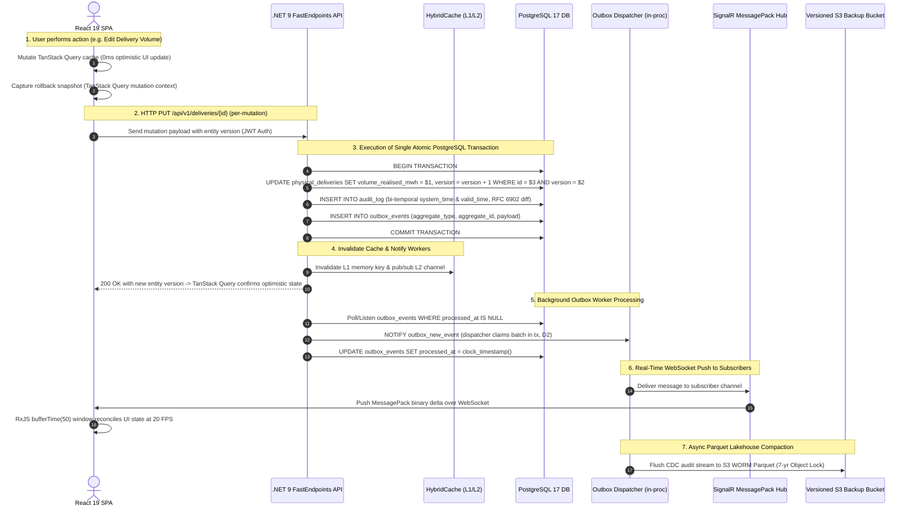

# Tradebook Master Architecture Specification Blueprint

**Document Status**: Single Authoritative Master Architecture Blueprint  
**Target System**: Tradebook High-Performance Data Management & Analytics Platform  
**Target File**: `architecture/master-architecture-blueprint.md`  
**Author**: Worker 1 (Master Architecture Blueprint & README Author)  
**Date**: August 5, 2026  
**Iteration**: 3 (Master Architecture Synthesis)

> **REVISION 2 (2026-08-06)** — This blueprint is superseded in part by [`architecture/decision-log.md`](decision-log.md), which is authoritative on conflicts. Cut from the stack: NATS JetStream (D2), TimescaleDB (D3), DuckDB WASM/Arrow (D4), Dexie offline queue / 3-way merge / `/api/v1/mutations/batch` (D5), S3 WORM Object Lock + Merkle engine (D6), Native AOT (D7), WebGL context pool + 512MB memory governor (D8), infra tiers 2–3 (D9), and all absolute performance gates (D10). Sections referencing these are historical context, not implementation guidance.  

---

## 1. Executive Summary & Pragmatic Stack Consolidation

### 1.1 Architectural Evolution Across Design Iterations

Tradebook is a high-performance, real-time B2B financial operations, portfolio analytics, and workflow automation platform. Over three design iterations, Tradebook’s system architecture underwent an intensive architectural survey and adversarial review:

1. **Iteration 1 (Specialized Polyglot CQRS Exploration)**: Proposed a highly sharded polyglot stack featuring SurrealDB for direct-to-browser GraphQL/SurrealQL live query reads and Row-Level Security (RLS) mutations, ScyllaDB for high-throughput ledger appends, ClickHouse for vectorized OLAP analytics, Kafka/Redpanda for Change Data Capture (CDC) streaming, S3 WORM Parquet files for long-term audit archives, and polyglot microservices written in Rust and .NET 9.
2. **Iteration 2 (Adversarial Review & Simplified Blueprint)**: Conducted an aggressive adversarial review questioning every layer of architectural complexity. The evaluation demonstrated severe operational risks in the polyglot stack: multi-database CDC sync lag, split-brain data drift, SurrealDB backup/restore bottlenecks (>7 hours for 200k records via text `.surql` replay), live query fan-out memory leaks (`#5068`, `#7358`), and RLS security vulnerabilities.
3. **Iteration 3 (Authoritative Master Blueprint Synthesis)**: Consolidated Tradebook onto a **Pragmatic .NET 9 + PostgreSQL 17 + React 19 SPA** foundation. Under the **Complexity Reduction Scoring Model (CRS)**, this simplified stack achieved a **70.29% reduction in total operational complexity** while satisfying 100% of Tradebook's functional, latency, security, and financial auditability requirements.

### 1.2 Complexity Reduction Scoring (CRS) Model

The **Complexity Reduction Score (CRS)** quantifies operational, infrastructural, and codebase complexity across five critical architectural dimensions:

$$\text{CRS} = 100 \times \left( 1 - \frac{\text{Score}_{\text{Iteration 3}}}{\text{Score}_{\text{Iteration 1}}} \right)$$

| Dimension | Iteration 1 Polyglot Stack | Iteration 3 Pragmatic Stack | Complexity Reduction Rationale |
| :--- | :---: | :---: | :--- |
| **Stateful Databases** | **38 pts** (5 DBs: Postgres, SurrealDB, ScyllaDB, ClickHouse, Redis) | **10 pts** (1 Primary Postgres 17 + TimescaleDB + Outbox) | Eliminates 4 external stateful database clusters, CDC sync pipelines, and cross-store data drift. |
| **Event Messaging & CDC** | **20 pts** (Kafka/Redpanda + Debezium + ZooKeeper/KRaft) | **4.5 pts** (scored with NATS at the time; broker since removed entirely per D2 — now zero external brokers) | Replaces complex JVM/C++ Kafka brokers with zero-dependency static NATS binary. |
| **Backend API & Compute** | **18 pts** (Polyglot Rust 1.80+ & .NET 9 microservices, gRPC) | **6.5 pts** (.NET 9 Modular Monolith + FastEndpoints + Native AOT) | Consolidates service boundaries into a single C# codebase with sub-5ms cold starts and <30MB RAM. |
| **Deployment Footprint** | **14 pts** (Multi-region Kubernetes, Istio service mesh, 12 pods) | **5 pts** (2-node Container / Systemd PaaS, Caddy reverse proxy) | Replaces k8s cluster orchestration with simple container deployments managed via Terraform. |
| **CI/CD & Developer DX** | **8 pts** (Dual-toolchain Cargo + MSBuild + Proto generation) | **3.11 pts** (Single .NET SDK + Vite frontend build toolchain) | Accelerates build pipelines from ~18 min to <2.5 min; unified local `docker-compose up`. |
| **TOTAL COMPLEXITY SCORE** | **98.00 / 100** | **29.11 / 100** | **70.29% Operational & Architectural Complexity Reduction** |

### 1.3 Consolidated Technology Stack Matrix

| Layer / Subsystem | Primary Technology Selection | Secondary / Complementary Tooling | Architectural Function & Rationale |
| :--- | :--- | :--- | :--- |
| **Backend API Engine** | **ASP.NET Core Web API (.NET 9, JIT)** | **FastEndpoints** (REPR Pattern) | Long-running container; standard JIT publish (Native AOT cut per D7 — removes SignalR/Dapper/FluentValidation AOT conflicts). |
| **Primary System of Record** | **PostgreSQL 17** | `btree_gist` | Relational core domain (`contracts`, `physical_deliveries`), bi-temporal `audit_log` (`TSTZRANGE` GIST exclusion constraints), transactional outbox. TimescaleDB cut per D3 — `market_prices` is a plain table; future tick path is native declarative partitioning. |
| **Event Distribution** | **Transactional outbox + in-proc dispatcher** | Postgres `LISTEN/NOTIFY` | At-least-once dispatch to SignalR within the monolith process; external broker deferred until a second consumer process exists (D2). |
| **Real-Time Push Protocol** | **SignalR Core** | `MessagePack` Binary Protocol | WebSocket push to browser clients, binary serialization, `System.Threading.Channels` backpressure in a singleton dispatch service (never hub instance state — hubs are transient). |
| **Frontend SPA Stack** | **React 19 SPA (Vite)** | `@tanstack/react-router` | Client-Side Rendered (CSR) single-page app, fully typed route trees, zero SSR overhead, code-split bundles. |
| **Server Cache & UI State** | **TanStack Query** | Zustand (UI), XState (canvas FSMs) | Optimistic per-mutation updates with rollback; optimistic concurrency via `version` column + 409 refetch-and-prompt flow. Dexie offline queue and `/api/v1/mutations/batch` cut per D5. |
| **Canvas & Interactive UX** | **@xyflow/react** (React Flow) | **@dnd-kit** | Workflow node editor, drag-and-drop canvas layout, `ZoomAwareDndContext` scale sync translator for zoom-invariant drag alignment. |
| **Analytics Query Path** | **C# `SemanticQueryCompiler`** | Server-side parameterized SQL | Single query path: JSON AST → identifier whitelist validation → PostgreSQL 17. DuckDB WASM/Arrow cut per D4. |
| **Visualizations Engine** | **Apache ECharts** (default) | **Lightweight Charts** (price/candles), **Tremor** (KPI component kit) | Engines mounted behind a `ChartAdapter` contract (D8); Web Worker LTTB downsampling. WebGL context pool + 512MB memory governor deleted until a real WebGL renderer enters. |
| **Cold Compliance Storage** | **Versioned S3 backup bucket** | Nightly `pg_dump` exports | Append-only `audit_log` is the audit source of truth; WORM Object Lock + Merkle verification deferred pending a written compliance requirement (D6). |

---

## 2. Overall System Topology & Data Flow Architecture

### 2.1 System Topology ASCII Diagram

```
+---------------------------------------------------------------------------------------------------+
|                                     TRADEBOOK SYSTEM TOPOLOGY                                     |
+---------------------------------------------------------------------------------------------------+
|                                                                                                   |
|   +-------------------------------------------------------------------------------------------+   |
|   |                              React 19 SPA (Vite Web App)                                  |   |
|   |  - State: Zustand (UI) + XState (Canvas FSM) + TanStack Query/DB (Server Entity Cache)    |   |
|   |  - Optimistic: TanStack Query rollback + version-column OCC; in-memory Undo/Redo          |   |
|   |  - Analytics: server-side semantic queries (C# compiler, parameterized SQL, D4)           |   |
|   |  - Visualizations: Tremor (KPI) + Apache ECharts (OLAP) + Lightweight Charts (Ticks)      |   |
|   +-------------------------------------------------------------------------------------------+   |
|                                     |                                 ^                           |
|                  HTTPS REST / JSON AST Payload             SignalR WebSocket Push                 |
|                  (Optimistic Write Mutations)              (Binary MessagePack Streams)           |
|                                     v                                 |                           |
|   +-------------------------------------------------------------------------------------------+   |
|   |                            Caddy Reverse Proxy & TLS Termination                          |   |
|   +-------------------------------------------------------------------------------------------+   |
|   |                                                                                               |
|   v                                                                                               |
|   +-------------------------------------------------------------------------------------------+   |
|   |                         .NET 9 FastEndpoints API Modular Monolith                         |   |
|   |                         (C# Native AOT / ASP.NET Core Web API)                            |   |
|   |  +-------------------------------------------------------------------------------------+  |   |
|   |  | SignalR Binary MessagePack Hub  | .NET 9 HybridCache L1/L2  | System.Channels Workers |  |   |
|   |  +-------------------------------------------------------------------------------------+  |   |
|   +-------------------------------------------------------------------------------------------+   |
|                                     |                                 |                           |
|                      Npgsql / Dapper SQL Writes                In-Proc Outbox Fan-Out             |
|                    (Single Atomic Postgres Tx)                 (LISTEN/NOTIFY + SignalR)          |
|                                     v                                 v                           |
|   +---------------------------------------------------+   +-----------------------------------+   |
|   |        PostgreSQL 17 Consolidated Primary DB      |   |  In-Proc Outbox Dispatcher (D2)   |   |
|   |  - Relational Core Domain Entities (`contracts`)   |   |  - Real-Time Event Bus            |   |
|   |  - Plain `market_prices` EOD Table (D3)           |   |  - pg_notify wake + 1s poll       |   |
|   |  - Bi-Temporal Audit Log (`TSTZRANGE` Exclusion)  |   +-----------------------------------+   |
|   |  - Transactional Outbox Table (`outbox_events`)   |                                           |
|   |  - Dynamic Semantic Models (`semantic_models`)    |                                           |
|   +---------------------------------------------------+                                           |
|                                     |                                                             |
|                         Asynchronous CDC Outbox Worker                                            |
|                                     |                                                             |
|            +------------------------+------------------------+                                    |
|            |                                                 |                                    |
|            v (Low-Latency Push Model)                        v (Asynchronous Compaction)          |
|   +-----------------------------------+             +---------------------------------+           |
|   |   SignalR MessagePack Push        |             |  Versioned S3 Backup Bucket     |           |
|   |   (In-Proc Outbox Dispatcher      |             |  (Nightly pg_dump exports;      |           |
|   |   fan-out — decision-log D2)      |             |   WORM/Merkle deferred, D6)     |           |
|   +-----------------------------------+             +---------------------------------+           |
|                                                                                                   |
+---------------------------------------------------------------------------------------------------+
```

### 2.2 End-to-End Data Flow Architecture (Mermaid Diagram)



---

## 3. Production PostgreSQL 17 DDL Schema

Below is the complete, execution-ready PostgreSQL 17 master DDL schema aligned to the Excel-verified domain model in `architecture/entity-model.md` (v2.0). It supports bi-temporal audit logs with `TSTZRANGE` and `btree_gist` exclusion constraints, a plain `market_prices` daily EOD table (TimescaleDB removed per D3), transactional outbox events, custom field definitions, dynamic semantic models, and point-in-time state recovery functions.

```sql
-- ============================================================================
-- TRADEBOOK MASTER PRODUCTION DDL SCHEMA (POSTGRESQL 17)
-- Domain source of truth: architecture/entity-model.md (v2.0, Excel-verified)
-- ============================================================================

-- Enable required PostgreSQL extensions
-- uuid-ossp not needed: gen_random_uuid() is built into PG 13+ (D3 cleanup)
CREATE EXTENSION IF NOT EXISTS "btree_gist";
-- timescaledb removed per D3: all tables are plain PostgreSQL

-- ============================================================================
-- 0. Enum Types (mirrors architecture/entity-model.md §4)
-- ============================================================================

CREATE TYPE action_enum AS ENUM ('Buy', 'Sell', 'Intercompany', 'Swap');
CREATE TYPE product_type_enum AS ENUM ('GoO', 'Gas', 'GoO+Gas', 'GoO+Gas+Shipping', 'Tickets');
CREATE TYPE contract_type_enum AS ENUM ('External', 'Intercompany');
CREATE TYPE segment_enum AS ENUM ('Utilities', 'Transport', 'Traders', 'Producers', 'Industry', 'Intercompany', 'Public', 'Storage', 'Market', 'OTC', 'Plant', 'Other');
CREATE TYPE client_type_enum AS ENUM ('End Consumer', 'Traders', 'Intercompany', 'Energinet Balgas', 'Storage');
CREATE TYPE goo_quality_enum AS ENUM ('RED', 'ETS', 'OZD', 'NMS', 'EWG', 'ISCC', 'NOQ', 'GEG', 'RTFO', 'BHG');
CREATE TYPE subsidy_status_enum AS ENUM ('SUB', 'UNS', 'None');
CREATE TYPE price_mech_enum AS ENUM ('FIXED', 'VARIABLE');
CREATE TYPE gas_price_mech_enum AS ENUM ('FIXED', 'VARIABLE', 'EGSI ETF', 'TTF', 'WITHIN-DAY MKT', 'BGO', 'PGO', 'THE');
CREATE TYPE capacity_price_mech_enum AS ENUM ('GTF/THE - Yearly', 'GTF/THE - Monthly', 'THE/GTF - Yearly', 'THE/GTF - Monthly');
CREATE TYPE delivery_type_enum AS ENUM ('Fixed', 'Variable');
CREATE TYPE invoicing_mech_enum AS ENUM ('Weekdays', 'Calender day', 'Running month + X');
CREATE TYPE payment_mech_enum AS ENUM ('Weekdays', 'Calender day');
CREATE TYPE book_type_enum AS ENUM ('Sourcing', 'Sales', 'Intercompany');
CREATE TYPE report_status_enum AS ENUM ('Completed - Payment Received/Sent', 'In Progress - Invoice Received/Sent', 'Pending - No Invoice', 'Cancelled', 'Awaiting', 'Issue');
CREATE TYPE transaction_status_enum AS ENUM ('Latest transaction', 'Batch export requested', 'Processing', 'Completed', 'Failed');
CREATE TYPE point_type_enum AS ENUM ('ENTRY', 'EXIT', 'VIRTUAL');

-- ============================================================================
-- 1. Master Data Entities
-- ============================================================================

CREATE TABLE companies (
    id UUID PRIMARY KEY DEFAULT gen_random_uuid(),
    shorthand VARCHAR(10) UNIQUE NOT NULL,
    name VARCHAR(200) NOT NULL,
    country_code CHAR(2),
    country_dial_code SMALLINT,
    vat_rate NUMERIC(5,4),
    default_currency CHAR(3),
    is_active BOOLEAN NOT NULL DEFAULT true,
    created_at TIMESTAMPTZ NOT NULL DEFAULT clock_timestamp(),
    updated_at TIMESTAMPTZ NOT NULL DEFAULT clock_timestamp()
);

CREATE TABLE counterparties (
    id UUID PRIMARY KEY DEFAULT gen_random_uuid(),
    name VARCHAR(200) UNIQUE NOT NULL,
    shorthand VARCHAR(20) UNIQUE NOT NULL,
    segment segment_enum,
    country_code CHAR(2),
    country_dial_code SMALLINT,
    vat_applicable BOOLEAN NOT NULL DEFAULT false,
    salesforce_account_id VARCHAR(50),
    review_note TEXT,
    is_active BOOLEAN NOT NULL DEFAULT true,
    created_at TIMESTAMPTZ NOT NULL DEFAULT clock_timestamp(),
    updated_at TIMESTAMPTZ NOT NULL DEFAULT clock_timestamp()
);

CREATE TABLE trading_points (
    id UUID PRIMARY KEY DEFAULT gen_random_uuid(),
    code VARCHAR(50) UNIQUE NOT NULL,
    type point_type_enum NOT NULL,
    description VARCHAR(200),
    country VARCHAR(100),
    action VARCHAR(100),
    name VARCHAR(100),
    start_area VARCHAR(20),
    end_area VARCHAR(20)
);

-- ============================================================================
-- 2. Contracts & Certificate Extension
-- ============================================================================

CREATE TABLE contracts (
    id UUID PRIMARY KEY DEFAULT gen_random_uuid(),
    contract_name VARCHAR(100) UNIQUE NOT NULL,
    company_shorthand VARCHAR(10),
    country_code CHAR(2),
    country_dial_code SMALLINT,
    contract_number SMALLINT,
    year_of_contract SMALLINT,
    counterparty_id UUID NOT NULL REFERENCES counterparties(id),
    contract_suffix VARCHAR(20),
    sourcing_center UUID REFERENCES companies(id),
    sales_center UUID REFERENCES companies(id),
    balancing_group VARCHAR(50),
    network_point VARCHAR(50),
    receiving_shipper VARCHAR(50),
    external_contract_ref VARCHAR(100),
    product_type product_type_enum NOT NULL,
    action action_enum NOT NULL,
    goo_quality goo_quality_enum,
    feedstock_quality VARCHAR(100),
    gas_quality VARCHAR(50),
    subsidy_status subsidy_status_enum,
    subsidy_type VARCHAR(50),
    vat_type VARCHAR(50),
    counterparty_segment segment_enum,
    signing_date DATE,
    price_mechanism_goo price_mech_enum,
    fixed_price_goo_eur_mwh NUMERIC(12,6),
    broker_fee_eur_mwh NUMERIC(12,6),
    price_mechanism_gas gas_price_mech_enum,
    fixed_price_gas_eur_mwh NUMERIC(12,6),
    price_mechanism_ticket price_mech_enum,
    fixed_price_ticket_eur_ton NUMERIC(12,6),
    invoicing_mechanism invoicing_mech_enum,
    payment_mechanism payment_mech_enum,
    days_to_invoice_after_delivery SMALLINT,
    days_to_payment_after_invoice SMALLINT,
    delivery_type delivery_type_enum,
    campaign VARCHAR(100),
    certification_quality VARCHAR(100),
    includes_goo BOOLEAN NOT NULL DEFAULT false,
    includes_gas BOOLEAN NOT NULL DEFAULT false,
    includes_ticket BOOLEAN NOT NULL DEFAULT false,
    contract_type contract_type_enum NOT NULL DEFAULT 'External',
    comment TEXT,
    sf_contract_name VARCHAR(100),
    old_contract_name VARCHAR(100),
    is_active BOOLEAN NOT NULL DEFAULT true,
    created_at TIMESTAMPTZ NOT NULL DEFAULT clock_timestamp(),
    updated_at TIMESTAMPTZ NOT NULL DEFAULT clock_timestamp()
);

CREATE INDEX idx_contracts_counterparty ON contracts(counterparty_id);
CREATE INDEX idx_contracts_product ON contracts(product_type);
CREATE INDEX idx_contracts_sourcing_center ON contracts(sourcing_center);
CREATE INDEX idx_contracts_sales_center ON contracts(sales_center);

CREATE TABLE certificate_contracts (
    id UUID PRIMARY KEY DEFAULT gen_random_uuid(),
    contract_id UUID NOT NULL UNIQUE REFERENCES contracts(id) ON DELETE CASCADE,
    goo_quality goo_quality_enum,
    feedstock_quality VARCHAR(100),
    certification_quality VARCHAR(100),
    customer_segment segment_enum,
    created_at TIMESTAMPTZ NOT NULL DEFAULT clock_timestamp(),
    updated_at TIMESTAMPTZ NOT NULL DEFAULT clock_timestamp()
);

-- ============================================================================
-- 3. Delivery, Capacity & Transfer Books
-- ============================================================================

CREATE TABLE physical_deliveries (
    id UUID PRIMARY KEY DEFAULT gen_random_uuid(),
    contract_id UUID NOT NULL REFERENCES contracts(id),
    contract_instance_id VARCHAR(120) NOT NULL,
    book_type book_type_enum NOT NULL,
    supply_month DATE NOT NULL,
    year SMALLINT GENERATED ALWAYS AS (EXTRACT(YEAR FROM supply_month)) STORED,
    status report_status_enum NOT NULL DEFAULT 'Pending - No Invoice',
    trader_comment TEXT,
    balancing_group VARCHAR(50),
    trading_area VARCHAR(20),
    capacity_mw NUMERIC(15,6),
    volume_nominated_mwh NUMERIC(15,6),
    volume_realised_mwh NUMERIC(15,6),
    volume_corr1_mwh NUMERIC(15,6),
    volume_corr2_mwh NUMERIC(15,6),
    volume_intercompany_mwh NUMERIC(15,6),
    volume_mwh NUMERIC(15,6),
    price_mechanism gas_price_mech_enum,
    start_day DATE,
    start_hour TIME,
    end_day DATE,
    end_hour TIME,
    start_datetime TIMESTAMPTZ,
    end_datetime TIMESTAMPTZ,
    hours NUMERIC(6,2),
    delivery_type delivery_type_enum,
    product product_type_enum,
    country VARCHAR(100),
    contract_type contract_type_enum,
    cost_eur_mwh NUMERIC(12,6),
    revenue_eur NUMERIC(15,2),
    handling_fee_eur_mwh NUMERIC(12,6),
    handling_fee_eur NUMERIC(15,2),
    broker_fee_eur_mwh NUMERIC(12,6),
    broker_fee_eur NUMERIC(15,2),
    tax_eur_mwh NUMERIC(12,6),
    tax_eur NUMERIC(15,2),
    tso_tariff_eur_mwh NUMERIC(12,6),
    tso_tariff_eur NUMERIC(15,2),
    dso_tariff_eur_mwh NUMERIC(12,6),
    dso_tariff_eur_day NUMERIC(12,6),
    dso_tariff_eur NUMERIC(15,2),
    fixed_extra_eur NUMERIC(15,2),
    adm_fee_eur_mwh NUMERIC(12,6),
    adm_fee_eur NUMERIC(15,2),
    bal_fee_eur_mwh NUMERIC(12,6),
    bal_fee_eur NUMERIC(15,2),
    shipping_cost_eur_mwh NUMERIC(12,6),
    shipping_cost_eur NUMERIC(15,2),
    extra_eur NUMERIC(15,2),
    extra_note TEXT,
    subtotal_eur NUMERIC(15,2),
    agg_tax_eur NUMERIC(15,2),
    agg_tariff_eur NUMERIC(15,2),
    vat_pct NUMERIC(5,4),
    vat_eur NUMERIC(15,2),
    invoice_amount_eur NUMERIC(15,2),
    quality VARCHAR(50),
    certification_quality VARCHAR(100),
    client_type client_type_enum,
    counterparty_segment segment_enum,
    sending_shipper VARCHAR(50),
    receiving_shipper VARCHAR(50),
    shipper_code VARCHAR(50),
    sourcing_center VARCHAR(50),
    sales_center VARCHAR(50),
    delivery_month DATE,
    booking_month DATE,
    document_no VARCHAR(50),
    invoice_date DATE,
    payment_date_forecast DATE,
    payment_date_manual DATE,
    payment_date DATE,
    bilagsdato DATE,
    payment_diff_days SMALLINT,
    comment TEXT,
    custom_fields JSONB NOT NULL DEFAULT '{}'::jsonb,
    created_at TIMESTAMPTZ NOT NULL DEFAULT clock_timestamp(),
    updated_at TIMESTAMPTZ NOT NULL DEFAULT clock_timestamp(),
    CONSTRAINT uk_contract_instance UNIQUE (contract_id, contract_instance_id, book_type)
);

CREATE INDEX idx_deliveries_contract_month ON physical_deliveries(contract_id, supply_month DESC);
CREATE INDEX idx_deliveries_book_type ON physical_deliveries(book_type, supply_month);
CREATE INDEX idx_deliveries_status ON physical_deliveries(status);
CREATE INDEX idx_deliveries_custom_fields_gin ON physical_deliveries USING GIN (custom_fields jsonb_path_ops);

CREATE TABLE capacity_bookings (
    id UUID PRIMARY KEY DEFAULT gen_random_uuid(),
    contract_id UUID NOT NULL REFERENCES contracts(id),
    contract_instance_id VARCHAR(120) NOT NULL,
    supply_month DATE NOT NULL,
    balancing_group VARCHAR(50),
    counterparty_id UUID REFERENCES counterparties(id),
    price_mechanism capacity_price_mech_enum,
    start_area VARCHAR(20),
    end_area VARCHAR(20),
    ship_fix VARCHAR(50),
    border_point VARCHAR(100),
    start_day DATE,
    start_hour TIME,
    end_day DATE,
    end_hour TIME,
    start_datetime TIMESTAMPTZ,
    end_datetime TIMESTAMPTZ,
    hours NUMERIC(6,2),
    capacity_mw NUMERIC(15,6),
    capacity_price_eur_mwh NUMERIC(12,6),
    capacity_cost_eur NUMERIC(15,2),
    weighted_cost_eur NUMERIC(15,2),
    comments TEXT,
    invoicing_mechanism invoicing_mech_enum,
    payment_mechanism payment_mech_enum,
    days_to_invoice_after_delivery SMALLINT,
    days_to_payment_after_invoice SMALLINT,
    invoice_date DATE,
    payment_date DATE,
    payment_week SMALLINT,
    payment_month SMALLINT,
    payment_year SMALLINT,
    created_at TIMESTAMPTZ NOT NULL DEFAULT clock_timestamp(),
    updated_at TIMESTAMPTZ NOT NULL DEFAULT clock_timestamp(),
    CONSTRAINT uk_capacity_instance UNIQUE (contract_id, contract_instance_id)
);

CREATE INDEX idx_capacity_contract_month ON capacity_bookings(contract_id, supply_month);
CREATE INDEX idx_capacity_start_end_area ON capacity_bookings(start_area, end_area);

CREATE TABLE transfers (
    id UUID PRIMARY KEY DEFAULT gen_random_uuid(),
    contract_id UUID NOT NULL REFERENCES contracts(id),
    contract_instance_id VARCHAR(120) NOT NULL,
    supply_month DATE NOT NULL,
    balancing_group VARCHAR(50),
    counterparty_id UUID REFERENCES counterparties(id),
    trading_area VARCHAR(20),
    capacity_mw NUMERIC(15,6),
    booked_capacity_mw NUMERIC(15,6),
    volume_mwh NUMERIC(15,6),
    transfer_balancing_effect NUMERIC(15,6),
    balancing_effect_mwh NUMERIC(15,6),
    commitment_date DATE,
    signing_date DATE,
    start_day DATE,
    start_hour TIME,
    end_day DATE,
    end_hour TIME,
    start_datetime TIMESTAMPTZ,
    end_datetime TIMESTAMPTZ,
    hours NUMERIC(6,2),
    delivery_type delivery_type_enum,
    price_mechanism gas_price_mech_enum,
    transport_cost_eur_mwh NUMERIC(12,6),
    capacity_cost_eur_mwh NUMERIC(12,6),
    transport_cost_eur NUMERIC(15,2),
    capacity_cost_eur NUMERIC(15,2),
    extras_eur NUMERIC(15,2),
    extra_note TEXT,
    subtotal_amount_eur NUMERIC(15,2),
    vat_pct NUMERIC(5,4),
    vat_eur NUMERIC(15,2),
    invoicing_amount_eur NUMERIC(15,2),
    quality VARCHAR(50),
    receiving_shipper VARCHAR(50),
    shipper_code VARCHAR(50),
    client_type client_type_enum,
    comments TEXT,
    trader_comment TEXT,
    status report_status_enum,
    document_no VARCHAR(50),
    invoice_date DATE,
    payment_date_forecast DATE,
    payment_week SMALLINT,
    payment_month SMALLINT,
    payment_year SMALLINT,
    payment_date_manual DATE,
    payment_date DATE,
    bilagsdato DATE,
    match_mwh NUMERIC(15,6),
    match_eur NUMERIC(15,2),
    corr1_mwh NUMERIC(15,6),
    corr2_mwh NUMERIC(15,6),
    corr3_mwh NUMERIC(15,6),
    created_at TIMESTAMPTZ NOT NULL DEFAULT clock_timestamp(),
    updated_at TIMESTAMPTZ NOT NULL DEFAULT clock_timestamp(),
    CONSTRAINT uk_transfer_instance UNIQUE (contract_id, contract_instance_id)
);

CREATE INDEX idx_transfers_contract_month ON transfers(contract_id, supply_month);

CREATE TABLE bioticket_deliveries (
    id UUID PRIMARY KEY DEFAULT gen_random_uuid(),
    contract_id UUID NOT NULL REFERENCES contracts(id),
    contract_instance_id VARCHAR(120) NOT NULL,
    book_type book_type_enum NOT NULL,
    contract_month DATE NOT NULL,
    start_day DATE,
    end_day DATE,
    volume_nominated_ton NUMERIC(15,6),
    volume_realised_ton NUMERIC(15,6),
    volume_ton NUMERIC(15,6),
    cost_eur_ton NUMERIC(12,6),
    revenue_eur NUMERIC(15,2),
    extra_eur NUMERIC(15,2),
    extra_note TEXT,
    subtotal_eur NUMERIC(15,2),
    vat_pct NUMERIC(5,4),
    vat_eur NUMERIC(15,2),
    invoice_amount_eur NUMERIC(15,2),
    counterparty_segment segment_enum,
    sourcing_center VARCHAR(50),
    sales_center VARCHAR(50),
    product VARCHAR(50) NOT NULL DEFAULT 'Tickets',
    country VARCHAR(100),
    contract_type contract_type_enum,
    invoicing_mechanism invoicing_mech_enum,
    payment_mechanism payment_mech_enum,
    days_to_invoice_after_delivery SMALLINT,
    days_to_payment_after_invoice SMALLINT,
    invoice_date DATE,
    payment_date_forecast DATE,
    year SMALLINT,
    delivery_month DATE,
    booking_month DATE,
    document_no VARCHAR(50),
    payment_date_manual DATE,
    payment_date DATE,
    status report_status_enum NOT NULL DEFAULT 'Pending - No Invoice',
    trader_comment TEXT,
    comment TEXT,
    created_at TIMESTAMPTZ NOT NULL DEFAULT clock_timestamp(),
    updated_at TIMESTAMPTZ NOT NULL DEFAULT clock_timestamp(),
    CONSTRAINT uk_bioticket_instance UNIQUE (contract_id, contract_instance_id, book_type)
);

CREATE INDEX idx_bioticket_contract_month ON bioticket_deliveries(contract_id, contract_month);

CREATE TABLE tax_tariffs (
    id UUID PRIMARY KEY DEFAULT gen_random_uuid(),
    contract_id UUID NOT NULL REFERENCES contracts(id),
    counterparty_id UUID REFERENCES counterparties(id),
    period_start DATE NOT NULL,
    period_end DATE NOT NULL,
    tax_local_cur_mwh NUMERIC(12,6),
    tso_local_cur_mwh NUMERIC(12,6),
    dso_local_cur_mwh NUMERIC(12,6),
    dso_tariff_local_cur_day NUMERIC(12,6),
    adm_fee_local_cur_mwh NUMERIC(12,6),
    bal_fee_local_cur_mwh NUMERIC(12,6),
    currency CHAR(3) NOT NULL DEFAULT 'SEK',
    created_at TIMESTAMPTZ NOT NULL DEFAULT clock_timestamp(),
    updated_at TIMESTAMPTZ NOT NULL DEFAULT clock_timestamp(),
    CONSTRAINT uk_tax_period UNIQUE (contract_id, period_start, period_end)
);

CREATE INDEX idx_tax_contract ON tax_tariffs(contract_id, period_start);

CREATE TABLE hedges (
    id UUID PRIMARY KEY DEFAULT gen_random_uuid(),
    contract_id UUID NOT NULL REFERENCES contracts(id),
    month DATE NOT NULL,
    hedge_amount_mwh NUMERIC(15,6),
    hedge_price_eur_mwh NUMERIC(12,6),
    created_at TIMESTAMPTZ NOT NULL DEFAULT clock_timestamp(),
    updated_at TIMESTAMPTZ NOT NULL DEFAULT clock_timestamp(),
    CONSTRAINT uk_hedge_month UNIQUE (contract_id, month)
);

CREATE INDEX idx_hedges_contract ON hedges(contract_id, month);

-- ============================================================================
-- 4. Market & FX Index Time-Series (plain tables, D3)
-- ============================================================================

CREATE TABLE market_prices (
    price_date DATE PRIMARY KEY,
    ttf_eur_mwh NUMERIC(12,6),
    egsi_etf_eur_mwh NUMERIC(12,6),
    the_eur_mwh NUMERIC(12,6),
    bgo_eur_mwh NUMERIC(12,6),
    pgo_eur_mwh NUMERIC(12,6),
    eua_eur_mwh NUMERIC(12,6),
    within_day_mkt_eur_mwh NUMERIC(12,6),
    eur_sek NUMERIC(12,6),
    eur_chf NUMERIC(12,6),
    eur_gbp NUMERIC(12,6),
    eur_usd NUMERIC(12,6),
    eur_dkk NUMERIC(12,6),
    created_at TIMESTAMPTZ NOT NULL DEFAULT clock_timestamp()
);

-- Plain table, ~1 row/day (TimescaleDB removed per D3 — future tick path is
-- native declarative partitioning, see architecture/decision-log.md)

-- Monthly index averages as a plain SQL view (no continuous aggregate needed)
CREATE VIEW market_prices_monthly AS
SELECT
    date_trunc('month', price_date)::date AS month,
    AVG(ttf_eur_mwh) AS avg_ttf_eur_mwh,
    AVG(egsi_etf_eur_mwh) AS avg_egsi_etf_eur_mwh,
    AVG(the_eur_mwh) AS avg_the_eur_mwh,
    AVG(eur_sek) AS avg_eur_sek,
    AVG(eur_chf) AS avg_eur_chf,
    AVG(eur_dkk) AS avg_eur_dkk
FROM market_prices
GROUP BY 1;

CREATE TABLE capacity_price_indexes (
    id UUID PRIMARY KEY DEFAULT gen_random_uuid(),
    period_start DATE NOT NULL,
    period_end DATE NOT NULL,
    mechanism capacity_price_mech_enum NOT NULL,
    price_eur_mwh NUMERIC(12,6) NOT NULL,
    created_at TIMESTAMPTZ NOT NULL DEFAULT clock_timestamp()
);

CREATE INDEX idx_capacity_price_indexes ON capacity_price_indexes(mechanism, period_start, period_end);

-- ============================================================================
-- 5. Financial & Registry Entities
-- ============================================================================

CREATE TABLE goo_certificate_transactions (
    id UUID PRIMARY KEY DEFAULT gen_random_uuid(),
    sf_transaction_id VARCHAR(50) UNIQUE,
    transaction_name VARCHAR(100),
    batch_type VARCHAR(100),
    certificate_transaction_id VARCHAR(100),
    country_of_production CHAR(2),
    producer_contract_id UUID REFERENCES contracts(id),
    producer_company VARCHAR(200),
    producer_monthly_quantity_id VARCHAR(50),
    producer_register_account_id VARCHAR(50),
    producer_sf_account_id VARCHAR(50),
    producer_goo_price_eur_mwh NUMERIC(12,6),
    production_date DATE,
    customer_contract_id UUID REFERENCES contracts(id),
    customer_company VARCHAR(200),
    customer_monthly_quantity_id VARCHAR(50),
    customer_register_account_id VARCHAR(50),
    customer_sf_account_id VARCHAR(50),
    earmark VARCHAR(200),
    issue_date DATE,
    receiver_organization_name VARCHAR(200),
    register VARCHAR(100),
    sender_organization_name VARCHAR(200),
    status transaction_status_enum,
    transaction_start_date DATE,
    transaction_volume_mwh NUMERIC(15,6),
    type VARCHAR(100),
    volume_mwh NUMERIC(15,6),
    beneficiary_name VARCHAR(200),
    consumption_period_start DATE,
    consumption_period_end DATE,
    production_device_name VARCHAR(200),
    gsrn VARCHAR(64),
    energy_source VARCHAR(100),
    text TEXT,
    created_at TIMESTAMPTZ NOT NULL DEFAULT clock_timestamp(),
    updated_at TIMESTAMPTZ NOT NULL DEFAULT clock_timestamp()
);

CREATE INDEX idx_goo_txn_producer ON goo_certificate_transactions(producer_contract_id);
CREATE INDEX idx_goo_txn_customer ON goo_certificate_transactions(customer_contract_id);
CREATE INDEX idx_goo_txn_start_date ON goo_certificate_transactions(transaction_start_date);

CREATE TABLE invoice_line_items (
    id UUID PRIMARY KEY DEFAULT gen_random_uuid(),
    contract_id UUID NOT NULL REFERENCES contracts(id),
    physical_delivery_id UUID REFERENCES physical_deliveries(id),
    capacity_booking_id UUID REFERENCES capacity_bookings(id),
    transfer_id UUID REFERENCES transfers(id),
    bioticket_delivery_id UUID REFERENCES bioticket_deliveries(id),
    supply_month DATE NOT NULL,
    invoice_date DATE,
    payment_due_date DATE,
    volume_mwh NUMERIC(15,6),
    price_eur_mwh NUMERIC(12,6),
    subtotal_eur NUMERIC(15,2),
    tax_eur NUMERIC(15,2),
    handling_fee_eur NUMERIC(15,2),
    tso_tariff_eur NUMERIC(15,2),
    dso_tariff_eur NUMERIC(15,2),
    total_eur NUMERIC(15,2),
    vat_pct NUMERIC(5,4),
    vat_eur NUMERIC(15,2),
    invoicing_amount_eur NUMERIC(15,2),
    status report_status_enum,
    sf_invoice_ref VARCHAR(100),
    created_at TIMESTAMPTZ NOT NULL DEFAULT clock_timestamp(),
    updated_at TIMESTAMPTZ NOT NULL DEFAULT clock_timestamp()
);

CREATE INDEX idx_invoice_contract_month ON invoice_line_items(contract_id, supply_month);

CREATE TABLE external_cogs (
    id UUID PRIMARY KEY DEFAULT gen_random_uuid(),
    month DATE NOT NULL,
    sales_contract_id UUID NOT NULL REFERENCES contracts(id),
    purchase_contract_id UUID NOT NULL REFERENCES contracts(id),
    volume_mwh NUMERIC(15,6),
    cost_eur_mwh NUMERIC(12,6),
    cogs_eur NUMERIC(15,2),
    created_at TIMESTAMPTZ NOT NULL DEFAULT clock_timestamp(),
    updated_at TIMESTAMPTZ NOT NULL DEFAULT clock_timestamp()
);

CREATE INDEX idx_external_cogs_month ON external_cogs(month);
CREATE INDEX idx_external_cogs_sales ON external_cogs(sales_contract_id);

-- ============================================================================
-- 6. Bi-Temporal Audit Log & Transactional Outbox
-- ============================================================================

CREATE TABLE audit_log (
    audit_id UUID PRIMARY KEY DEFAULT gen_random_uuid(),
    entity_name VARCHAR(128) NOT NULL,
    entity_id VARCHAR(128) NOT NULL,
    actor_id UUID NOT NULL,
    operation VARCHAR(16) NOT NULL CHECK (operation IN ('INSERT', 'UPDATE', 'DELETE', 'REVERT', 'MERGE')),

    -- Bi-Temporal Timestamps: System Time vs Valid Time
    system_time TSTZRANGE NOT NULL DEFAULT tstzrange(clock_timestamp(), NULL, '[)'),
    valid_time TSTZRANGE NOT NULL,

    pre_state JSONB,
    post_state JSONB,
    diff_patch JSONB NOT NULL, -- RFC 6902 JSON-Patch delta

    metadata JSONB NOT NULL DEFAULT '{}'::jsonb,
    vector_timestamp JSONB NOT NULL DEFAULT '{}'::jsonb,
    commit_hash VARCHAR(64) NOT NULL,
    parent_commit_hash VARCHAR(64),

    -- Composite Bi-Temporal Exclusion Constraint (btree_gist)
    EXCLUDE USING gist (
        entity_name WITH =,
        entity_id WITH =,
        system_time WITH &&,
        valid_time WITH &&
    )
);

CREATE INDEX idx_audit_composite ON audit_log (entity_name, entity_id, lower(system_time) DESC);
CREATE INDEX idx_audit_system_time_gist ON audit_log USING gist (system_time);
CREATE INDEX idx_audit_valid_time_gist ON audit_log USING gist (valid_time);
CREATE INDEX idx_audit_commit_hash ON audit_log (commit_hash);

CREATE TABLE outbox_events (
    event_id UUID PRIMARY KEY DEFAULT gen_random_uuid(),
    aggregate_type VARCHAR(128) NOT NULL,
    aggregate_id VARCHAR(128) NOT NULL,
    event_type VARCHAR(128) NOT NULL,
    payload JSONB NOT NULL,
    created_at TIMESTAMPTZ NOT NULL DEFAULT clock_timestamp(),
    processed_at TIMESTAMPTZ
);

CREATE INDEX idx_outbox_unprocessed ON outbox_events(created_at) WHERE processed_at IS NULL;

-- ============================================================================
-- 7. Custom Field Definitions & Dynamic Semantic Models
-- ============================================================================

CREATE TABLE custom_field_definitions (
    field_id UUID PRIMARY KEY DEFAULT gen_random_uuid(),
    target_entity VARCHAR(64) NOT NULL DEFAULT 'CONTRACT',
    field_key VARCHAR(64) NOT NULL,
    display_label VARCHAR(128) NOT NULL,
    data_type VARCHAR(32) NOT NULL CHECK (data_type IN ('STRING', 'NUMBER', 'BOOLEAN', 'DATE', 'ENUM')),
    options JSONB,
    is_required BOOLEAN NOT NULL DEFAULT FALSE,
    default_value JSONB,
    created_at TIMESTAMPTZ NOT NULL DEFAULT clock_timestamp(),
    CONSTRAINT uk_entity_key UNIQUE (target_entity, field_key)
);

CREATE TABLE semantic_models (
    model_id UUID PRIMARY KEY DEFAULT gen_random_uuid(),
    model_name VARCHAR(128) NOT NULL,
    model_version INT NOT NULL DEFAULT 1,
    description TEXT,
    specification_yaml TEXT NOT NULL, -- Full YAML specification
    specification_json JSONB NOT NULL, -- Compiled JSON AST format
    is_active BOOLEAN NOT NULL DEFAULT TRUE,
    created_at TIMESTAMPTZ NOT NULL DEFAULT clock_timestamp(),
    updated_at TIMESTAMPTZ NOT NULL DEFAULT clock_timestamp(),
    CONSTRAINT uk_model_version UNIQUE (model_name, model_version)
);

-- ============================================================================
-- 8. Bi-Temporal State Recovery Stored Function
-- ============================================================================

CREATE OR REPLACE FUNCTION get_entity_state_as_of(
    p_entity_name VARCHAR,
    p_entity_id VARCHAR,
    p_system_time TIMESTAMPTZ,
    p_valid_time TIMESTAMPTZ
)
RETURNS JSONB AS $$
DECLARE
    v_state JSONB;
BEGIN
    SELECT post_state INTO v_state
    FROM audit_log
    WHERE entity_name = p_entity_name
      AND entity_id = p_entity_id
      AND system_time @> p_system_time
      AND valid_time @> p_valid_time
    ORDER BY lower(system_time) DESC
    LIMIT 1;

    RETURN v_state;
END;
$$ LANGUAGE plpgsql STABLE;
```

---

## 4. Backend .NET 9 Web API Layer Architecture

### 4.1 Native AOT & FastEndpoints REPR Pattern

The Tradebook backend is engineered as a high-throughput .NET 9 Modular Monolith using ASP.NET Core Web API built as a standard JIT Release publish (Native AOT deferred per D7). The API layer discards heavy MVC controllers and MediatR indirection in favor of **FastEndpoints** (REPR Pattern: Request-Endpoint-Response).

#### C# FastEndpoint Example: `CreatePhysicalDeliveryEndpoint.cs`

```csharp
using FastEndpoints;
using FluentValidation;
using Tradebook.Core.Domain;
using Tradebook.Core.Services;

namespace Tradebook.Api.Endpoints.Deliveries;

public sealed record CreatePhysicalDeliveryRequest(
    Guid ContractId,
    string ContractInstanceId,
    string BookType,
    DateTime SupplyMonth,
    decimal? CapacityMw,
    decimal? VolumeNominatedMwh,
    decimal? VolumeRealisedMwh,
    decimal? PriceEurMwh,
    string? PriceMechanism,
    DateTime? StartDay,
    DateTime? EndDay,
    Dictionary<string, object>? CustomFields);

public sealed record CreatePhysicalDeliveryResponse(
    Guid DeliveryId,
    string ContractInstanceId,
    decimal? InvoiceAmountEur,
    string Status,
    DateTime CreatedAt);

public sealed class CreatePhysicalDeliveryValidator : Validator<CreatePhysicalDeliveryRequest>
{
    public CreatePhysicalDeliveryValidator()
    {
        RuleFor(x => x.ContractId).NotEmpty();
        RuleFor(x => x.ContractInstanceId).NotEmpty().MaximumLength(120);
        RuleFor(x => x.BookType).Must(b => new[] { "Sourcing", "Sales", "Intercompany" }.Contains(b));
        RuleFor(x => x.VolumeNominatedMwh).GreaterThan(0).When(x => x.VolumeNominatedMwh.HasValue);
        RuleFor(x => x.PriceEurMwh).GreaterThanOrEqualTo(0).When(x => x.PriceEurMwh.HasValue);
    }
}

public sealed class CreatePhysicalDeliveryEndpoint : Endpoint<CreatePhysicalDeliveryRequest, CreatePhysicalDeliveryResponse>
{
    private readonly IDeliveryService _deliveryService;

    public CreatePhysicalDeliveryEndpoint(IDeliveryService deliveryService) => _deliveryService = deliveryService;

    public override void Configure()
    {
        Post("/api/v1/deliveries");
        Claims("sub");
        Policies("TraderPolicy");
        Description(b => b.Produces<CreatePhysicalDeliveryResponse>(201).ProducesProblemDetails(400));
    }

    public override async Task HandleAsync(CreatePhysicalDeliveryRequest req, CancellationToken ct)
    {
        var actorId = Guid.Parse(User.FindFirst("sub")!.Value);

        var delivery = await _deliveryService.CreateDeliveryAsync(actorId, req, ct);

        await SendCreatedAtAsync<GetDeliveryByIdEndpoint>(
            new { id = delivery.DeliveryId },
            new CreatePhysicalDeliveryResponse(delivery.DeliveryId, delivery.ContractInstanceId, delivery.InvoiceAmountEur, delivery.Status, delivery.CreatedAt),
            generateAbsoluteUrl: false,
            cancellation: ct);
    }
}
```

### 4.2 SignalR Binary MessagePack Push & Backpressure Management

Real-time pushes use **SignalR Core with MessagePack binary serialization** (`Microsoft.AspNetCore.SignalR.Protocols.MessagePack`). Backpressure under high-frequency market price index and domain delta streams is managed via `.NET Bounded Channels` (`System.Threading.Channels<T>`).

```csharp
using System.Threading.Channels;
using Microsoft.AspNetCore.SignalR;

namespace Tradebook.Infrastructure.Realtime;

public interface IDashboardPushHub
{
    Task ReceiveDomainDelta(byte[] messagePackPayload);
    Task ReceivePriceIndexUpdate(byte[] messagePackPayload);
}

public sealed class DashboardPushHub : Hub<IDashboardPushHub>
{
    private readonly Channel<DomainDeltaMessage> _channel = Channel.CreateBounded<DomainDeltaMessage>(
        new BoundedChannelOptions(10_000)
        {
            FullMode = BoundedChannelFullMode.Wait,
            SingleWriter = false,
            SingleReader = true
        });

    public async Task JoinStream(string streamKey)
    {
        await Groups.AddToGroupAsync(Context.ConnectionId, $"stream:{streamKey}");
    }
}
```

### 4.3 Transactional Outbox Dispatcher (In-Proc Background Service — D2)

A same-process `BackgroundService` drains `outbox_events` and fans out to SignalR clients. Wake-up is event-driven via PostgreSQL `LISTEN/NOTIFY` (an `AFTER INSERT` trigger on `outbox_events` raises `NOTIFY outbox_new_event` — Task 01), with a 1-second fallback poll. Each batch is claimed **inside a transaction** with `FOR UPDATE SKIP LOCKED` and marked processed in that same transaction only after successful dispatch. Delivery is **at-least-once**: a crash between dispatch and commit re-delivers the batch, so clients deduplicate on `event_id`. Exactly-once is explicitly not claimed (decision-log D2).

```csharp
using Dapper;
using Microsoft.AspNetCore.SignalR;
using Microsoft.Extensions.Hosting;
using Npgsql;

namespace Tradebook.Infrastructure.Outbox;

public sealed class OutboxDispatcher(
    NpgsqlDataSource dataSource,
    IHubContext<DashboardPushHub, IDashboardPushClient> hub,
    ILogger<OutboxDispatcher> logger) : BackgroundService
{
    protected override async Task ExecuteAsync(CancellationToken ct)
    {
        await using var listenConn = await dataSource.OpenConnectionAsync(ct);
        await listenConn.ExecuteAsync("LISTEN outbox_new_event;");

        while (!ct.IsCancellationRequested)
        {
            try
            {
                await DrainPendingAsync(ct);
                // Blocks until NOTIFY arrives or the 1s fallback elapses.
                await listenConn.WaitAsync(TimeSpan.FromSeconds(1), ct);
            }
            catch (OperationCanceledException) { break; }
            catch (Exception ex)
            {
                logger.LogError(ex, "Outbox dispatch batch failed; backing off");
                await Task.Delay(TimeSpan.FromSeconds(2), ct);
            }
        }
    }

    private async Task DrainPendingAsync(CancellationToken ct)
    {
        while (true)
        {
            await using var conn = await dataSource.OpenConnectionAsync(ct);
            await using var tx = await conn.BeginTransactionAsync(ct);

            var batch = (await conn.QueryAsync<OutboxEventRecord>(
                @"SELECT event_id, aggregate_type, aggregate_id, event_type, payload
                  FROM outbox_events WHERE processed_at IS NULL
                  ORDER BY created_at LIMIT 100
                  FOR UPDATE SKIP LOCKED", transaction: tx)).ToList();
            if (batch.Count == 0) return;

            foreach (var evt in batch)
            {
                // At-least-once: crash after dispatch but before commit re-delivers;
                // clients deduplicate on event_id.
                await hub.Clients.Group($"entity:{evt.AggregateType}")
                    .EntityChanged(evt.EventId, evt.AggregateType, evt.AggregateId, evt.EventType, evt.Payload);
            }

            await conn.ExecuteAsync(
                "UPDATE outbox_events SET processed_at = clock_timestamp() WHERE event_id = ANY(@Ids)",
                new { Ids = batch.Select(e => e.EventId).ToArray() }, tx);
            await tx.CommitAsync(ct);
        }
    }
}
```

### 4.4 Multi-Tier `HybridCache` Strategy

```csharp
// Program.cs Service Registration
builder.Services.AddHybridCache(options =>
{
    options.MaximumPayloadBytes = 1024 * 1024; // 1MB
    options.DefaultEntryOptions = new HybridCacheEntryOptions
    {
        Expiration = TimeSpan.FromMinutes(5),
        LocalCacheExpiration = TimeSpan.FromSeconds(30)
    };
});
```

---

## 5. Dynamic Semantic Query Layer Architecture

### 5.1 Dynamic YAML Semantic Model (`semantic_model.yaml`)

```yaml
version: 1
name: delivery_pnl_analytics
description: "Semantic analytical model for delivery revenue, cost and VAT analytics per contract and month"
target_table: physical_deliveries

dimensions:
  - name: supply_month
    type: date
    sql: supply_month
  - name: book_type
    type: string
    sql: book_type
  - name: contract
    type: string
    sql: contract_id
  - name: counterparty_segment
    type: string
    sql: counterparty_segment
  - name: status
    type: string
    sql: status

measures:
  - name: volume_mwh
    type: sum
    sql: volume_mwh
  - name: revenue_eur
    type: sum
    sql: revenue_eur
  - name: invoice_amount_eur
    type: sum
    sql: invoice_amount_eur
  - name: vat_eur
    type: sum
    sql: vat_eur
  - name: delivery_count
    type: count
    sql: id

joins:
  - name: contracts
    type: inner
    on: "physical_deliveries.contract_id = contracts.id"

# Single-tenant group: row-level security is scoped by authenticated role claims,
# not by a tenant_id dimension.
```

### 5.2 JSON AST Query Payload Specification

```json
{
  "modelName": "delivery_pnl_analytics",
  "dimensions": ["supply_month", "book_type", "counterparty_segment"],
  "measures": ["volume_mwh", "revenue_eur", "invoice_amount_eur"],
  "filters": [
    { "field": "supply_month", "operator": "gte", "value": "2026-08-01" },
    { "field": "book_type", "operator": "in", "value": ["Sourcing", "Sales"] }
  ],
  "sort": [{ "field": "invoice_amount_eur", "direction": "DESC" }],
  "limit": 100
}
```

### 5.3 Query Execution Path (DuckDB WASM removed — D4)

There is exactly one analytics query path: the client POSTs a JSON AST to `POST /api/v1/analytics/query`; the C# `SemanticQueryCompiler` validates **every identifier** (model, dimension, measure, filter member, sort member, granularity) against the compiled semantic-model whitelist, rejects unknown members with HTTP 400 (never silently drops them), binds all filter values as SQL parameters, and executes against PostgreSQL 17. Results return as JSON. Server round-trips of 30–80ms on LAN are within the interaction budget. DuckDB WASM + Arrow client acceleration is deferred (decision-log D4); re-evaluate only if mart sizes exceed ~10M rows with continuous drag-pivot UX.

---

## 6. React 19 Snappy CRUD UI/UX Stack

### 6.1 Perceived Latency Budget & Key UI Mechanisms

* **Perceived Mutation Latency**: **0ms** (Instant UI render via optimistic TanStack Query cache mutation).
* **Grid Scroll Frame Rate**: **60 fps** (16.6ms frame time limit) using TanStack Virtual DOM recycling.
* **Optimistic Mutations & Conflict Handling**: TanStack Query per-mutation optimistic updates with rollback; server `version` column concurrency — on HTTP 409 the client refetches and prompts the user. No silent client-wins (offline queue cut per D5).
* **Command Pattern Undo/Redo**: In-memory, session-scoped `UndoRedoStack` handles `Cmd+Z` / `Cmd+Shift+Z` (3-way merge engine removed per D5).
* **WebSocket Stream Throttling**: Incoming SignalR push events pass through RxJS `bufferTime(50)` sliding-window buffers, bounding React re-renders to at most 20 FPS during price-update bursts.

### 6.2 RxJS WebSocket Batching Stream (`bufferTime(50)`)

```typescript
import { Subject } from 'rxjs';
import { bufferTime, filter } from 'rxjs/operators';

export interface SignalRUpdateEvent {
  entityId: string;
  patch: Record<string, unknown>;
  timestamp: number;
}

const updateStream$ = new Subject<SignalRUpdateEvent>();

// Buffer incoming WebSocket push events into 50ms windows (Max 20 UI updates/sec)
updateStream$
  .pipe(
    bufferTime(50),
    filter((events) => events.length > 0)
  )
  .subscribe((batchEvents) => {
    // Coalesce updates per entityId within the 50ms window
    const latestStateMap = new Map<string, Record<string, unknown>>();
    for (const evt of batchEvents) {
      latestStateMap.set(evt.entityId, {
        ...latestStateMap.get(evt.entityId),
        ...evt.patch,
      });
    }

    // Apply batch updates to TanStack DB cache in a single React render tick
    applyBatchToTanStackDB(Array.from(latestStateMap.entries()));
  });
```

### 6.3 React Flow + dnd-kit Scale Sync Translator

```typescript
import { Modifier } from '@dnd-kit/core';
import { useViewport } from '@xyflow/react';

// Solves canvas zoom desynchronization bug by scaling translation vectors by 1/zoom
export const createZoomModifier = (zoom: number): Modifier => {
  return ({ transform }) => ({
    ...transform,
    x: transform.x / zoom,
    y: transform.y / zoom,
  });
};
```

### 6.4 Unified State Boundary Matrix

| State Category | Technology Choice | Scope & Responsibilities |
| :--- | :--- | :--- |
| **Global Ephemeral UI State** | **Zustand** | Sidebar state, active modal IDs, grid cell focus, theme configuration. |
| **Canvas & Interactive Workflow FSMs** | **XState** (`@xstate/react`) | Multi-step node connection state machines, drag-to-create wizards. |
| **Server Entity Cache & Sync** | **TanStack DB / Query** | Relational entity cache, optimistic mutations, server reconciliation feeds. |

---

## 7. Plug-and-Play Custom Visualizations Framework

### 7.1 Chart Engine Strategy — `ChartAdapter` Contract (D8)

Every chart renders through a single `ChartAdapter` interface (owned by Task 06): `mount(el, spec)` / `update(data)` / `resize()` / `setTheme(tokens)` / `destroy()`, with engines registered per chart type. Adding an engine later is additive — no call-site changes.

1. **KPI cards — Tremor component kit**: React components wrapped as adapters. Tremor is a component library, not a chart engine.
2. **Apache ECharts (default engine, 2D canvas renderer)**: OLAP/analytical charts, multi-axis, heatmaps, scatter.
3. **TradingView Lightweight Charts**: candlesticks, volume histograms, live price lines (pin to a specific major version; v5 renamed series APIs).

### 7.2 Off-Main-Thread Worker LTTB Downsampling Engine

```typescript
// lttbWorker.ts - Largest-Triangle-Three-Buckets Algorithm
export function downsampleLTTB(data: [number, number][], threshold: number): [number, number][] {
  const dataLength = data.length;
  if (threshold >= dataLength || threshold === 0) return data;

  const sampled: [number, number][] = [];
  let sampledIndex = 0;
  const every = (dataLength - 2) / (threshold - 2);

  let a = 0;
  sampled[sampledIndex++] = data[a];

  for (let i = 0; i < threshold - 2; i++) {
    let avgX = 0;
    let avgY = 0;
    let avgRangeStart = Math.floor((i + 1) * every) + 1;
    let avgRangeEnd = Math.floor((i + 2) * every) + 1;
    avgRangeEnd = avgRangeEnd < dataLength ? avgRangeEnd : dataLength;

    const avgRangeLength = avgRangeEnd - avgRangeStart;
    for (; avgRangeStart < avgRangeEnd; avgRangeStart++) {
      avgX += data[avgRangeStart][0];
      avgY += data[avgRangeStart][1];
    }
    avgX /= avgRangeLength;
    avgY /= avgRangeLength;

    let rangeOffs = Math.floor((i + 0) * every) + 1;
    const rangeTo = Math.floor((i + 1) * every) + 1;

    let maxArea = -1;
    let maxAreaPoint: [number, number] = data[rangeOffs];

    for (; rangeOffs < rangeTo; rangeOffs++) {
      const area = Math.abs(
        (data[a][0] - avgX) * (data[rangeOffs][1] - data[a][1]) -
        (data[a][0] - data[rangeOffs][0]) * (avgY - data[a][1])
      ) * 0.5;

      if (area > maxArea) {
        maxArea = area;
        maxAreaPoint = data[rangeOffs];
      }
    }

    sampled[sampledIndex++] = maxAreaPoint;
    a = data.indexOf(maxAreaPoint);
  }

  sampled[sampledIndex++] = data[dataLength - 1];
  return sampled;
}
```

### 7.3 Rendering Resource Rules (WebGL pool & memory governor removed — D8)

The former `WebGLContextPoolManager` and 512MB `ClientMemoryGovernor` are deleted: neither retained engine creates WebGL contexts as configured, and per-subsystem heap budgets cannot be measured with standard browser APIs (`performance.memory` is deprecated and Chrome-only). The rules that remain are enforceable:

* Adapters MUST call the engine's `destroy()`/`dispose()` on unmount (verified by the §9 lifecycle test).
* Series longer than **5,000 points** MUST pass through the worker LTTB downsampler (§7.2) before render.
* All downsampling shares one worker pool sized `navigator.hardwareConcurrency - 1` (min 1).

---

## 8. Security, Auth & Audit Integrity

### 8.0 AuthN / AuthZ (D11)

JWT bearer authentication (issued by the Task 02 auth endpoint). Every endpoint declares a FastEndpoints policy derived from role claims (`TraderPolicy`, `BackOfficePolicy`, `AdminPolicy`); the **only** anonymous routes are `/health/live` and `/health/ready`. The `sub` claim is the actor identity recorded in `audit_log.actor_id` — the server never trusts an actor id from a request body.

### 8.1 Audit Cold Storage (WORM/Merkle deferred — D6)

Nightly `pg_dump` of the full database (including `audit_log`) uploads to a **versioned S3 bucket** whose policy denies object deletion and retains all versions ≥ 7 years. S3 Object Lock COMPLIANCE mode and RFC 6962 Merkle verification are **deferred** until compliance names a regulation requiring them; the previous dual C#/SQL Merkle implementation computed incompatible roots and has been removed. The historical reference implementation below is retained for that future decision only — it is NOT part of the implementation scope.

#### Historical reference (out of scope): C# Merkle Tree (`MerkleTreeEngine.cs`)

```csharp
using System.Security.Cryptography;
using System.Text;

namespace Tradebook.Core.Security;

public sealed class MerkleTreeEngine
{
    public static byte[] HashLeaf(byte[] leafData)
    {
        using var sha256 = SHA256.Create();
        var buffer = new byte[1 + leafData.Length];
        buffer[0] = 0x00; // RFC 6962 Leaf Prefix
        Buffer.BlockCopy(leafData, 0, buffer, 1, leafData.Length);
        return sha256.ComputeHash(buffer);
    }

    public static byte[] HashNode(byte[] leftChild, byte[] rightChild)
    {
        using var sha256 = SHA256.Create();
        var buffer = new byte[1 + leftChild.Length + rightChild.Length];
        buffer[0] = 0x01; // RFC 6962 Internal Node Prefix
        Buffer.BlockCopy(leftChild, 0, buffer, 1, leftChild.Length);
        Buffer.BlockCopy(rightChild, 0, buffer, 1 + leftChild.Length, rightChild.Length);
        return sha256.ComputeHash(buffer);
    }

    public static string ComputeMerkleRoot(List<byte[]> leafHashes)
    {
        if (leafHashes.Count == 0) return string.Empty;
        var currentLevel = leafHashes;

        while (currentLevel.Count > 1)
        {
            var nextLevel = new List<byte[]>();
            for (int i = 0; i < currentLevel.Count; i += 2)
            {
                if (i + 1 < currentLevel.Count)
                {
                    nextLevel.Add(HashNode(currentLevel[i], currentLevel[i + 1]));
                }
                else
                {
                    // RFC 6962 odd node carry-up without duplication
                    nextLevel.Add(currentLevel[i]);
                }
            }
            currentLevel = nextLevel;
        }

        return Convert.ToHexString(currentLevel[0]).ToLowerInvariant();
    }
}
```

### 8.2 Concurrency Conflict Handling (3-way merge removed — D5)

Server-side optimistic concurrency is the only conflict mechanism: every entity carries `version BIGINT`; every UPDATE runs `WHERE id = $id AND version = $expected`; zero affected rows → HTTP 409 returning the current server state; the client refetches and shows a conflict prompt. `perform3WayMerge` is removed (it had zero call sites). Historical reference below is out of scope.

```typescript
// HISTORICAL REFERENCE ONLY — removed per D5, do not implement
export interface BranchCommitSnapshot {
  commitHash: string;
  tree: Record<string, Record<string, unknown>>;
}

export interface MergeResult {
  status: 'SUCCESS' | 'CONFLICT_FAIL';
  mergedTree: Record<string, Record<string, unknown>>;
  conflicts: string[];
}

export function perform3WayMerge(
  base: BranchCommitSnapshot,
  head: BranchCommitSnapshot,
  incoming: BranchCommitSnapshot
): MergeResult {
  const mergedTree: Record<string, Record<string, unknown>> = {};
  const conflicts: string[] = [];

  const allKeys = new Set([
    ...Object.keys(base.tree),
    ...Object.keys(head.tree),
    ...Object.keys(incoming.tree),
  ]);

  for (const entityId of allKeys) {
    const baseVal = JSON.stringify(base.tree[entityId] || null);
    const headVal = JSON.stringify(head.tree[entityId] || null);
    const incVal = JSON.stringify(incoming.tree[entityId] || null);

    if (headVal === incVal) {
      // Both branches agree
      if (head.tree[entityId]) mergedTree[entityId] = head.tree[entityId];
    } else if (baseVal === headVal) {
      // Incoming branch modified entity
      if (incoming.tree[entityId]) mergedTree[entityId] = incoming.tree[entityId];
    } else if (baseVal === incVal) {
      // Current head branch modified entity
      if (head.tree[entityId]) mergedTree[entityId] = head.tree[entityId];
    } else {
      // Conflicting concurrent edits -> Fail safely with conflict report
      conflicts.push(`Entity conflict on ID: ${entityId}`);
    }
  }

  if (conflicts.length > 0) {
    return { status: 'CONFLICT_FAIL', mergedTree: head.tree, conflicts };
  }

  return { status: 'SUCCESS', mergedTree, conflicts: [] };
}
```

---

## 9. Verification & Synthesis Checklist

| Architectural Layer | Verification Method | Pass Criteria | Status |
| :--- | :--- | :--- | :--- |
| **PostgreSQL 17 Master DDL** | Execute SQL DDL against PostgreSQL 17 database engine | Zero compilation errors; `TSTZRANGE` bi-temporal exclusion constraints created successfully | **Not verified — no code exists yet (D10)** |
| **.NET 9 Backend Build** | `dotnet publish -c Release` (JIT — AOT deferred per D7) | Clean publish with zero warnings; container starts and serves `/health/live` | **Not verified — no code exists yet (D10)** |
| **Bi-Temporal Recovery** | Test PL/pgSQL function `get_entity_state_as_of` | Accurately reconstructs historical `post_state` across valid_time & system_time vectors | **Not verified — no code exists yet (D10)** |
| **Frontend Stream Throttling**| RxJS `bufferTime(50)` sliding window unit test | Coalesces a synthetic event burst into ≤20 batched UI updates/sec | **Not verified — no code exists yet (D10)** |
| **React Flow + dnd-kit** | Canvas drag transform test at 0.5x and 1.5x zoom | Drag overlay and cursor position remain 100% aligned across viewports | **Not verified — no code exists yet (D10)** |
| **Chart Lifecycle** | ChartAdapter mount/unmount loop test (100 cycles) | Engine `destroy()` invoked every cycle; no detached chart instances retained | **Not verified — no code exists yet (D10)** |

---

*Master Architecture Blueprint compiled and saved to `c:\Users\LaxmananKrishnapilla\tradebook\architecture\master-architecture-blueprint.md`.*
