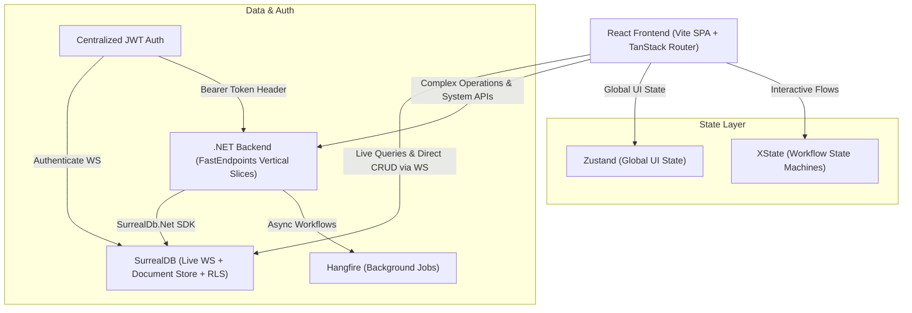

# System Architecture Overview

> **LEGACY — DO NOT IMPLEMENT (marked 2026-08-06).** This is the Iteration 1 design (SurrealDB direct-to-browser, Hangfire, XState workflow FSMs). It was superseded by [`master-architecture-blueprint.md`](master-architecture-blueprint.md) and [`decision-log.md`](decision-log.md). Kept for historical context only.

*Part of the [Tradebook architecture plan](../README.md).*

# Architecture Implementation Plan: Highly Interactive WebApp Stack

This plan synthesizes all architectural decisions resolved during our design session. It defines a high-performance, real-time, hybrid web application architecture featuring React (Vite + TanStack Router), SurrealDB, and a .NET Vertical Slice backend.

---

## 1. Overall System Architecture



---

## 2. Technical Stack Delineation & Package Matrix

### A. Frontend Stack (CSR SPA)
* **Build System & Framework**: React 19 + Vite SPA (Omitted TanStack Start SSR to maintain lean, ultra-fast client-side execution).
* **Routing**: `@tanstack/react-router` (Strictly typed, code-split routes).
* **State Management**:
  * `zustand`: App-wide UI state (user session, theme, layout toggles, active modals).
  * `xstate` (`@xstate/react`): State machines for complex multi-step workflows (canvas editors, interactive wizards, drag-drop state machines).
  * `surrealdb` JavaScript SDK: Server state sync via WebSocket subscriptions (`surreal.live()`).
* **UI & Styling System**:
  * `tailwindcss` v4 + `clsx` + `tailwind-merge` + `lucide-react`
  * `@radix-ui/*` primitives wrapped via **ShadCN UI** components.
* **Animations & Visual FX**:
  * `framer-motion` / `motion`: Layout animations, page transitions, interactive micro-interactions.
  * **Aceternity UI** & **Animate UI**: Curated glow effects, background beams, glare cards, hero effects.
* **Canvas & Virtualization**:
  * `@xyflow/react` (React Flow): Interactive node-based diagrams and canvases.
  * `@tanstack/react-virtual`: High-performance virtualized lists and tables for minimal memory overhead.
* **Drag-and-Drop**:
  * `@dnd-kit/core`, `@dnd-kit/sortable`: Application UI drag-and-drop (sidebars, sortable lists, kanban cards).
  * *Integration Rule*: React Flow handles internal canvas node dragging natively. Sidebar-to-canvas item dropping is bridged using HTML5 drag events / dnd-kit drop zones.

---

### B. Backend Stack (.NET 9 Vertical Slice Architecture)
* **Framework**: ASP.NET Core Web API (.NET 9).
* **Endpoint Pattern**: `FastEndpoints` (Request-Endpoint-Response / REPR pattern replacing controller/MediatR boilerplate).
* **Validation**: `FluentValidation` integrated into FastEndpoints execution pipeline.
* **Database Driver**: `SurrealDb.Net` (Official C# SDK for direct SurrealDB operations, migrations, and system queries).
* **Background Jobs**: `Hangfire` (PostgreSQL / Redis / Memory storage) for reliable background queues, retries, and scheduled tasks.
* **Documentation**: `FastEndpoints.Swagger` / `Scalar` for auto-generated OpenAPI documentation.

---

### C. Database & Security Model (SurrealDB)
* **Access Model**: Frontend connects directly to SurrealDB over WebSockets (`ws://` / `wss://`).
* **Authentication**: Centralized JWT issued by .NET Auth Endpoint.
  * React calls `surreal.authenticate(jwtToken)` upon connection.
* **Record-Level Security (RLS)**: Enforced directly inside SurrealDB schemas:
  ```surrealql
  DEFINE TABLE project SCHEMAFULL
      PERMISSIONS
          FOR select WHERE tenant = $auth.tenant_id AND (owner = $auth.id OR $auth.role = 'admin')
          FOR create, update, delete WHERE tenant = $auth.tenant_id AND owner = $auth.id;
  ```
