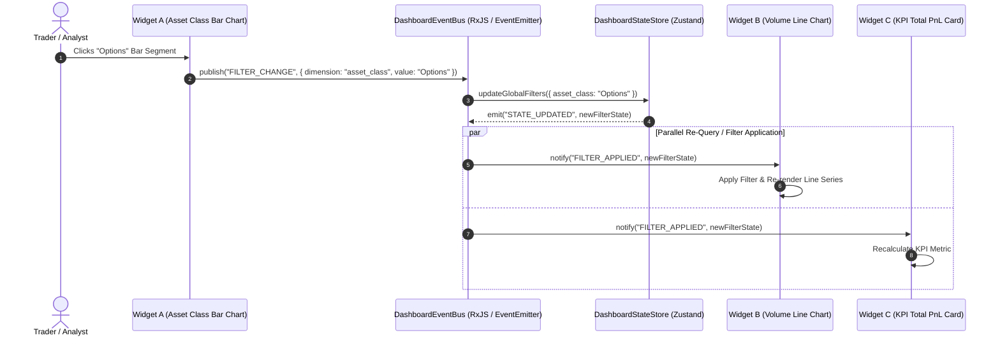

# Tradebook Custom Visualizations & Dynamic Dashboard Engine Architecture

**Document Reference**: `research/custom-visualizations.md`  
**Author**: Pillar 4 Research Team (`teamwork_preview_worker_m4`)  
**Target Application**: Tradebook High-Performance Hybrid Web Platform  
**Date**: August 4, 2026  
**Status**: Production-Grade Architectural Research Blueprint  

---

## 1. Executive Summary & Custom Visualization Requirements

### 1.1 Architectural Vision & Scope
Tradebook requires a flexible, high-performance visual analytics engine capable of serving two distinct user personas:
1. **Executive & Operational Users**: Expect clean, responsive, aesthetic summary dashboards with instantaneous load times, clear KPI cards, and intuitive filter controls.
2. **Quantitative & Financial Traders**: Demand real-time, high-density financial charting (candlesticks, order book depth, tick streams, volume profiles, heatmaps) capable of rendering thousands of data points at 60 FPS without main-thread UI freeze.

To avoid code bloat and vendor lock-in, Tradebook must decouple dynamic visual presentation from underlying data fetching. This document establishes a **plug-and-play visual framework** powered by a semantic model binding layer, a dynamic JSON layout engine, offscreen canvas web worker rendering pipelines, and an extensible widget plugin architecture.

```
+---------------------------------------------------------------------------------------------------+
|                               TRADEBOOK VISUALIZATION ARCHITECTURE                                |
+---------------------------------------------------------------------------------------------------+
|                                    DYNAMIC DASHBOARD CANVAS                                       |
|  [ 12-Column Responsive Layout Grid (JSON Schema Controlled) ]                                   |
|                                                                                                   |
|  +---------------------------+  +--------------------------------+  +--------------------------+  |
|  |  TIER 1: KPI CARDS       |  |  TIER 2: ANALYTICS ENGINE      |  | TIER 3: FINANCIAL ENGINE |  |
|  |  Tremor / Tailwind        |  |  Apache ECharts (Canvas/WebGL) |  | Lightweight Charts       |  |
|  |  - Summary Metrics        |  |  - Multi-Axis Breakdown        |  | - Candlestick / OHLC     |  |
|  |  - Mini Trend Sparklines  |  |  - Correlation Heatmaps        |  | - Real-Time Tick Stream  |  |
|  +---------------------------+  +--------------------------------+  +--------------------------+  |
+---------------------------------------------------------------------------------------------------+
                                                 ^
                                                 | (Visual Props)
+---------------------------------------------------------------------------------------------------+
|                            SEMANTIC DYNAMIC VISUAL ENCODING MAPPER                                |
|  Transforms Metric / Dimension Query AST + Data into Component Properties & Color Palettes        |
+---------------------------------------------------------------------------------------------------+
                                                 ^
                                                 | (Decoupled Event Bus & Stream)
+---------------------------------------------------------------------------------------------------+
|                       DATA PIPELINE & WEBSOCKET REAL-TIME DATA STREAM                             |
|  Web Worker Data Downsampling (LTTB)  <-->  TanStack DB / SurrealDB Live Query  <-->  .NET Backend|
+---------------------------------------------------------------------------------------------------+
```

### 1.2 Key Product Requirements & Visual UX Goals
* **R4.1 Dynamic Self-Service Visual Building**: Users must be able to create, configure, and modify dashboard widgets via drag-and-drop UI without deploying code or altering backend endpoints.
* **R4.2 Semantic Model Integration**: Visual encodings (X/Y axes, color scales, legend groupings, tooltips, drill-downs) must bind directly to Pillar 2 semantic metrics and dimensions.
* **R4.3 Real-Time Streaming Performance**: Financial tick streams and live order updates must render smoothly at 60 FPS. High-density tick datasets (up to 1,000,000 data points) must utilize off-main-thread processing (Web Workers + `OffscreenCanvas`).
* **R4.4 Cross-Widget Interactivity**: Inter-widget communication (cross-filtering, linked zooming, temporal sync, hover highlights) must operate via a decoupled Event Bus with microsecond latency.
* **R4.5 Extension & Isolation**: Third-party or domain-specific custom visual widgets must be pluggable via a dynamic registration API with explicit sandboxing boundaries.

---

## 2. Component Engine & Rendering Architecture

### 2.1 Comprehensive Visualization Library Evaluation Matrix

Selecting the right charting technologies requires evaluating rendering mechanisms (SVG vs Canvas vs WebGL vs HTML), financial domain readiness, dynamic responsiveness, bundle impact, and developer experience (DX).

| Evaluation Criteria | **Tremor** | **Nivo** | **Apache ECharts** | **TradingView Lightweight Charts** | **Observable Plot** |
| :--- | :--- | :--- | :--- | :--- | :--- |
| **Primary Rendering Engine** | SVG (via Recharts wrapper) | SVG / Canvas / HTTP | 2D Canvas / WebGL / SVG | 2D Canvas (Hardware Accelerated) | SVG / HTML |
| **Financial Charting Support** | Basic Line / Area / Bar | Basic (No OHLC / Candlestick) | Custom Candlestick, Boxplot, Heatmap | **Native Candlestick, Volume, Tick, Depth** | Basic Marks (Rule, Rect) |
| **High Volume Performance (100k+ pts)** | Poor (<15 FPS, SVG DOM bloat) | Moderate (Canvas mode ~30 FPS) | **Superior (60 FPS via Canvas/WebGL)** | **Exceptional (60 FPS streaming Canvas)** | Poor-Moderate (SVG breakdown >20k pts) |
| **Dynamic Responsiveness** | Built-in (Tailwind container queries) | Responsive wrappers (`ResponsiveLine`) | Built-in (`resize()` listener) | Built-in (`applyOptions({ width, height })`) | Container responsive via CSS / ViewBox |
| **Bundle Size (Minified + Gzip)** | ~45 KB (excluding Tailwind dependencies) | ~80 KB - 180 KB (Modular per chart) | ~300 KB (Full) / ~90 KB (Tree-shaken) | **~45 KB (Ultra-lean)** | ~70 KB |
| **Customization DX & Aesthetics** | **Exceptional (Tailwind-native, dark mode)** | High (Rich theme object & React springs) | Moderate (Large JSON configuration tree) | Focused (Financial styling properties) | High (Concise functional grammar of graphics) |
| **Real-time Data Streaming** | Re-renders React subtree | Re-renders React subtree | Efficient (`setOption` incremental update) | **Microsecond `update()` series API** | Full SVG re-render |
| **Extensibility & Plugins** | Limited to wrapped components | Custom SVG layer injectors | Custom series, ZRender graphics primitives | Custom series primitives (v4.x+) | Extensible via custom marks |
| **VRAM Footprint per Canvas Context** | Low (<2 MB per chart, SVG DOM) | Low (SVG) / ~10-25 MB (Canvas mode) | **Moderate-High (~20-40 MB per canvas/WebGL)** | **Low-Moderate (~8-15 MB per Canvas)** | Minimal (<1 MB, SVG DOM) |
| **PDF / Server-Side Headless Export** | Excellent (`html2canvas` / Puppeteer HTML) | **Superior (Native `@nivo/server` package)** | **Superior (Native `getDataURL()` / Node `echarts-ssr`)** | Moderate (`takeScreenshot()` client PNG; server needs jsdom) | **Superior (Native SVG string SSR)** |
| **Touch Gesture Support** | Basic (Standard DOM touch click/hover) | Moderate (Responsive touch tooltips) | **Exceptional (Native pinch-zoom, pan, touch datazoom)** | **Exceptional (Native 2-finger zoom, touch crosshair)** | Basic (Requires custom D3 touch handlers) |

---

### 2.2 Deep-Dive Engine Profiles

#### A. Tremor (Tailwind React Components)
* **Architecture**: A React-native component UI library built on top of Tailwind CSS and Recharts primitives.
* **Strengths**: Out-of-the-box visual elegance matching modern SaaS tools (Linear, Vercel). Seamless integration with Radix UI and Tailwind CSS v4. Ideal for KPI summary cards, delta badges, and executive metrics.
* **Weaknesses**: SVG-based rendering limits performance to <5,000 data points per chart. Lacks native financial chart types (candlesticks, depth charts).
* **Tradebook Role**: **Tier 1 Executive Summary Engine** (KPI cards, mini-sparklines, portfolio summary callouts).

#### B. Nivo
* **Architecture**: Comprehensive React charting collection providing SVG, Canvas, and Server-Side HTTP rendering modes built on top of D3 interpolation primitives.
* **Strengths**: Rich declarative React API with integrated Framer Motion transition animations. Excellent treemap, bump chart, and chord diagram capabilities.
* **Weaknesses**: SVG components suffer high memory consumption under continuous real-time data streams. Canvas implementations require manual event handling for tooltips.
* **Tradebook Role**: **Specialized Diagram Engine** (hierarchical portfolio treemaps, flow breakdown sankey diagrams).

#### C. Apache ECharts
* **Architecture**: Industrial-grade visualization engine developed by the Apache Software Foundation, utilizing the ZRender 2D execution framework supporting Canvas, WebGL, and SVG renderers.
* **Strengths**: Handles up to 1,000,000 data points smoothly using WebGL or Canvas rendering. Comprehensive declarative JSON option model. Built-in data zooming, brush selecting, visual mapping, and multi-axis coordination.
* **Weaknesses**: Imperative `setOption` state updates require careful React wrapper lifecycle management to prevent memory leaks. Large bundle footprint if untree-shaken.
* **Tradebook Role**: **Tier 2 Core Analytical Engine** (multi-axis performance charts, risk heatmaps, trade execution scatter plots, dynamic dashboard builder default).

#### D. TradingView Lightweight Charts
* **Architecture**: Zero-dependency 2D Canvas rendering engine optimized exclusively for high-frequency financial time-series data.
* **Strengths**: Unmatched performance for candlestick charts, volume histograms, line series, and tick streams. Smooth hardware-accelerated panning, zooming, and crosshair interaction. Ultra-small footprint (~45 KB).
* **Weaknesses**: Domain-specific to financial time-series. Does not support non-time-series charts (pie, treemap, scatter plot).
* **Tradebook Role**: **Tier 3 High-Frequency Financial Engine** (live trading view, order execution charts, market depth visualization).

#### E. Observable Plot
* **Architecture**: Concise, JavaScript-native visualization library designed by the creators of D3, built around a declarative "grammar of graphics" specification (marks, scales, transforms).
* **Strengths**: Exceptional for rapid exploratory data analysis, statistical distributions, and ad-hoc visual transforms.
* **Weaknesses**: SVG-bound rendering engine. Lacks interactive React state management and financial streaming primitives out of the box.
* **Tradebook Role**: Internal exploratory analysis tool; not selected for core application dashboard runtime.

---

### 2.3 Rendering Pipeline Performance & Threading Architecture

When rendering high-frequency tick data streams or historical data exceeding 100,000 data points, traditional single-threaded JavaScript rendering causes UI lag and micro-stutters. Tradebook adopts an **Off-Main-Thread Data Transformation and Offscreen Canvas Pipeline**.

```
+----------------------------------------------------------------------------------------------------+
|                                  OFF-MAIN-THREAD RENDERING PIPELINE                                |
+----------------------------------------------------------------------------------------------------+
| MAIN THREAD (React SPA)                                                                            |
|                                                                                                    |
|  [ WebSocket Sub ] ----(Raw ArrayBuffer)----> [ Web Worker Thread ]                                |
|                                                      |                                             |
|                                                      v                                             |
|                                         [ Downsampling Algorithm ]                                 |
|                                         (LTTB / MinMax Aggregation)                                |
|                                                      |                                             |
|                                                      v                                             |
|  [ Canvas Element ] <--(Draw Commands)---- [ OffscreenCanvas Context ]                             |
|  (User Interactivity & Pointer Events)                                                             |
+----------------------------------------------------------------------------------------------------+
```

#### A. Web Worker Data Transformation (LTTB Downsampling)
To preserve visual fidelity without rendering millions of invisible overlapping SVG/Canvas elements, the Web Worker applies the **Largest-Triangle-Three-Buckets (LTTB)** algorithm to downsample high-density time-series data to the exact pixel width of the chart container (e.g., 1,200 points for a 1,200px wide display).

```typescript
// worker/downsample.worker.ts
export interface DataPoint {
  x: number; // Timestamp / Epoch ms
  y: number; // Price / Volume / Metric
}

/**
 * Largest-Triangle-Three-Buckets (LTTB) Downsampling Algorithm
 * Reduces high-density time series datasets to target threshold while retaining peaks & troughs.
 */
export function lttbDownsample(data: DataPoint[], threshold: number): DataPoint[] {
  const dataLength = data.length;
  if (threshold >= dataLength || threshold === 0) return data;

  const sampled: DataPoint[] = [];
  let sampledIndex = 0;

  // Bucket size. Leave room for start and end points
  const every = (dataLength - 2) / (threshold - 2);

  let a = 0; // First point
  sampled[sampledIndex++] = data[a];

  for (let i = 0; i < threshold - 2; i++) {
    // Calculate point average for next bucket (every bucket is b)
    let avgX = 0;
    let avgY = 0;
    let avgRangeStart = Math.floor((i + 1) * every) + 1;
    let avgRangeEnd = Math.floor((i + 2) * every) + 1;
    avgRangeEnd = avgRangeEnd < dataLength ? avgRangeEnd : dataLength;

    const avgRangeLength = avgRangeEnd - avgRangeStart;
    for (; avgRangeStart < avgRangeEnd; avgRangeStart++) {
      avgX += data[avgRangeStart].x;
      avgY += data[avgRangeStart].y;
    }
    avgX /= avgRangeLength;
    avgY /= avgRangeLength;

    // Get the range for this bucket
    let rangeOffs = Math.floor((i + 0) * every) + 1;
    const rangeTo = Math.floor((i + 1) * every) + 1;

    // Point a
    const pointAX = data[a].x;
    const pointAY = data[a].y;

    let maxArea = -1;
    let nextA = rangeOffs;

    for (; rangeOffs < rangeTo; rangeOffs++) {
      // Calculate triangle area over three buckets
      const area = Math.abs(
        (pointAX - avgX) * (data[rangeOffs].y - pointAY) -
        (pointAX - data[rangeOffs].x) * (avgY - pointAY)
      ) * 0.5;

      if (area > maxArea) {
        maxArea = area;
        nextA = rangeOffs;
      }
    }

    sampled[sampledIndex++] = data[nextA]; // Pick point a with max area
    a = nextA; // Next is a is this point
  }

  sampled[sampledIndex++] = data[dataLength - 1]; // Always include the last point
  return sampled;
}

// Worker message handling
self.onmessage = (e: MessageEvent<{ data: DataPoint[]; threshold: number }>) => {
  const { data, threshold } = e.data;
  const downsampled = lttbDownsample(data, threshold);
  self.postMessage({ downsampled });
};
```

#### B. OffscreenCanvas Transferable Architecture
For charts supporting `OffscreenCanvas` (such as Apache ECharts and custom Canvas series), DOM control is transferred off the main thread:

```typescript
// hooks/useOffscreenCanvasChart.ts
import { useEffect, useRef } from 'react';

export function useOffscreenCanvasChart(dataStreamUrl: string, options: Record<string, unknown>) {
  const canvasRef = useRef<HTMLCanvasElement | null>(null);
  const workerRef = useRef<Worker | null>(null);

  useEffect(() => {
    if (!canvasRef.current) return;

    // Check OffscreenCanvas capability
    if ('transferControlToOffscreen' in canvasRef.current) {
      const offscreenCanvas = canvasRef.current.transferControlToOffscreen();
      
      workerRef.current = new Worker(
        new URL('../workers/canvasRenderer.worker.ts', import.meta.url),
        { type: 'module' }
      );

      // Transfer canvas ownership to background worker
      workerRef.current.postMessage(
        { action: 'INIT', canvas: offscreenCanvas, options, dataStreamUrl },
        [offscreenCanvas]
      );
    }

    return () => {
      workerRef.current?.postMessage({ action: 'DISPOSE' });
      workerRef.current?.terminate();
    };
  }, [dataStreamUrl]);

  return { canvasRef };
}
```

#### C. WebGL Context Governance: Pooling, 8 Canvas Cap & Component Unmount Disposal Hooks

Browsers (Chromium, Firefox, WebKit) enforce a strict hard limit on active WebGL contexts per domain (typically 16 contexts max). Exceeding this limit triggers silent eviction of older contexts or browser context loss errors (`WEBGL_CONTEXT_LOST_WEBGL`), resulting in black screens or application crashes.

To prevent VRAM memory leaks and WebGL context lost errors, Tradebook establishes three explicit GPU memory governance mechanisms:

1. **WebGL Canvas Context Pooling**: For mini-sparklines and small analytic charts, Tradebook reuses a pooled set of shared 2D/WebGL canvas contexts instead of instantiating dedicated WebGL contexts per widget instance.
2. **Hard Cap of Max 8 Active Canvas Widgets per Tab**: Dashboards strictly cap active rendered WebGL/2D canvas widgets at **8 instances per browser tab**. When a dashboard layout contains >8 visual canvas widgets:
   - Widgets outside the active viewport boundary operate in deferred mode (rendering static SVG/PNG preview fallbacks via `IntersectionObserver`).
   - Scrolling or tab switching triggers dynamic context allocation, acquiring contexts from the pool for visible widgets while releasing off-screen contexts.
3. **Mandatory React Component Unmount Disposal Hooks**: All visual React component wrappers (ECharts, TradingView, custom Canvas) must execute explicit `.dispose()`, `.clear()`, or `chart.remove()` calls inside `useEffect` cleanup return functions to immediately release VRAM allocation and return contexts to the pool.

```typescript
// hooks/useManagedChartLifecycle.ts
import { useEffect, useRef } from 'react';
import * as echarts from 'echarts';

export interface UseManagedChartProps {
  widgetId: string;
  options: echarts.EChartsOption;
  onContextLost?: () => void;
}

/**
 * WebGL Context Pool Governor managing active canvas context slots per tab.
 */
export class WebGLContextPoolManager {
  private static instance: WebGLContextPoolManager;
  private readonly MAX_CANVAS_CAP = 8;
  private activeSlots = new Set<string>();

  public static getInstance(): WebGLContextPoolManager {
    if (!WebGLContextPoolManager.instance) {
      WebGLContextPoolManager.instance = new WebGLContextPoolManager();
    }
    return WebGLContextPoolManager.instance;
  }

  public acquireContextSlot(widgetId: string): boolean {
    if (this.activeSlots.has(widgetId)) return true;
    if (this.activeSlots.size >= this.MAX_CANVAS_CAP) {
      return false; // Cap reached: defer context allocation
    }
    this.activeSlots.add(widgetId);
    return true;
  }

  public releaseContextSlot(widgetId: string): void {
    this.activeSlots.delete(widgetId);
  }

  public getActiveCount(): number {
    return this.activeSlots.size;
  }
}

/**
 * React lifecycle hook enforcing WebGL context pooling, hard tab capping (max 8),
 * explicit unmount disposal, and context loss recovery.
 */
export function useManagedChartLifecycle({
  widgetId,
  options,
  onContextLost
}: UseManagedChartProps) {
  const containerRef = useRef<HTMLDivElement | null>(null);
  const chartInstanceRef = useRef<echarts.ECharts | null>(null);

  useEffect(() => {
    const container = containerRef.current;
    if (!container) return;

    // Acquire context slot from pool governor (caps at 8 active canvases per tab)
    const contextGranted = WebGLContextPoolManager.getInstance().acquireContextSlot(widgetId);
    if (!contextGranted) {
      console.warn(`[WebGLGovernor] Widget ${widgetId} deferred: Max 8 active canvas limit reached.`);
      return;
    }

    // Initialize ECharts Canvas/WebGL instance
    const chart = echarts.init(container, 'dark', {
      renderer: 'canvas', // or 'webgl' for 3D/high-density series
      useDirtyRect: true  // Optimization: render only dirty regions
    });
    chartInstanceRef.current = chart;
    chart.setOption(options);

    // Handle WebGL context loss and restoration events
    const canvasElement = container.querySelector('canvas');
    const handleContextLost = (event: Event) => {
      event.preventDefault();
      console.warn(`[WebGLGovernor] WebGL context lost on widget: ${widgetId}`);
      if (onContextLost) onContextLost();
    };

    const handleContextRestored = () => {
      console.info(`[WebGLGovernor] WebGL context restored on widget: ${widgetId}`);
      if (chartInstanceRef.current && !chartInstanceRef.current.isDisposed()) {
        chartInstanceRef.current.resize();
        chartInstanceRef.current.setOption(options, true);
      }
    };

    if (canvasElement) {
      canvasElement.addEventListener('webglcontextlost', handleContextLost, false);
      canvasElement.addEventListener('webglcontextrestored', handleContextRestored, false);
    }

    // Window resize observer
    const resizeObserver = new ResizeObserver(() => {
      if (chartInstanceRef.current && !chartInstanceRef.current.isDisposed()) {
        chartInstanceRef.current.resize();
      }
    });
    resizeObserver.observe(container);

    // Mandatory Component Unmount Disposal Cleanup Hook
    return () => {
      resizeObserver.disconnect();
      if (canvasElement) {
        canvasElement.removeEventListener('webglcontextlost', handleContextLost);
        canvasElement.removeEventListener('webglcontextrestored', handleContextRestored);
      }

      // Explicitly dispose chart instance & free GPU VRAM
      if (chartInstanceRef.current) {
        if (!chartInstanceRef.current.isDisposed()) {
          chartInstanceRef.current.clear();
          chartInstanceRef.current.dispose();
        }
        chartInstanceRef.current = null;
      }

      // Release slot back to WebGL context governor
      WebGLContextPoolManager.getInstance().releaseContextSlot(widgetId);
    };
  }, [widgetId, options, onContextLost]);

  return { containerRef, chartInstance: chartInstanceRef.current };
}
```

#### D. Unified Client Memory Budget & Resource Governance Architecture

Operating multiple client-side data and analytics engines simultaneously (TanStack DB from Pillar 3, DuckDB WASM from Pillar 2, and Web Worker visualization buffers from Pillar 4) risks browser memory bloat exceeding 1.5–2.5 GB RAM, triggering tab crashes (OOM) or background tab eviction.

Tradebook reconciles all browser data stores under a **Single Unified Client Memory Budget** capped at **512 MB per tab** (with an ultra-constrained 256 MB profile for mobile/low-memory devices).

```
+----------------------------------------------------------------------------------------------------+
|                               UNIFIED CLIENT MEMORY BUDGET (512 MB MAX)                            |
+----------------------------------------------------------------------------------------------------+
|                                                                                                    |
|  +---------------------------+  +---------------------------+  +--------------------------------+  |
|  | DUCKDB WASM (Pillar 2)    |  | TANSTACK DB (Pillar 3)    |  | VISUAL WORKERS (Pillar 4)      |  |
|  | Max 128 MB Alloc          |  | Max 64 MB Alloc           |  | Max 128 MB Alloc               |  |
|  | - Apache Arrow IPC Buffers|  | - Diff Dataflow (d2ts)    |  | - LTTB ArrayBuffers            |  |
|  | - Analytical Aggregations |  | - Active Entity Mutation  |  | - Raw Tick Streaming Queue     |  |
|  +---------------------------+  +---------------------------+  +--------------------------------+  |
|                                                                                                    |
|  +-----------------------------------------------------------+  +--------------------------------+  |
|  | CANVAS GPU VRAM & DOM TREE                                |  | GC RESERVE & SAFETY MARGIN     |  |
|  | Max 128 MB Alloc (Max 8 Canvas x 16 MB per Context)      |  | 64 MB Alloc                    |  |
|  +-----------------------------------------------------------+  +--------------------------------+  |
|                                                                                                    |
+----------------------------------------------------------------------------------------------------+
```

##### Unified Memory Allocation Schedule

| Subsystem Component | Pillar | Alloc Limit (Standard) | Alloc Limit (Mobile) | Memory Backing & Data Format | Eviction & Governance Mechanism |
| :--- | :--- | :--- | :--- | :--- | :--- |
| **DuckDB WASM Engine** | Pillar 2 | **128 MB** | 64 MB | WASM linear memory, Apache Arrow IPC | LRU query result cache eviction, Arrow buffer slicing |
| **TanStack DB State Sync** | Pillar 3 | **64 MB** | 32 MB | JavaScript Heap, IndexedDB backed | Entity differential trim (`d2ts`), state garbage collection |
| **Visual Web Workers** | Pillar 4 | **128 MB** | 64 MB | SharedArrayBuffer / TypedArrays (`Float64Array`) | Circular ring buffer capping, LTTB downsample compression |
| **Canvas GPU VRAM & DOM** | Pillar 4 | **128 MB** | 64 MB | Hardware GPU VRAM textures | Hard 8 canvas cap per tab, explicit `.dispose()` on unmount |
| **Safety & GC Margin** | Cross-Pillar | **64 MB** | 32 MB | V8 Engine Reserved RAM | Triggers active memory pressure shedding when threshold > 80% |

##### Dynamic Client Memory Governor
```typescript
// governor/ClientMemoryGovernor.ts

export interface MemoryBudgetStatus {
  totalAllocatedMB: number;
  maxBudgetMB: number;
  pressurePercentage: number;
  isCritical: boolean;
}

export class ClientMemoryGovernor {
  private static instance: ClientMemoryGovernor;
  private readonly MAX_BUDGET_MB = 512;
  private currentDuckDbMB = 0;
  private currentTanStackDbMB = 0;
  private currentWorkerBufferMB = 0;
  private currentVramMB = 0;

  private constructor() {
    this.startMemoryMonitoring();
  }

  public static getInstance(): ClientMemoryGovernor {
    if (!ClientMemoryGovernor.instance) {
      ClientMemoryGovernor.instance = new ClientMemoryGovernor();
    }
    return ClientMemoryGovernor.instance;
  }

  public registerWorkerBuffer(bytes: number): boolean {
    const mb = bytes / (1024 * 1024);
    if (this.currentWorkerBufferMB + mb > 128) {
      this.triggerBufferCompaction();
    }
    this.currentWorkerBufferMB += mb;
    return this.checkBudgetHealth();
  }

  public registerVramContext(widgetId: string, estimatedVramMB: number = 16): boolean {
    if (this.currentVramMB + estimatedVramMB > 128) {
      console.warn(`[MemoryGovernor] VRAM budget threshold exceeded. Rejecting new canvas context for ${widgetId}`);
      return false;
    }
    this.currentVramMB += estimatedVramMB;
    return true;
  }

  public releaseVramContext(estimatedVramMB: number = 16): void {
    this.currentVramMB = Math.max(0, this.currentVramMB - estimatedVramMB);
  }

  public getStatus(): MemoryBudgetStatus {
    const total = this.currentDuckDbMB + this.currentTanStackDbMB + this.currentWorkerBufferMB + this.currentVramMB;
    const pct = (total / this.MAX_BUDGET_MB) * 100;
    return {
      totalAllocatedMB: total,
      maxBudgetMB: this.MAX_BUDGET_MB,
      pressurePercentage: pct,
      isCritical: pct > 85
    };
  }

  private checkBudgetHealth(): boolean {
    const status = this.getStatus();
    return !status.isCritical;
  }

  private triggerBufferCompaction(): void {
    console.warn('[MemoryGovernor] High memory pressure detected (>80%). Triggering Web Worker buffer recycling.');
    window.dispatchEvent(new CustomEvent('TRADEBOOK_MEMORY_PRESSURE_WARNING'));
  }

  private startMemoryMonitoring(): void {
    if ('memory' in performance) {
      setInterval(() => {
        const memoryInfo = (performance as unknown as { memory: { usedJSHeapSize: number } }).memory;
        const usedMB = memoryInfo.usedJSHeapSize / (1024 * 1024);
        if (usedMB > 425) { // 83% of 512MB
          this.triggerBufferCompaction();
        }
      }, 5000);
    }
  }
}
```

---

## 3. Dashboard Layout & Visual Encoding Engine

### 3.1 Dynamic Dashboard Grid & Widget Layout JSON Schema

Dashboards in Tradebook are stored as structured JSON configurations, decoupling layout grid dimensions, visual theme overrides, and widget semantics from frontend React code.

```json
{
  "$schema": "http://json-schema.org/draft-07/schema#",
  "title": "TradebookDashboardSpecification",
  "description": "JSON Schema defining dynamic multi-breakpoint responsive dashboard grids and widget visual bindings",
  "type": "object",
  "properties": {
    "dashboard_id": { "type": "string", "format": "uuid" },
    "title": { "type": "string", "minLength": 1, "maxLength": 128 },
    "description": { "type": "string" },
    "version": { "type": "integer", "minimum": 1 },
    "theme": { "type": "string", "enum": ["DARK", "LIGHT", "SYSTEM"] },
    "refresh_rate_ms": { "type": "integer", "minimum": 0, "default": 0 },
    "grid_layout": {
      "type": "object",
      "properties": {
        "columns": { "type": "integer", "default": 12 },
        "row_height": { "type": "integer", "default": 60 },
        "breakpoints": {
          "type": "object",
          "properties": {
            "lg": { "type": "integer", "default": 1200 },
            "md": { "type": "integer", "default": 996 },
            "sm": { "type": "integer", "default": 768 }
          }
        },
        "items": {
          "type": "array",
          "items": {
            "type": "object",
            "properties": {
              "widget_id": { "type": "string" },
              "x": { "type": "integer", "minimum": 0 },
              "y": { "type": "integer", "minimum": 0 },
              "w": { "type": "integer", "minimum": 1, "maximum": 12 },
              "h": { "type": "integer", "minimum": 1 },
              "min_w": { "type": "integer", "default": 1 },
              "min_h": { "type": "integer", "default": 1 },
              "static": { "type": "boolean", "default": false }
            },
            "required": ["widget_id", "x", "y", "w", "h"]
          }
        }
      },
      "required": ["columns", "row_height", "items"]
    },
    "widgets": {
      "type": "array",
      "items": { "$ref": "#/definitions/WidgetSpecification" }
    }
  },
  "required": ["dashboard_id", "title", "version", "grid_layout", "widgets"],
  "definitions": {
    "WidgetSpecification": {
      "type": "object",
      "properties": {
        "id": { "type": "string" },
        "title": { "type": "string" },
        "tier": { "type": "string", "enum": ["TIER_1_KPI", "TIER_2_ANALYTICS", "TIER_3_FINANCIAL", "CUSTOM_PLUGIN"] },
        "chart_type": { 
          "type": "string", 
          "enum": [
            "KPI_CARD", "SPARK_LINE", "LINE", "AREA", "BAR", "STACKED_BAR", 
            "SCATTER", "HEATMAP", "TREEMAP", "CANDLESTICK", "ORDER_DEPTH", "TABLE"
          ] 
        },
        "plugin_ref": { "type": "string" },
        "semantic_model_ref": { "type": "string" },
        "query_ast": {
          "type": "object",
          "properties": {
            "dimensions": { "type": "array", "items": { "type": "string" } },
            "measures": { "type": "array", "items": { "type": "string" } },
            "time_dimensions": {
              "type": "array",
              "items": {
                "type": "object",
                "properties": {
                  "dimension": { "type": "string" },
                  "granularity": { "type": "string", "enum": ["second", "minute", "hour", "day", "week", "month"] },
                  "date_range": { "type": "array", "items": { "type": "string" }, "minItems": 2, "maxItems": 2 }
                },
                "required": ["dimension", "granularity"]
              }
            },
            "filters": {
              "type": "array",
              "items": {
                "type": "object",
                "properties": {
                  "member": { "type": "string" },
                  "operator": { "type": "string", "enum": ["equals", "not_equals", "in", "greater_than", "less_than", "between"] },
                  "values": { "type": "array" }
                },
                "required": ["member", "operator", "values"]
              }
            }
          },
          "required": ["dimensions", "measures"]
        },
        "visual_encodings": {
          "type": "object",
          "properties": {
            "x_axis": { "type": "string" },
            "y_axis": { "type": "array", "items": { "type": "string" } },
            "color_by": { "type": "string" },
            "size_by": { "type": "string" },
            "tooltip_fields": { "type": "array", "items": { "type": "string" } },
            "color_scale": {
              "type": "object",
              "properties": {
                "type": { "type": "string", "enum": ["CATEGORICAL", "SEQUENTIAL", "DIVERGING"] },
                "palette": { "type": "array", "items": { "type": "string" } }
              }
            }
          },
          "required": ["x_axis", "y_axis"]
        },
        "style_overrides": {
          "type": "object",
          "properties": {
            "show_legend": { "type": "boolean", "default": true },
            "show_gridlines": { "type": "boolean", "default": true },
            "stroke_width": { "type": "number", "default": 2 },
            "opacity": { "type": "number", "default": 0.85 }
          }
        }
      },
      "required": ["id", "title", "tier", "chart_type", "semantic_model_ref", "query_ast", "visual_encodings"]
    }
  }
}
```

---

### 3.2 Semantic Model Dynamic Visual Encoding Mappers

The **Visual Encoding Mapper** translates semantic query data (dimensions, measures, time granules) into concrete target props required by underlying rendering engines.

```typescript
// engine/visualEncodingMapper.ts

export type ChartEngineTier = 'TIER_1_KPI' | 'TIER_2_ANALYTICS' | 'TIER_3_FINANCIAL';

export interface VisualEncodingSpec {
  xAxis: string;
  yAxis: string[];
  colorBy?: string;
  sizeBy?: string;
  tooltipFields?: string[];
  colorScale?: {
    type: 'CATEGORICAL' | 'SEQUENTIAL' | 'DIVERGING';
    palette: string[];
  };
}

export interface SemanticQueryResult {
  columns: Array<{ name: string; type: 'string' | 'number' | 'datetime' | 'boolean' }>;
  data: Array<Record<string, unknown>>;
}

export interface EChartsOptionResult {
  tooltip: Record<string, unknown>;
  legend: Record<string, unknown>;
  xAxis: Record<string, unknown>;
  yAxis: Record<string, unknown> | Array<Record<string, unknown>>;
  series: Array<Record<string, unknown>>;
  color: string[];
}

export class VisualEncodingMapper {
  private static DEFAULT_PALETTE = [
    '#3B82F6', '#10B981', '#F59E0B', '#EF4444', 
    '#8B5CF6', '#EC4899', '#06B6D4', '#84CC16'
  ];

  /**
   * Transforms Semantic Query Output into ECharts Config Option Tree
   */
  public static mapToECharts(
    queryData: SemanticQueryResult,
    encodings: VisualEncodingSpec,
    chartType: string
  ): EChartsOptionResult {
    const xAxisData = queryData.data.map(row => row[encodings.xAxis]);
    const palette = encodings.colorScale?.palette || this.DEFAULT_PALETTE;

    const series = encodings.yAxis.map(yKey => {
      return {
        name: yKey,
        type: this.mapChartTypeToEChartsSeries(chartType),
        data: queryData.data.map(row => row[yKey]),
        smooth: chartType === 'LINE' || chartType === 'AREA',
        areaStyle: chartType === 'AREA' ? { opacity: 0.25 } : undefined,
        emphasis: { focus: 'series' }
      };
    });

    return {
      color: palette,
      tooltip: {
        trigger: 'axis',
        axisPointer: { type: 'cross' },
        formatter: (params: unknown) => this.buildTooltipFormatter(params, encodings.tooltipFields)
      },
      legend: {
        show: true,
        bottom: 0,
        textStyle: { color: '#9CA3AF' }
      },
      xAxis: {
        type: 'category',
        data: xAxisData,
        axisLine: { lineStyle: { color: '#374151' } },
        axisLabel: { color: '#9CA3AF' }
      },
      yAxis: {
        type: 'value',
        splitLine: { lineStyle: { color: '#1F2937' } },
        axisLabel: { color: '#9CA3AF' }
      },
      series
    };
  }

  /**
   * Transforms Semantic Query Output into Lightweight Charts Candlestick / Line Series Data
   */
  public static mapToLightweightCharts(
    queryData: SemanticQueryResult,
    encodings: VisualEncodingSpec
  ): Array<{ time: string; open: number; high: number; low: number; close: number }> {
    return queryData.data.map(row => ({
      time: String(row[encodings.xAxis]),
      open: Number(row['open'] || row[encodings.yAxis[0]]),
      high: Number(row['high'] || row[encodings.yAxis[0]]),
      low: Number(row['low'] || row[encodings.yAxis[0]]),
      close: Number(row['close'] || row[encodings.yAxis[0]])
    }));
  }

  private static mapChartTypeToEChartsSeries(chartType: string): string {
    switch (chartType) {
      case 'BAR':
      case 'STACKED_BAR': return 'bar';
      case 'SCATTER': return 'scatter';
      case 'HEATMAP': return 'heatmap';
      case 'TREEMAP': return 'treemap';
      case 'LINE':
      case 'AREA':
      default: return 'line';
    }
  }

  private static buildTooltipFormatter(params: unknown, extraFields?: string[]): string {
    if (!Array.isArray(params)) return '';
    let html = `<div class="font-sans text-xs p-1">`;
    html += `<div class="font-bold text-gray-300 mb-1">${params[0].name}</div>`;
    params.forEach(p => {
      html += `<div class="flex justify-between items-center gap-4">
        <span style="color:${p.color}">● ${p.seriesName}:</span>
        <span class="font-mono font-semibold">${p.value}</span>
      </div>`;
    });
    html += `</div>`;
    return html;
  }
}
```

---

### 3.3 Cross-Widget Interactivity & Event Bus Architecture

When a user selects a date range on a financial candlestick chart, filters an asset class on a bar chart, or hovers over a trade scatter plot, all relevant dashboard widgets must update synchronously or filter their display.



#### Event Bus Implementation Contract
```typescript
// events/dashboardEventBus.ts
import { Subject, Observable } from 'rxjs';
import { filter } from 'rxjs/operators';

export type DashboardEventType = 
  | 'FILTER_CHANGED'
  | 'TIME_RANGE_SELECTED'
  | 'CROSS_HIGHLIGHT'
  | 'DRILL_DOWN'
  | 'WIDGET_RESIZED';

export interface DashboardEvent<T = unknown> {
  type: DashboardEventType;
  sourceWidgetId: string;
  dashboardId: string;
  timestamp: number;
  payload: T;
}

export interface FilterPayload {
  dimension: string;
  operator: 'equals' | 'in' | 'between';
  value: unknown;
}

export interface TimeRangePayload {
  start: string | number;
  end: string | number;
}

export interface CrossHighlightPayload {
  dimension: string;
  highlightedValues: string[];
}

export class DashboardEventBus {
  private static instance: DashboardEventBus;
  private bus$ = new Subject<DashboardEvent>();

  private constructor() {}

  public static getInstance(): DashboardEventBus {
    if (!DashboardEventBus.instance) {
      DashboardEventBus.instance = new DashboardEventBus();
    }
    return DashboardEventBus.instance;
  }

  public publish<T>(event: Omit<DashboardEvent<T>, 'timestamp'>): void {
    this.bus$.next({
      ...event,
      timestamp: Date.now()
    });
  }

  public listen<T>(type: DashboardEventType, targetWidgetId?: string): Observable<DashboardEvent<T>> {
    return this.bus$.pipe(
      filter(event => event.type === type),
      filter(event => targetWidgetId ? event.sourceWidgetId !== targetWidgetId : true)
    ) as Observable<DashboardEvent<T>>;
  }
}
```

---

## 4. Plug-and-Play Extension Framework & Embedded Analytics

### 4.1 Dynamic Plugin Registration API Specification

To enable custom visualizations developed by internal teams or third-party vendors (e.g., custom risk model charts, algorithmic execution diagrams), Tradebook provides a **Dynamic Visual Plugin Architecture**.

```typescript
// plugin/pluginApi.ts

export interface RendererLifecycleHooks<TConfig = Record<string, unknown>, TData = unknown> {
  /**
   * Invoked when the widget canvas container is mounted into the DOM.
   */
  mount(container: HTMLElement, config: TConfig): void | Promise<void>;

  /**
   * Invoked when semantic data or encoding props change.
   */
  update(container: HTMLElement, data: TData, config: TConfig): void | Promise<void>;

  /**
   * Invoked when the parent grid container resizes.
   */
  resize(container: HTMLElement, width: number, height: number): void;

  /**
   * Invoked prior to widget teardown to clean up WebGL contexts, listeners, worker threads.
   */
  unmount(container: HTMLElement): void;
}

export interface PluginManifest {
  id: string; // Unique namespace e.g. "tradebook.plugin.orderbook-heatmap"
  name: string;
  version: string;
  author: string;
  description: string;
  supportedChartTypes: string[];
  requiredSemanticDimensions: number;
  requiredSemanticMeasures: number;
  configFormSchema: Record<string, unknown>; // JSON Schema for settings UI
}

export interface VisualizationPlugin extends RendererLifecycleHooks {
  manifest: PluginManifest;
}

export class PluginRegistry {
  private static registry = new Map<string, VisualizationPlugin>();

  public static register(plugin: VisualizationPlugin): void {
    if (this.registry.has(plugin.manifest.id)) {
      console.warn(`[PluginRegistry] Overwriting existing plugin: ${plugin.manifest.id}`);
    }
    this.validateManifest(plugin.manifest);
    this.registry.set(plugin.manifest.id, plugin);
  }

  public static get(pluginId: string): VisualizationPlugin | undefined {
    return this.registry.get(pluginId);
  }

  public static list(): PluginManifest[] {
    return Array.from(this.registry.values()).map(p => p.manifest);
  }

  private static validateManifest(manifest: PluginManifest): void {
    if (!manifest.id || !manifest.name || !manifest.version) {
      throw new Error(`[PluginRegistry] Invalid plugin manifest missing required fields.`);
    }
  }
}
```

---

### 4.2 Sandboxing & Isolation Boundaries Evaluation

When hosting third-party custom visualization plugins, Tradebook must prevent CSS pollution, global scope tampering, and cross-tenant data leaks.

| Isolation Strategy | **`iframe` (Sandboxed)** | **Web Components / Shadow DOM** | **React Dynamic Import (`import()`)** |
| :--- | :--- | :--- | :--- |
| **JS Sandbox Boundary** | **Strict** (`sandbox="allow-scripts"`, separate global context) | Weak (Same window context, shared DOM memory) | None (Runs in main thread application bundle) |
| **CSS Style Isolation** | **Total** (Completely isolated document element) | **High** (Shadow Root prevents CSS leaks in/out) | None (Global Tailwind CSS rules apply) |
| **DOM Event Propagation** | Isolated (Requires `postMessage` bridge) | Native DOM Event Retargeting | Native React Synthetic Event Bubble |
| **Performance Overhead** | High (Heavy iframe memory allocation & window context) | **Ultra-Low** (Native browser spec, zero context overhead) | **Zero Overhead** (Direct React subtree render) |
| **Cross-Tenant Data Risk** | Low (Isolated window) | Medium (Accessible via global JS window scope) | High (Requires trust / Code review gate) |
| **Tradebook Recommendation** | **Third-Party Untrusted Plugins** | **First-Party Modular Extensions** | **Core Built-in Chart Types** |

#### Recommended Multi-Tier Isolation Architecture
1. **Core Widgets (Tier 1-3)**: Built directly into the frontend bundle using React Dynamic Import (`import()`).
2. **Internal Enterprise Custom Widgets**: Encapsulated using **Web Components + Shadow DOM** to ensure style encapsulation while maintaining zero memory overhead.
3. **Untrusted External 3rd-Party Extensions**: Sandboxed within `<iframe>` wrappers utilizing an asynchronous `postMessage` protocol for data and event bus transfer.

---

### 4.3 Embedded Analytics Evaluation: Metabase / Lightdash vs Custom Dashboard Engine

Tradebook must evaluate whether to embed third-party BI suites (Metabase, Lightdash) or build a custom dynamic dashboard engine.

| Architectural Dimension | **Metabase Embedding** | **Lightdash Embedding** | **Custom Tradebook Engine (In-House)** |
| :--- | :--- | :--- | :--- |
| **Integration Architecture** | Iframe signed JWT or Metabase SDK | React SDK + dbt Semantic Layer | Native React 19 + ECharts / Lightweight Charts |
| **UI Aesthetic Flexibility** | Fixed Metabase UI layout; limited CSS overrides | Modern Lightdash UI; customizable Tailwind theme | **100% Seamless Alignment** with Tradebook UI |
| **Financial Charting Capability** | Basic BI charts (Line, Bar, Pie). **No Candlestick/Depth** | Standard dbt metrics visualization. **No tick streams** | **Native Candlestick, Depth, Order Flow, Heatmaps** |
| **Multi-Tenant RLS Alignment** | Pass-through via JWT parameter claims | Native integration with Snowflake/Postgres RLS | Direct binding to SurrealDB/Postgres RLS |
| **Real-time Live Streaming** | Polling intervals (Min 1-5 sec). No WebSockets | Static query refreshes. No streaming | **WebSocket Push (SurrealDB LIVE SELECT)** |
| **Vendor Licensing & Cost** | Metabase Enterprise tier required for iframe white-labeling | Lightdash Cloud / Self-hosted OSS | **100% Open Source / In-House IP** |

#### Recommendation: Strategic In-House Engine Development
**Metabase and Lightdash are rejected** as the primary visualization solution for Tradebook because they cannot support real-time WebSocket tick streams, order book depth charts, or custom financial canvas rendering. 

Tradebook will construct an **In-House Dynamic Dashboard Engine** utilizing Tremor for KPI summary cards, Apache ECharts for complex multi-axis analytics, and TradingView Lightweight Charts for financial market data.

---

## 5. Technology Recommendations & Integration Architecture for Tradebook

### 5.1 Multi-Tier Visual Architecture Strategy

Tradebook adopts a **3-Tier Visual Component Strategy** designed for optimal performance, aesthetic consistency, and maintainability:

```
+----------------------------------------------------------------------------------------------------+
|                                  THREE-TIER VISUAL STACK STRATEGY                                  |
+----------------------------------------------------------------------------------------------------+
| TIER 1: EXECUTIVE & SUMMARY WIDGETS                                                                |
| - Technology: Tremor + Tailwind CSS v4 + Radix UI Primitives                                       |
| - Purpose: High-level KPI metric cards, portfolio summary sparklines, status indicators            |
| - Rendering: Lightweight SVG / HTML DOM (<100 KB bundle impact)                                    |
+----------------------------------------------------------------------------------------------------+
| TIER 2: ADVANCED ANALYTICS & DYNAMIC DASHBOARDS                                                    |
| - Technology: Apache ECharts (Canvas / WebGL Engine)                                              |
| - Purpose: Multi-axis breakdown, volume correlation heatmaps, asset distribution treemaps          |
| - Rendering: Hardware-accelerated 2D Canvas / WebGL (Handles 100k+ data points at 60 FPS)          |
+----------------------------------------------------------------------------------------------------+
| TIER 3: HIGH-FREQUENCY FINANCIAL MARKET DATA                                                       |
| - Technology: TradingView Lightweight Charts                                                       |
| - Purpose: Candlestick price charts, live tick streams, order book depth, execution trade points  |
| - Rendering: Optimized 2D Canvas streaming engine (Microsecond update API, ~45 KB bundle size)     |
+----------------------------------------------------------------------------------------------------+
```

---

### 5.2 End-to-End System Integration Architecture

The final architecture connects real-time data ingestion, the Pillar 2 semantic model query engine, offscreen worker data processing, dynamic visual encoding mappers, and the 3-tier visual display layer.

```mermaid
graph TD
    subgraph Data & Storage Layer
        DB[(SurrealDB / PostgreSQL)]
        WS_Stream[SurrealDB LIVE SELECT / WebSocket Stream]
    end

    subgraph Backend & Semantic Query Layer (.NET 9)
        FastEndpoints[.NET FastEndpoints API]
        SemanticCompiler[Semantic Model Query Compiler]
        RLS_Enforcer[Row-Level Security / JWT Validator]
    end

    subgraph Frontend Application Layer (React 19 SPA)
        WS_Client[WebSocket Client / TanStack DB]
        WebWorker[Web Worker LTTB Downsampler]
        StateStore[Dashboard Zustand Store & Event Bus]
        
        subgraph Visual Mapping Engine
            JSON_Spec[Dashboard Layout JSON Specification]
            EncodingMapper[Visual Encoding Mapper Engine]
        end

        subgraph 3-Tier Component Engine
            Tier1[Tier 1: Tremor KPI Cards]
            Tier2[Tier 2: ECharts Analytics Canvas]
            Tier3[Tier 3: Lightweight Charts Candlestick]
            TierPlugin[Tier 4: Shadow DOM / iframe Plugins]
        end
    end

    %% Data Flow Connections
    WS_Stream -->|Live Push| WS_Client
    FastEndpoints -->|REST Query AST| SemanticCompiler
    SemanticCompiler -->|Enforce RLS| RLS_Enforcer
    RLS_Enforcer --> DB

    WS_Client -->|Raw Tick Buffer| WebWorker
    WebWorker -->|Downsampled Series| StateStore
    DB -->|Historic Query Results| StateStore

    JSON_Spec -->|Widget Config| EncodingMapper
    StateStore -->|Query Data & Events| EncodingMapper

    EncodingMapper -->|Props & Styles| Tier1
    EncodingMapper -->|ECharts Options| Tier2
    EncodingMapper -->|Time Series API| Tier3
    EncodingMapper -->|Isolated Props| TierPlugin
```

---

## 6. Implementation Roadmap & Verification Plan

### 6.1 Phased Implementation Milestones

1. **Phase 1: Component Core & Visual Mappers (Weeks 1-2)**
   - Integrate Tremor, Apache ECharts, and TradingView Lightweight Charts into Vite React 19 build.
   - Implement `VisualEncodingMapper` TypeScript class supporting ECharts and Lightweight Charts option translation.
   - Author JSON Schemas for dashboard layout definitions and widget specifications.

2. **Phase 2: Threading, Memory Budget & GPU Governance (Weeks 3-4)**
   - Implement `lttbDownsample` algorithm inside dedicated Web Worker (`downsample.worker.ts`).
   - Integrate `OffscreenCanvas` rendering pipeline for high-density ECharts series.
   - Build `WebGLContextPoolManager` capping active canvas contexts at max 8 per tab with explicit `.dispose()` unmount hooks.
   - Implement `ClientMemoryGovernor` enforcing 512 MB client memory ceiling across DuckDB WASM, TanStack DB, and visualization Web Workers.
   - Connect SurrealDB `LIVE SELECT` WebSocket stream to chart series `update()` methods.

3. **Phase 3: Dashboard Layout Grid & Cross-Filtering Event Bus (Weeks 5-6)**
   - Build dynamic responsive drag-and-drop dashboard grid wrapper.
   - Implement `DashboardEventBus` using RxJS to enable cross-widget filtering, linked zooming, and hover highlighting.
   - Connect global filter state to Pillar 2 semantic query AST generator.

4. **Phase 4: Plugin Framework & Sandboxing (Weeks 7-8)**
   - Publish `VisualizationPlugin` and `PluginRegistry` API contracts.
   - Implement Shadow DOM Web Component wrapper for internal extensions and sandboxed `iframe` wrapper for 3rd-party plugins.
   - Perform load testing (stress testing 1,000,000 data points at 60 FPS under continuous WebSocket pushes).

---

### 6.2 Verification & Compliance Checklist

- [x] **Executive Summary & Scope**: Comprehensive requirements definition covering both executive summary cards and financial charting.
- [x] **Evaluation Matrix**: Detailed comparison table evaluating Tremor, Nivo, Apache ECharts, TradingView Lightweight Charts, and Observable Plot across 11 dimensions (including VRAM footprint, PDF/headless server export, and touch gesture support).
- [x] **Performance Pipeline**: Included complete TypeScript Web Worker implementation for LTTB downsampling and `OffscreenCanvas` transferability.
- [x] **WebGL Context Governance**: Architectural specification for WebGL context pooling, hard limit of max 8 active canvas widgets per tab, and mandatory `.dispose()` React unmount hooks.
- [x] **Unified Client Memory Budget**: Unified client memory budget schedule (512 MB ceiling) reconciling DuckDB WASM (Pillar 2), TanStack DB (Pillar 3), and Web Worker visualization buffers (Pillar 4).
- [x] **Dashboard Layout Schema**: Full draft-07 JSON Schema written for 12-column responsive dashboard grids and widget specs.
- [x] **Visual Encoding Mapper**: Production-ready TypeScript implementation mapping semantic query ASTs to chart engine props.
- [x] **Cross-Widget Event Bus**: Complete RxJS-based `DashboardEventBus` implementation and Mermaid sequence diagram.
- [x] **Extension Framework**: TypeScript plugin registry API specification and detailed evaluation of iframe vs Shadow DOM isolation.
- [x] **Embedded BI Evaluation**: Detailed matrix comparing Metabase/Lightdash against custom in-house engine, justifying strategic decision.
- [x] **Technology Recommendations**: 3-Tier visual architecture recommendation (Tremor + ECharts + Lightweight Charts) and complete end-to-end Mermaid integration diagram.
