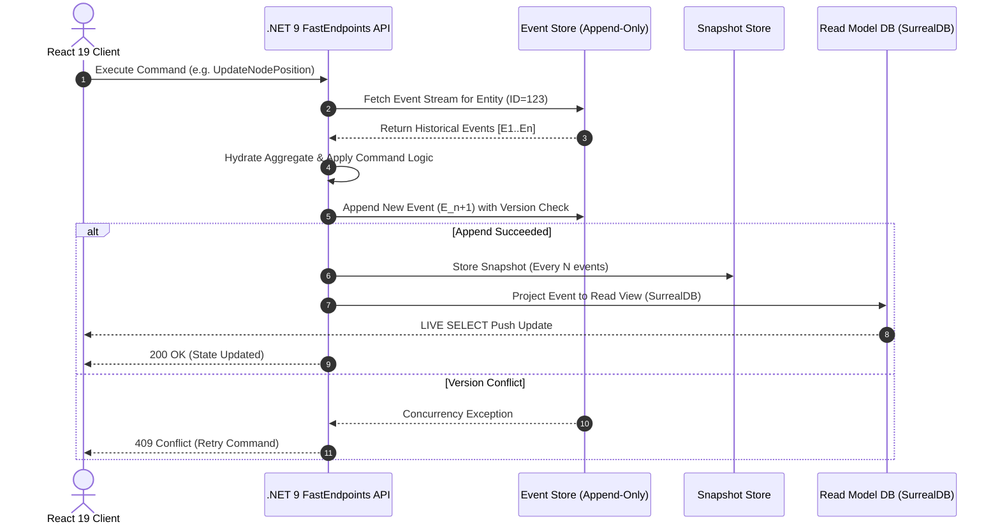
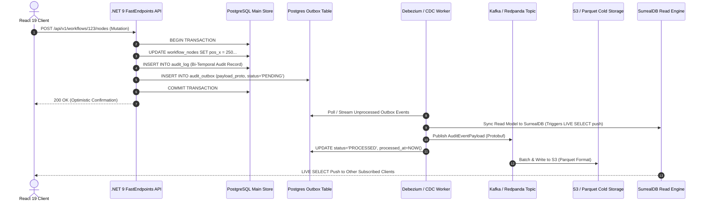

# Comprehensive Versioning and Audit Trails Architecture

**Author**: Tradebook Architectural Research Team (Pillar 1)  
**Date**: August 2026  
**Status**: Production-Grade Architectural Specification  
**Target System**: Tradebook High-Performance Data Management & Workflow Platform  
**Target File**: `research/versioning-and-audit-trails.md`  

---

## Executive Summary & System Context

Tradebook is a high-performance, real-time B2B application combining interactive workflow automation canvases (`@xyflow/react`), kanban task management (`@dnd-kit`), visual data management, and dynamic analytical dashboards. To serve enterprise financial and operational requirements, Tradebook must guarantee **full revertability**, **granular change attribution ("who changed what, when, why, and from where")**, **tamper-proof compliance recording**, and **collaborative workspace branching/merging**.

### Baseline Architectural Stack & Topology

Tradebook operates on a strict CQRS-split hybrid application architecture with PostgreSQL as the single primary write authority:

```
+---------------------------------------------------------------------------------------------------+
|                                  TRADEBOOK CQRS TOPOLOGY                                          |
+---------------------------------------------------------------------------------------------------+
|                                                                                                   |
|   +---------------------------------------+       WebSocket Direct      +---------------------+   |
|   |         React 19 Frontend SPA         |---------------------------->|     SurrealDB       |   |
|   | (Zustand, XState, TanStack Query/DB)  |<----------------------------| (Read & Live Select)|   |
|   +---------------------------------------+       LIVE SELECT Push      +---------------------+   |
|                       |                                                            ^              |
|                       | HTTP POST / PATCH / DELETE                                 | Async CDC    |
|                       v                                                            | Outbox Sync  |
|   +---------------------------------------+   Primary TX    +---------------------------------+   |
|   |          .NET 9 Backend API           |---------------->|       PostgreSQL Primary        |   |
|   | (FastEndpoints REPR, Interceptors)    | (Entities+Audit | (Entities, Bi-Temporal Audit,  |   |
|   +---------------------------------------+   + Outbox)     |  Outbox, Hangfire Job Store)    |   |
|                                                             +---------------------------------+   |
|                                                                             | CDC Outbox Worker   |
|                                                                             v                     |
|                                                                     +-----------------+           |
|                                                                     |  AWS S3 WORM    |           |
|                                                                     | (Parquet Audit) |           |
|                                                                     +-----------------+           |
+---------------------------------------------------------------------------------------------------+
```

- **Frontend Layer**: React 19 SPA powered by Vite, `@tanstack/react-router`, `Zustand` (UI state), `XState` (workflow machines), `@xyflow/react` (canvas), `@dnd-kit` (drag-and-drop), and `@tanstack/react-virtual` (virtualized tables).
- **Backend Layer**: .NET 9 Web API using **Vertical Slice Architecture** with `FastEndpoints` (REPR pattern: Request-Endpoint-Response) and `FluentValidation`.
- **Primary Write Authority**: `PostgreSQL` is the single primary write store for all domain entities, bi-temporal `audit_log` tables, transactional outbox tables, and background `Hangfire` jobs.
- **Read Model & Streaming Engine**: `SurrealDB` functions strictly as a read-model and real-time push engine, synchronized asynchronously via Change Data Capture (CDC) outbox workers. Direct writes to SurrealDB from API endpoints or frontend clients are prohibited.
- **Cold Storage**: AWS S3 Parquet Lakehouse with S3 Object Lock (`COMPLIANCE` retention mode) for tamper-proof, non-repudiable audit archives.
- **Single Write Authority CQRS Enforcement**: Direct browser database writes are strictly restricted (`PERMISSIONS FOR create, update, delete NONE` on SurrealDB tables). All state mutations execute as atomic PostgreSQL transactions inside .NET 9 FastEndpoints (updating entity state, writing bi-temporal audit logs with RFC 6902 JSON-Patch diffs, and emitting outbox events). This single-write topology prevents dual-write split-brain data drift and ensures 100% audit coverage.

---

## 1. Temporal Data & Audit Models

### 1.1 Bi-Temporal PostgreSQL SQL DDL Schema

Bi-temporal modeling tracks state across two independent timelines:
1. **Valid Time (`valid_time`)**: The real-world business period during which a fact is true (e.g., a trade contract valid from `2026-01-01` to `2026-12-31`).
2. **System Time (`system_time`)**: The transaction timeline recorded by the database engine indicating when the record was physically stored or modified.

The following PostgreSQL schema utilizes `TSTZRANGE` ranges, the `btree_gist` extension for composite temporal exclusion constraints covering both timelines (`system_time WITH &&` and `valid_time WITH &&`), and JSONB RFC 6902 patch tracking.

```sql
-- Enable necessary PostgreSQL extensions
CREATE EXTENSION IF NOT EXISTS "uuid-ossp";
CREATE EXTENSION IF NOT EXISTS "btree_gist";

-- Bi-Temporal Core Audit Log Table
CREATE TABLE audit_log (
    audit_id UUID PRIMARY KEY DEFAULT gen_random_uuid(),
    entity_name VARCHAR(128) NOT NULL,
    entity_id VARCHAR(128) NOT NULL,
    tenant_id UUID NOT NULL,
    actor_id UUID NOT NULL,
    operation VARCHAR(16) NOT NULL CHECK (operation IN ('INSERT', 'UPDATE', 'DELETE', 'REVERT', 'MERGE')),
    
    -- Bi-Temporal Timestamps
    -- System Time: Transaction timeline managed by system clock [sys_start, sys_end)
    system_time TSTZRANGE NOT NULL DEFAULT tstzrange(clock_timestamp(), NULL, '[)'),
    -- Valid Time: Business timeline specified by application context [val_start, val_end)
    valid_time TSTZRANGE NOT NULL,
    
    -- State Snapshots & Diffs
    pre_state JSONB,                                 -- NULL on INSERT
    post_state JSONB,                                -- NULL on DELETE
    diff_patch JSONB NOT NULL,                       -- RFC 6902 JSON Patch array
    
    -- Metadata & Vector Clocks
    metadata JSONB NOT NULL DEFAULT '{}'::jsonb,     -- IP, User-Agent, Session, CorrelationId
    vector_timestamp JSONB NOT NULL DEFAULT '{}'::jsonb, -- Distributed node clock mapping
    commit_hash VARCHAR(64) NOT NULL,                -- SHA-256 chain link
    parent_commit_hash VARCHAR(64),
    
    -- Composite Bi-Temporal Exclusion Constraint:
    -- Prevents overlapping system_time AND valid_time ranges for the same entity version
    EXCLUDE USING gist (
        tenant_id WITH =,
        entity_name WITH =,
        entity_id WITH =,
        system_time WITH &&,
        valid_time WITH &&
    )
);

-- Indexing for High-Performance Audit Retrieval
CREATE INDEX idx_audit_entity_lookup 
    ON audit_log (tenant_id, entity_name, entity_id);

CREATE INDEX idx_audit_system_time_gist 
    ON audit_log USING gist (system_time);

CREATE INDEX idx_audit_valid_time_gist 
    ON audit_log USING gist (valid_time);

CREATE INDEX idx_audit_actor_lookup 
    ON audit_log (tenant_id, actor_id, system_time DESC);

CREATE INDEX idx_audit_commit_hash 
    ON audit_log (commit_hash);

-- PostgreSQL Function for Point-In-Time Bi-Temporal Queries
CREATE OR REPLACE FUNCTION get_entity_state_as_of(
    p_tenant_id UUID,
    p_entity_name VARCHAR,
    p_entity_id VARCHAR,
    p_system_time TIMESTAMPTZ,
    p_valid_time TIMESTAMPTZ
)
RETURNS JSONB AS $$
DECLARE
    v_state JSONB;
BEGIN
    SELECT post_state INTO v_state
    FROM audit_log
    WHERE tenant_id = p_tenant_id
      AND entity_name = p_entity_name
      AND entity_id = p_entity_id
      AND system_time @> p_system_time
      AND valid_time @> p_valid_time
    ORDER BY lower(system_time) DESC
    LIMIT 1;
    
    RETURN v_state;
END;
$$ LANGUAGE plpgsql STABLE;
```

---

### 1.2 SurrealQL Revision & Audit Schemas

SurrealDB serves as Tradebook's operational read-model and real-time push engine. Audit logs in SurrealDB are stored in append-only SCHEMAFULL tables protected by strict Record-Level Security (RLS).

```surrealql
-- Define SCHEMAFULL Audit Revision Table
DEFINE TABLE entity_revision SCHEMAFULL
    PERMISSIONS
        FOR select WHERE tenant = $auth.tenant_id
        FOR create, update, delete NONE; -- Immutable append-only write block for direct DB clients

DEFINE FIELD id ON TABLE entity_revision TYPE record<entity_revision>;
DEFINE FIELD entity_ref ON TABLE entity_revision TYPE record;
DEFINE FIELD entity_type ON TABLE entity_revision TYPE string;
DEFINE FIELD version ON TABLE entity_revision TYPE int;
DEFINE FIELD operation ON TABLE entity_revision TYPE string 
    ASSERT $value INSIDE ['CREATE', 'UPDATE', 'DELETE', 'REVERT', 'MERGE'];
DEFINE FIELD tenant ON TABLE entity_revision TYPE record<tenant>;
DEFINE FIELD actor ON TABLE entity_revision TYPE record<user>;

-- Detailed Change Payload
DEFINE FIELD delta ON TABLE entity_revision TYPE array; -- Array of RFC 6902 JSON patch ops
DEFINE FIELD delta[*] ON TABLE entity_revision TYPE object;
DEFINE FIELD delta[*].op ON TABLE entity_revision TYPE string;
DEFINE FIELD delta[*].path ON TABLE entity_revision TYPE string;
DEFINE FIELD delta[*].value ON TABLE entity_revision FLEXIBLE;

DEFINE FIELD snapshot ON TABLE entity_revision TYPE object FLEXIBLE;
DEFINE FIELD metadata ON TABLE entity_revision TYPE object FLEXIBLE;
DEFINE FIELD vector_timestamp ON TABLE entity_revision TYPE object FLEXIBLE;

DEFINE FIELD system_time ON TABLE entity_revision TYPE datetime DEFAULT time::now();
DEFINE FIELD valid_from ON TABLE entity_revision TYPE datetime;
DEFINE FIELD valid_to ON TABLE entity_revision TYPE option<datetime>;

-- Unique Index to Guarantee Version Monotonicity per Entity
DEFINE INDEX idx_entity_version 
    ON TABLE entity_revision COLUMNS entity_ref, version UNIQUE;

-- Lookup Index for Multi-Tenant Audit Retrieval
DEFINE INDEX idx_tenant_entity_time 
    ON TABLE entity_revision COLUMNS tenant, entity_type, system_time;

-- SurrealDB Change Feed Definition for Real-Time Audit Streaming
DEFINE EVENT entity_mutation_audit ON TABLE entity_revision 
WHEN $event = "CREATE" THEN {
    -- Emit event to downstream subscribers / Live Queries
    CREATE notification SET 
        type = "AUDIT_LOG_APPENDED",
        revision_id = $after.id,
        tenant = $after.tenant,
        created_at = time::now();
};
```

---

### 1.3 Protobuf Audit Payload Specification

For high-performance serialization across the CDC pipeline, microservices, and S3 cold storage compaction, audit payloads are defined using Protocol Buffers v3 (`audit_payload.proto`).

```protobuf
syntax = "proto3";

package tradebook.audit.v1;

option csharp_namespace = "Tradebook.Audit.Contracts";
option go_package = "tradebook/audit/v1;auditv1";

enum OperationType {
  OPERATION_UNSPECIFIED = 0;
  OPERATION_CREATE = 1;
  OPERATION_UPDATE = 2;
  OPERATION_DELETE = 3;
  OPERATION_REVERT = 4;
  OPERATION_MERGE = 5;
}

message VectorTimestamp {
  map<string, uint64> clocks = 1; // Node ID -> Counter
}

message ChangeDelta {
  string op = 1;              // "add", "replace", "remove", "copy", "move"
  string path = 2;            // JSON Pointer e.g. "/nodes/0/position/x"
  string old_value_json = 3;  // Serialized JSON snippet before edit
  string new_value_json = 4;  // Serialized JSON snippet after edit
}

message ActorContext {
  string actor_id = 1;
  string tenant_id = 2;
  string client_ip = 3;
  string user_agent = 4;
  string session_id = 5;
  string correlation_id = 6;
  string branch_id = 7;
}

message AuditEventPayload {
  string event_id = 1;                 // UUID v4
  string entity_type = 2;              // e.g. "workflow", "kanban_card", "trade"
  string entity_id = 3;                // Aggregate Primary Key
  uint64 entity_version = 4;           // Monotonic version counter
  OperationType operation = 5;
  
  ActorContext actor = 6;
  
  int64 valid_time_start_ms = 7;      // UTC epoch ms
  int64 valid_time_end_ms = 8;        // UTC epoch ms (0 if open-ended)
  int64 system_time_ms = 9;           // UTC epoch ms
  
  repeated ChangeDelta deltas = 10;
  string pre_state_json = 11;         // Full snapshot pre-mutation
  string post_state_json = 12;        // Full snapshot post-mutation
  
  map<string, string> custom_metadata = 13;
  VectorTimestamp vector_timestamp = 14;
  
  string commit_hash = 15;            // SHA-256 block hash
  string parent_commit_hash = 16;     // Parent SHA-256 hash in chain
}
```

---

### 1.4 Event Sourcing vs CDC Outbox Pattern Analysis

#### 1. Synchronous Event Sourcing Flow
In pure Event Sourcing, the aggregate state is never stored directly; state is reconstructed on-demand by replaying an immutable stream of domain events.



#### 2. Async CDC Outbox Pipeline Flow (Tradebook Standardized Write Topology)
Tradebook establishes **PostgreSQL as the sole primary write authority** via a Transactional Outbox + Change Data Capture (CDC) pipeline. State writes, bi-temporal audit logs, and outbox event insertions execute inside a single atomic PostgreSQL database transaction in .NET 9 FastEndpoints. Debezium / Hangfire workers tail outbox records, syncing SurrealDB read views and publishing audit payloads to Kafka and S3. Direct database writes from clients or dual-writes to SurrealDB from API endpoints are strictly prohibited.



---

## 2. Immutable Audit Log Architecture

### 2.1 WORM Storage & S3 Object Locking

To achieve compliance with non-repudiation mandates (e.g., SEC Rule 17a-4, FINRA, GDPR audit compliance), cold audit records must be rendered physically unalterable.

```
+---------------------------------------------------------------------------------------------------+
|                                  COLD STORAGE WORM TOPOLOGY                                       |
+---------------------------------------------------------------------------------------------------+
|                                                                                                   |
|   +-------------------+     Micro-Batches     +-------------------+      S3 Object Lock       |
|   |  Debezium / Kafka |-------------------->|  Hangfire Worker  |--------------------> +----+ |
|   |   Audit Stream    |                     | (Parquet Compiler)|  Retention: 7 Years  | W  | |
|   +-------------------+                     +-------------------+  Mode: COMPLIANCE   | O  | |
|                                                                                       | R  | |
|                                                                                       | M  | |
|                                                                                       +----+ |
+---------------------------------------------------------------------------------------------------+
```

- **S3 Object Lock Configuration**:
  - **Bucket Policy**: Enforces `COMPLIANCE` retention mode for 7 years. In `COMPLIANCE` mode, no user—including the AWS root account—can delete or modify object versions until the retention period expires.
  - **Legal Hold**: Can be toggled per tenant folder for ongoing litigation or regulatory inquiries.
- **Partition Layout**:
  ```text
  s3://tradebook-audit-cold-store/
  └── tenant_id=7c9e6679-7425-40de-944b-e07fc1f90ae7/
      └── year=2026/
          └── month=08/
              └── day=04/
                  ├── audit_chunk_0001_sha256_a8f9d.parquet
                  ├── audit_chunk_0002_sha256_b3e1c.parquet
                  └── manifest_block_header.json
  ```

---

### 2.2 Cryptographic Hashing & SHA-256 Merkle Tree Verification (RFC 6962 Compliance)

Every audit log entry contains a cryptographic hash linking it sequentially to its predecessor. Batches of audit events are compiled into **Merkle Trees** to enable constant-time tamper detection across millions of records.

To prevent cryptographic collision flaws (specifically CVE-2012-2459, the Bitcoin Merkle tree leaf duplication vulnerability), Tradebook constructs Merkle trees strictly following **RFC 6962 (Certificate Transparency standard)**:
1. **Leaf Node Hashing**: A prefix byte of `0x00` is prepended to the leaf data before computing SHA-256: `SHA-256(0x00 || protobufEventBytes)`.
2. **Internal Node Hashing**: A prefix byte of `0x01` is prepended to combined child hashes before computing SHA-256: `SHA-256(0x01 || leftChildHash || rightChildHash)`.
3. **Odd Node Carry-Up**: If a tree level contains an odd number of nodes, the last node is **carried up directly to the next level without duplication**.

```
                  +---------------------------------------------------+
                  |                 Merkle Root Hash                  |
                  |     H_ROOT = SHA-256(0x01 || H_01 || H_23)        |
                  +---------------------------------------------------+
                                            |
                    +-----------------------+-----------------------+
                    |                                               |
        +-----------------------+                       +-----------------------+
        |      Hash H_01        |                       |      Hash H_23        |
        | SHA-256(0x01||H0||H1) |                       | SHA-256(0x01||H2||H3) |
        +-----------------------+                       +-----------------------+
                    |                                               |
          +---------+---------+                           +---------+---------+
          |                   |                           |                   |
    +-----------+       +-----------+               +-----------+       +-----------+
    | Hash H_0  |       | Hash H_1  |               | Hash H_2  |       | Hash H_3  |
    |SHA-256    |       |SHA-256    |               |SHA-256    |       |SHA-256    |
    |(0x00||E0) |       |(0x00||E1) |               |(0x00||E2) |       |(0x00||E3) |
    +-----------+       +-----------+               +-----------+       +-----------+
          |                   |                           |                   |
     Audit Event 0       Audit Event 1               Audit Event 2       Audit Event 3
```

#### RFC 6962 Merkle Tree Implementation (`MerkleTreeAuditor.cs`)

```csharp
using System;
using System.Collections.Generic;
using System.Security.Cryptography;
using System.Text;

namespace Tradebook.Audit.Security
{
    /// <summary>
    /// Cryptographic Merkle Tree Auditor adhering strictly to RFC 6962 (Certificate Transparency standard).
    /// Prevents CVE-2012-2459 (Bitcoin Merkle tree leaf duplication vulnerability) by utilizing explicit 
    /// domain separators (0x00 for leaf nodes, 0x01 for internal nodes) and carrying odd nodes up to the next level.
    /// </summary>
    public sealed class MerkleTreeAuditor
    {
        /// <summary>
        /// Computes RFC 6962 domain-separated leaf hash: SHA-256(0x00 || leafData)
        /// </summary>
        public static string ComputeLeafHash(byte[] protobufEventBytes)
        {
            if (protobufEventBytes == null)
                throw new ArgumentNullException(nameof(protobufEventBytes));

            using var sha256 = SHA256.Create();
            byte[] buffer = new byte[1 + protobufEventBytes.Length];
            buffer[0] = 0x00; // RFC 6962 Leaf Domain Separator Prefix
            Array.Copy(protobufEventBytes, 0, buffer, 1, protobufEventBytes.Length);
            return Convert.ToHexString(sha256.ComputeHash(buffer)).ToLowerInvariant();
        }

        /// <summary>
        /// Builds RFC 6962 Merkle Root Hash from leaf hashes.
        /// Internal node hash: SHA-256(0x01 || leftChildBytes || rightChildBytes)
        /// Odd nodes are carried up directly to the next level without element duplication.
        /// </summary>
        public static string BuildMerkleRoot(IReadOnlyList<string> leafHashes)
        {
            if (leafHashes == null || leafHashes.Count == 0)
                throw new ArgumentException("Leaf hashes cannot be empty.", nameof(leafHashes));

            List<string> currentLevel = new List<string>(leafHashes);
            using var sha256 = SHA256.Create();

            while (currentLevel.Count > 1)
            {
                List<string> nextLevel = new List<string>();
                int i = 0;
                for (; i < currentLevel.Count - 1; i += 2)
                {
                    byte[] leftBytes = Convert.FromHexString(currentLevel[i]);
                    byte[] rightBytes = Convert.FromHexString(currentLevel[i + 1]);
                    byte[] buffer = new byte[1 + leftBytes.Length + rightBytes.Length];
                    buffer[0] = 0x01; // RFC 6962 Internal Node Domain Separator Prefix
                    Array.Copy(leftBytes, 0, buffer, 1, leftBytes.Length);
                    Array.Copy(rightBytes, 0, buffer, 1 + leftBytes.Length, rightBytes.Length);

                    byte[] hash = sha256.ComputeHash(buffer);
                    nextLevel.Add(Convert.ToHexString(hash).ToLowerInvariant());
                }

                // RFC 6962 Rule: Carry odd node up to the next level directly without duplicating it
                if (i < currentLevel.Count)
                {
                    nextLevel.Add(currentLevel[i]);
                }

                currentLevel = nextLevel;
            }

            return currentLevel[0];
        }

        /// <summary>
        /// Verifies an RFC 6962 Merkle proof path against expected root.
        /// Uses domain-separated internal node hashing: SHA-256(0x01 || left || right)
        /// </summary>
        public static bool VerifyMerkleProof(
            string leafHash, 
            IReadOnlyList<(string siblingHash, bool isLeft)> proofPath, 
            string expectedRoot)
        {
            if (string.IsNullOrEmpty(leafHash)) return false;
            if (string.IsNullOrEmpty(expectedRoot)) return false;
            if (proofPath == null) return false;

            string currentHash = leafHash;
            using var sha256 = SHA256.Create();

            foreach (var (siblingHash, isLeft) in proofPath)
            {
                byte[] leftBytes = Convert.FromHexString(isLeft ? siblingHash : currentHash);
                byte[] rightBytes = Convert.FromHexString(isLeft ? currentHash : siblingHash);
                byte[] buffer = new byte[1 + leftBytes.Length + rightBytes.Length];
                buffer[0] = 0x01; // RFC 6962 Internal Node Domain Separator Prefix
                Array.Copy(leftBytes, 0, buffer, 1, leftBytes.Length);
                Array.Copy(rightBytes, 0, buffer, 1 + leftBytes.Length, rightBytes.Length);

                currentHash = Convert.ToHexString(sha256.ComputeHash(buffer)).ToLowerInvariant();
            }

            return string.Equals(currentHash, expectedRoot, StringComparison.OrdinalIgnoreCase);
        }
    }
}
```

---

### 2.3 CDC Cold Storage Compaction Pipeline

High-velocity audit logs in PostgreSQL / Kafka are compacted by a background `Hangfire` recurring job into compressed Apache Parquet files on S3.

1. **Extraction**: Hangfire queries unprocessed entries in `audit_log` older than 1 hour.
2. **Serialization**: Convert entries to Protobuf and write to Apache Parquet columnar format using `ZSTD` compression. Parquet columnar indexing enables instant filtering on `tenant_id`, `entity_type`, and `actor_id` via DuckDB or AWS Athena.
3. **Verification**: Generate RFC 6962 Merkle Tree root hash for the Parquet chunk and store the block header manifest.
4. **Flush & Prune**: Upload chunk to S3 WORM bucket; mark Postgres rows as `archived=TRUE`.

---

## 3. Git-Style Revertability & Branch/Merge Models

### 3.1 Recursive RFC 6902 3-Way Merge Engine (`mergeEngine.ts`)

To support collaborative drafting (e.g., branching a complex workflow canvas, making edits, and merging back into production), Tradebook implements a recursive 3-Way Merge engine based on RFC 6902 JSON-Patch deltas.

```
                           [Base State (O)]
                        Common Ancestor Commit
                            /            \
                           /              \
                          v                v
            [Target State (B)]         [Source State (A)]
               Main Branch               Feature Branch
                          \                /
                           \              /
                            v            v
                       [Merged State (M)]
                     3-Way Conflict Engine
```

#### Key Algorithmic Requirements
1. **Recursive Deep Matching**: Merges nested objects and child collections recursively rather than shallow top-level key comparison.
2. **Stable ULID Key Alignment**: Arrays of entities (e.g., canvas nodes, kanban cards) are matched using stable ULID entity keys (`id`) instead of positional array indices (`"0"`, `"1"`), preventing false conflict storms when array order shifts.
3. **Non-Destructive `FAIL` Strategy**: Under the `FAIL` strategy, conflict states **do NOT overwrite target or source data**. Conflicted field paths are isolated in `conflicts[]`, flagging `success: false` without destroying existing state.

#### TypeScript Recursive 3-Way Merge Implementation (`mergeEngine.ts`)

```typescript
export type ConflictStrategy = 'FAIL' | 'TAKE_SOURCE' | 'TAKE_TARGET' | 'LAST_WRITER_WINS';

export interface FieldConflict {
  path: string; // RFC 6902 JSON Pointer path (e.g. "/nodes/01HXYZ.../position/x")
  baseValue: unknown;
  sourceValue: unknown;
  targetValue: unknown;
}

export interface RFC6902PatchOp {
  op: 'add' | 'remove' | 'replace';
  path: string;
  value?: unknown;
}

export interface MergeResult<T> {
  success: boolean;
  mergedState: T;
  conflicts: FieldConflict[];
  patches: RFC6902PatchOp[];
}

/**
 * Recursive RFC 6902 JSON-Patch 3-Way Merge Engine
 * Features:
 * 1. Deep recursive property merging across nested objects and arrays.
 * 2. Stable ULID entity key matching ('id') for collection arrays, avoiding positional index corruption.
 * 3. Non-destructive FAIL conflict strategy: conflict states isolate conflicted paths without overwriting data.
 */
export function perform3WayMerge<T extends Record<string, any>>(
  base: T,
  source: T,
  target: T,
  strategy: ConflictStrategy = 'FAIL'
): MergeResult<T> {
  const conflicts: FieldConflict[] = [];
  const patches: RFC6902PatchOp[] = [];

  function mergeRecursive(
    baseVal: any,
    sourceVal: any,
    targetVal: any,
    currentPath: string
  ): any {
    // 1. Identical values across source & target (or base)
    if (JSON.stringify(sourceVal) === JSON.stringify(targetVal)) {
      return sourceVal;
    }

    // 2. Only source modified (target matches base)
    if (JSON.stringify(targetVal) === JSON.stringify(baseVal)) {
      if (sourceVal !== undefined) {
        patches.push({ op: baseVal === undefined ? 'add' : 'replace', path: currentPath || '/', value: sourceVal });
      } else if (baseVal !== undefined) {
        patches.push({ op: 'remove', path: currentPath || '/' });
      }
      return sourceVal;
    }

    // 3. Only target modified (source matches base)
    if (JSON.stringify(sourceVal) === JSON.stringify(baseVal)) {
      if (targetVal !== undefined) {
        patches.push({ op: baseVal === undefined ? 'add' : 'replace', path: currentPath || '/', value: targetVal });
      } else if (baseVal !== undefined) {
        patches.push({ op: 'remove', path: currentPath || '/' });
      }
      return targetVal;
    }

    // 4. Both modified - Recursive object/array inspection
    if (
      baseVal && typeof baseVal === 'object' &&
      sourceVal && typeof sourceVal === 'object' &&
      targetVal && typeof targetVal === 'object'
    ) {
      // Subcase 4a: Array collection merging via stable ULID entity keys ('id')
      if (Array.isArray(baseVal) || Array.isArray(sourceVal) || Array.isArray(targetVal)) {
        const baseArr = Array.isArray(baseVal) ? baseVal : [];
        const sourceArr = Array.isArray(sourceVal) ? sourceVal : [];
        const targetArr = Array.isArray(targetVal) ? targetVal : [];

        const hasULIDKeys = [...baseArr, ...sourceArr, ...targetArr].every(
          (item) => item && typeof item === 'object' && 'id' in item
        );

        if (hasULIDKeys) {
          const baseMap = new Map(baseArr.map((item) => [item.id, item]));
          const sourceMap = new Map(sourceArr.map((item) => [item.id, item]));
          const targetMap = new Map(targetArr.map((item) => [item.id, item]));

          const allIds = new Set([
            ...Array.from(baseMap.keys()),
            ...Array.from(sourceMap.keys()),
            ...Array.from(targetMap.keys()),
          ]);

          const mergedArray: any[] = [];

          for (const id of allIds) {
            const bItem = baseMap.get(id);
            const sItem = sourceMap.get(id);
            const tItem = targetMap.get(id);
            const itemPath = `${currentPath}/${id}`;

            const resItem = mergeRecursive(bItem, sItem, tItem, itemPath);
            if (resItem !== undefined && resItem !== null && !resItem.__conflict_isolated) {
              mergedArray.push(resItem);
            }
          }

          return mergedArray;
        }
      } else {
        // Subcase 4b: Recursive Object Key Merging
        const allKeys = new Set([
          ...Object.keys(baseVal || {}),
          ...Object.keys(sourceVal || {}),
          ...Object.keys(targetVal || {}),
        ]);

        const mergedObj: Record<string, any> = {};

        for (const key of allKeys) {
          const keyPath = currentPath ? `${currentPath}/${key}` : `/${key}`;
          const resVal = mergeRecursive(
            baseVal ? baseVal[key] : undefined,
            sourceVal ? sourceVal[key] : undefined,
            targetVal ? targetVal[key] : undefined,
            keyPath
          );
          if (resVal !== undefined) {
            mergedObj[key] = resVal;
          }
        }

        return mergedObj;
      }
    }

    // 5. Unresolvable Conflict Path
    const conflict: FieldConflict = {
      path: currentPath || '/',
      baseValue: baseVal,
      sourceValue: sourceVal,
      targetValue: targetVal,
    };
    conflicts.push(conflict);

    switch (strategy) {
      case 'TAKE_SOURCE':
        patches.push({ op: 'replace', path: currentPath || '/', value: sourceVal });
        return sourceVal;
      case 'TAKE_TARGET':
        patches.push({ op: 'replace', path: currentPath || '/', value: targetVal });
        return targetVal;
      case 'LAST_WRITER_WINS':
        patches.push({ op: 'replace', path: currentPath || '/', value: sourceVal });
        return sourceVal;
      case 'FAIL':
      default:
        // FIX: Non-destructive FAIL strategy. Do NOT overwrite mergedState with target/source data.
        // Return isolated conflict marker so caller can inspect conflict without data corruption.
        return {
          __conflict_isolated: true,
          path: currentPath || '/',
          baseValue: baseVal,
          sourceValue: sourceVal,
          targetValue: targetVal,
        };
    }
  }

  const mergedState = mergeRecursive(base, source, target, '');

  return {
    success: conflicts.length === 0 || strategy !== 'FAIL',
    mergedState: mergedState as T,
    conflicts,
    patches,
  };
}
```

---

### 3.2 CRDT History vs Linear Event History Evaluation

| Metric / Dimension | CRDT History (State/Op CRDTs e.g., Yjs, Automerge) | Linear Event History (Append-Only Event Store) |
| :--- | :--- | :--- |
| **Primary Use Case** | Real-time concurrent multi-user rich text & canvas editing. | Transactional CRUD, financial ledgers, audit compliance. |
| **Conflict Handling** | Automatic mathematical convergence without server coordination. | Explicit optimism with server-authoritative validation & lock/version checks. |
| **Storage Cost** | High memory overhead (retains tombstones and operation metadata indefinitely). | Low-Medium (Snapshots + delta patches). |
| **Human Auditability** | Poor (Interleaved op logs hard to map to business intents). | Superior (Explicit business intent events e.g., `OrderPlaced`, `NodeRenamed`). |
| **Revertability** | Complex (Undoing specific past operations requires inverse CRDT transforms). | Trivial (Replay events up to target timestamp or apply inverse JSON patch). |
| **Tradebook Decision** | **Use CRDTs ONLY for ephemeral live visual cursors**. | **Adopt Linear Event History + 3-Way Merge for all core data models**. |

---

### 3.3 Branch Creation, Diffing, and Merge Schemas

#### PostgreSQL Branching & Commit Graph Schema

```sql
-- Workspace Branch Definition Table
CREATE TABLE workspace_branch (
    branch_id UUID PRIMARY KEY DEFAULT gen_random_uuid(),
    tenant_id UUID NOT NULL,
    workspace_id UUID NOT NULL,
    branch_name VARCHAR(64) NOT NULL,
    creator_id UUID NOT NULL,
    base_commit_hash VARCHAR(64) NOT NULL,
    head_commit_hash VARCHAR(64) NOT NULL,
    status VARCHAR(16) NOT NULL CHECK (status IN ('ACTIVE', 'MERGED', 'ABANDONED')),
    created_at TIMESTAMPTZ NOT NULL DEFAULT clock_timestamp(),
    updated_at TIMESTAMPTZ NOT NULL DEFAULT clock_timestamp(),
    
    UNIQUE (tenant_id, workspace_id, branch_name)
);

-- Immutable Commit Graph Table
CREATE TABLE branch_commit (
    commit_hash VARCHAR(64) PRIMARY KEY, -- SHA-256 of commit contents
    tenant_id UUID NOT NULL,
    branch_id UUID NOT NULL REFERENCES workspace_branch(branch_id),
    parent_commit_hash VARCHAR(64),     -- NULL for root commit
    actor_id UUID NOT NULL,
    commit_message TEXT NOT NULL,
    tree_snapshot JSONB NOT NULL,       -- Complete entity tree state at commit
    delta_patch JSONB NOT NULL,         -- Patch from parent commit
    created_at TIMESTAMPTZ NOT NULL DEFAULT clock_timestamp()
);

CREATE INDEX idx_commit_graph ON branch_commit (branch_id, created_at DESC);
```

---

## 4. Concrete Architectural Trade-Off Matrix

The following expanded matrix evaluates six core architectural paradigms across storage, latency, query capability, auditability, regulatory compliance, write amplification, schema evolution costs, and operational complexity.

| Dimension | Event Sourcing | Bi-Temporal Tables | CDC Outbox Pattern | Git-Style Branching | JSONB Delta Patch Log | CRDT History Engine |
| :--- | :--- | :--- | :--- | :--- | :--- | :--- |
| **Storage Overhead** | **High** (Event log retains full event history forever) | **Moderate** (Full row snapshots stored per valid/system window) | **Low** (Main store compact; outbox purged after stream) | **High** (Commit trees and branch snapshots accumulate) | **Very Low** (Only RFC 6902 diff arrays stored) | **Very High** (Tombstones and per-character/field metadata) |
| **Read Latency** | **High** (Requires stream replay unless cached by snapshot) | **Low** (Indexed `tstzrange` point-in-time SQL lookup) | **Ultra-Low** (Reads hit optimized OLTP tables directly) | **Moderate** (Tree traversal required to compute branch HEAD) | **Low-Medium** (Requires applying patches to base snapshot) | **Low-Medium** (Local memory fast, initial load rehydrates log) |
| **Write Latency** | **Moderate** (Append-only write, but concurrency collision retry overheads under high throughput) | **Moderate** (Temporal exclusion index update cost) | **Low** (Atomic insert to local Outbox table in same TX) | **Moderate** (Commit hash computation and tree serialization) | **Low** (In-memory diff computation + append patch) | **Microsecond** (Instant local update; async network gossip) |
| **Query Complexity** | **High** (Requires custom projections & read-model builders) | **Low** (Standard SQL queries with `AS OF` clauses) | **Low** (Standard SQL / SurrealQL queries) | **High** (Requires branch diff & 3-way merge algorithms) | **Medium** (Requires JSON path queries & patch application) | **Very High** (Complex state reconstruction logic) |
| **Auditability & Non-Repudiation** | **Maximum** (Domain facts immutable & tamper-proof) | **High** (Tracks valid & system timelines natively) | **High** (Captures exact DB mutations transactionally) | **Superior** (Cryptographic parent-child commit chain) | **High** (Field-level diff attribution) | **Low** (Lacks business intent contextual metadata) |
| **SEC 17a-4 Regulatory Compliance** | **Maximum** (Immutable event log easily streamed to S3 WORM storage) | **High** (Bi-temporal audit tracking with Postgres WORM outbox sync) | **Superior** (Protobuf outbox streamed to S3 Object Lock yields verifiable WORM logs) | **High** (SHA-256 parent-child commit DAG provides cryptographic non-repudiation) | **Moderate-High** (RFC 6902 patch stream requires SHA-256 chain for SEC compliance) | **Low** (Op logs lack immutable transaction boundaries and audit context) |
| **Write Amplification Factor** | **Low** (Appends small event payloads without row duplication) | **High** (Row updates duplicate full rows into history, updating multiple GIST/btree indexes) | **Low-Moderate** (Single outbox row written per TX, cleaned up post-stream) | **High** (Commit trees and delta patches written per commit) | **Very Low** (Appends compact JSON patch arrays without row copying) | **Very High** (Retains tombstones, vector clocks, and per-edit op metadata) |
| **Schema Migration & Upcasting Cost** | **High** (Requires writing backward-compatible runtime event upcasters) | **Moderate** (Requires DDL `ALTER TABLE` migrations across core and history tables) | **Low** (Protobuf backward/forward compatibility rules handle payload evolution) | **High** (Requires versioning stored commit tree JSON schemas across branches) | **Low-Medium** (JSON pointers accommodate added fields, path renames need patch translation) | **Very High** (Schema changes require complex CRDT model migrations across clients) |
| **Operational Complexity** | **Very High** (Requires upcasters, snapshots, CQRS projections) | **Moderate** (Requires temporal index management) | **Low-Moderate** (Standard Kafka / Debezium / Hangfire infrastructure) | **High** (Requires merge conflict resolution UI & backend) | **Low** (Simple JSON patch library integration) | **High** (Complex state convergence & memory management) |

---

## 5. Technology Recommendations & Implementation Roadmap

### 5.1 Final Recommended Architecture for Tradebook

Tradebook shall implement a **PostgreSQL Primary Write Authority with Hybrid CDC Outbox + Bi-Temporal JSONB Audit Architecture** and **Git-Style Branching for Workflow Canvases**:

```
+---------------------------------------------------------------------------------------------------+
|                              FINAL RECOMMENDED IMPLEMENTATION ARCHITECTURE                        |
+---------------------------------------------------------------------------------------------------+
|                                                                                                   |
|   React 19 SPA (TanStack DB / Query)                                                              |
|        |                                                                                          |
|        | HTTP POST / PATCH (Client-Generated ULID)                                                |
|        v                                                                                          |
|   .NET 9 FastEndpoints API                                                                        |
|     └── AuditInterceptor Filter                                                                   |
|              |                                                                                    |
|              +---> PostgreSQL (Primary Write Transaction)                                         |
|              |       ├── 1. Main Entity Table Update                                              |
|              |       ├── 2. Bi-Temporal audit_log Insert (JSONB Patch + SHA-256 Link)            |
|              |       └── 3. Transactional Outbox Insert                                           |
|              |                                                                                    |
|   Postgres Outbox Stream / CDC Worker                                                             |
|        |                                                                                          |
|        +---> SurrealDB Sync (Syncs Read Model & Triggers LIVE SELECT Push to Subscribers)          |
|        |                                                                                          |
|        v                                                                                          |
|   Hangfire / Debezium Worker                                                                      |
|        ├── 1. Serialize Audit Event to Protobuf Payload                                           |
|        ├── 2. Compute RFC 6962 Merkle Tree Root Hash (0x00/0x01 domain separation)                |
|        └── 3. Flush to S3 WORM Cold Storage (Apache Parquet, COMPLIANCE Mode 7yr)                  |
|                                                                                                   |
+---------------------------------------------------------------------------------------------------+
```

#### Core Components & Responsibilities
1. **Write Pipeline (.NET 9 FastEndpoints & PostgreSQL)**: Enforces single write authority entry point using an ASP.NET Core `AuditInterceptor`. Captures authenticated `tenant_id`, `actor_id`, client IP, user-agent, correlation ID, and pre/post entity states inside an atomic PostgreSQL transaction.
2. **Operational Datastore (PostgreSQL + SurrealDB)**:
   - PostgreSQL stores relational domain entities, bi-temporal `audit_log` records (with composite `system_time WITH &&, valid_time WITH &&` exclusion constraints), and transactional outbox entries.
   - SurrealDB mirrors live state asynchronously via CDC outbox workers for low-latency browser queries (`SELECT`) and real-time push subscriptions (`LIVE SELECT`). Direct writes to SurrealDB are prohibited.
3. **Audit Pipeline (Hangfire + S3 WORM)**: Hangfire background workers extract outbox records, construct RFC 6962 SHA-256 Merkle trees (0x00 leaf prefix, 0x01 internal node prefix, odd node carry-up), and archive compacted Parquet files to AWS S3 Object Lock storage.

---

### 5.2 Step-by-Step Implementation Roadmap

#### Phase 1: Core Write Interceptor & Bi-Temporal Schema (Weeks 1–3)
- Execute PostgreSQL migration script creating `audit_log` table with `TSTZRANGE` bi-temporal fields and composite GIST exclusion constraints (`system_time WITH &&, valid_time WITH &&`).
- Implement .NET 9 `FastEndpoints` global filter `AuditInterceptor` to capture incoming request context, execute pre/post state diffing via `JsonDiffPatchDotNet`, and write audit records transactionally to PostgreSQL.
- Establish unit and mutation tests using `Stryker.NET` to verify audit capture across all API mutation routes.

#### Phase 2: SurrealDB Revision Security & Live Integration (Weeks 4–5)
- Apply SCHEMAFULL definition for `entity_revision` in SurrealDB with strict `PERMISSIONS FOR create, update, delete NONE`.
- Configure SurrealDB `DEFINE EVENT` change feeds and CDC outbox workers to notify subscribed React 19 clients when audit revisions occur.
- Standardize client-side optimistic UI state management using ULID correlation keys to guarantee zero UI flicker during live query reconciliation.

#### Phase 3: CDC Pipeline, Protobuf & Merkle Cold Storage (Weeks 6–7)
- Compile `audit_payload.proto` into C# and Go/Node contracts.
- Build Hangfire recurring job (`AuditCompactionJob`) running hourly to aggregate outbox logs, calculate RFC 6962 Merkle tree root hashes, and write compressed Parquet blocks to AWS S3 with Object Lock (`COMPLIANCE` retention mode).
- Build automated validation CLI tool to verify RFC 6962 Merkle proofs and detect tampered historical logs.

#### Phase 4: Git-Style Branching & 3-Way Merge Engine (Weeks 8–10)
- Implement `workspace_branch` and `branch_commit` schemas in PostgreSQL.
- Build backend 3-Way Merge engine (`perform3WayMerge`) in .NET / TypeScript to support visual canvas branching, diff previewing, and conflict resolution using recursive RFC 6902 JSON-Patch merging and ULID array keys.
- Deliver visual diff UI component in React 19 allowing users to inspect field-level changes before finalizing merges.

---

## 6. Conclusion & Verification Strategy

This architectural specification provides Tradebook with an uncompromised, production-ready foundation for versioning, temporal queries, non-repudiable auditing, and collaborative branching. 

### Verification Commands & Methods
1. **Schema Verification**: Execute `psql -f audit_schema.sql` and verify GIST composite temporal exclusion constraints against overlapping valid/system ranges (`system_time WITH &&, valid_time WITH &&`).
2. **Merkle Proof Verification**: Run .NET test suite `dotnet test --filter Category=AuditMerkleTests` to validate RFC 6962 leaf hash calculation (0x00 prefix), internal node calculation (0x01 prefix), odd-node carry-up without duplication, and proof path evaluation.
3. **Audit Interceptor Integration**: Execute FastEndpoints API integration tests to confirm 100% of POST/PATCH/DELETE endpoints execute atomic PostgreSQL write transactions populating `audit_log` with valid JSON patches and actor contexts before CDC relay.
4. **3-Way Merge Verification**: Run Jest / Vitest test suite `npm test mergeEngine.test.ts` to verify recursive JSON-Patch merging, stable ULID key matching for array elements, and non-destructive `FAIL` strategy conflict isolation.
