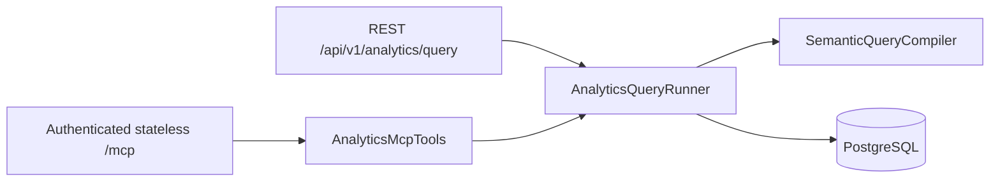

# Task 25: AI-native capability plane and authenticated MCP analytics slice

> **AI-NATIVE MILESTONE 1 (2026-08-11)** — establish the reusable execution pattern
> with one real read-only capability before adding an in-app agent or mutation tools.
> The slice exposes the existing semantic analytics query through REST and MCP without
> endpoint loopback or direct database access from the MCP adapter.

- **Phase**: AI-native Foundations
- **Lead / Owner**: Backend Platform + Security + Frontend Agent Platform
- **Complexity**: High
- **Prerequisites**: Tasks 12, 16, 17, 20, and 24
- **Target Files**: `docs/architecture/decision-log.md`, `docs/tasks/README.md`,
  `src/Backend/src/Tradebook.Api/AgentTools`, `src/Backend/src/Tradebook.Api/Features/Analytics`,
  `src/Backend/src/Tradebook.Api/Security`, `tests/Tradebook.ArchitectureTests`, and
  `tests/Tradebook.IntegrationTests`

---

## 1. Scope

### 1.1 In scope

1. Create a capability catalog for the analytics query, including its REST route, MCP tool
   name, and read-only classification.
2. Extract analytics execution into one shared runner used directly by the REST endpoint and
   MCP adapter.
3. Add `/mcp` with the official C# MCP SDK 2.1 and stateless Streamable HTTP transport.
4. Apply the existing `ReadPolicy` to `/mcp` and require a GUID Entra JWT `oid` after validating `tid` for actor identity.
5. Add architecture and integration coverage for transport, authorization, contract parity,
   tool metadata, and the no-loopback/no-direct-data-access boundaries.

### 1.2 Out of scope

- In-app model orchestration, AG-UI, chat UI, and autonomous task scheduling.
- Mutation tools, approval records, and durable agent runs.
- Dashboard generation through `json-render`, OpenUI, or model-authored markup.
- OAuth protected-resource metadata and dynamic client discovery. These are required before
  `/mcp` is enabled in production; milestone 1 uses the application's existing bearer token.

## 2. Architecture



The transport adapters contain no repository, SQL, `HttpClient`, or endpoint dependencies.
The MCP adapter invokes the runner in process. `AiCapabilityCatalog` is the coverage anchor:
its REST route must exist in TypeSpec and its MCP name must match discovery output.

Security remains transport-first. ASP.NET authenticates and authorizes the MCP request before
the SDK dispatches a tool call. Production and testing authentication both accept only UUID
`oid` after `tid` validation; `sub`, email, names, request bodies, and route values are not actor fallbacks.

## 3. Implementation steps

1. Pin `ModelContextProtocol.AspNetCore` 2.1.0 through central package management.
2. Register stateless MCP HTTP transport and map `/mcp` under `ReadPolicy`.
3. Add the analytics capability catalog and read-only MCP tool metadata.
4. Extract the existing allowlisted, parameterized analytics execution into
   `AnalyticsQueryRunner`; call it from both adapters.
5. Normalize decimal output in the runner so REST and MCP retain the TypeSpec wire contract.
6. Align production authentication, test authentication, backend actor extraction, and the
   frontend login session on the validated Entra `oid` GUID.
7. Add architecture, unit, and PostgreSQL-backed MCP integration tests.

## 4. Verification

```powershell
dotnet build src/Backend/Tradebook.sln -c Debug
dotnet test tests/Tradebook.UnitTests/Tradebook.UnitTests.csproj
dotnet test tests/Tradebook.ArchitectureTests/Tradebook.ArchitectureTests.csproj
dotnet run --project tests/Tradebook.IntegrationTests/Tradebook.IntegrationTests.csproj -- --filter-class Tradebook.IntegrationTests.McpAnalyticsIntegrationTests
dotnet run --project tests/Tradebook.IntegrationTests/Tradebook.IntegrationTests.csproj -- --filter-method Tradebook.IntegrationTests.JwtObjectIdAuthenticationIntegrationTests.McpRejectsTokensWithoutAValidUuidObjectId
bin/verify.sh
```

## 5. Acceptance criteria

| ID | Criterion | Evidence |
|----|-----------|----------|
| AINATIVE-01 | MCP has no endpoint loopback or direct data-access dependency | `AiNativeCapabilityTests.McpAdaptersHaveNoDirectDatabaseOrEndpointTransportDependencies` |
| AINATIVE-02 | REST and MCP use the same analytics execution path | `AiNativeCapabilityTests.RestAndMcpAdaptersUseTheSameAnalyticsRunner` plus endpoint mutation tests |
| AINATIVE-03 | `/mcp` is authenticated stateless Streamable HTTP and supports real discovery/invocation | `McpAnalyticsIntegrationTests` |
| AINATIVE-04 | Validated Entra `tid` + GUID `oid` is the sole actor identity for API and MCP | `ActorIdTests`, `JwtObjectIdAuthenticationIntegrationTests`, and MCP auth tests |
| AINATIVE-05 | The official MCP ASP.NET SDK is centrally pinned to 2.1.0 | `AiNativeCapabilityTests.CapabilityCatalogRoutesExistInTypeSpecAndMcpSdkIsPinned` and `ToolingConfigurationTests` |
| AINATIVE-06 | Every cataloged capability has a TypeSpec REST route | `AiNativeCapabilityTests.CapabilityCatalogRoutesExistInTypeSpecAndMcpSdkIsPinned` |
| AINATIVE-07 | Milestone 1 exposes no mutation-capable or open-world MCP tool | capability catalog assertion plus MCP discovery metadata assertions |
| AINATIVE-08 | No OpenUI or raw model-UI runtime dependency is introduced | `AiNativeCapabilityTests.FirstSliceHasNoModelUiRuntimeDependency` |

## 6. Integrity guardrails

1. Do not call Tradebook's own HTTP endpoints from an MCP or in-app adapter.
2. Do not inject repositories, Dapper, Npgsql, or SQL into an MCP adapter.
3. Do not accept actor identity outside the validated Entra JWT `oid` after `tid` validation.
4. Do not expose a mutation tool until risk classification, explicit approval, and audit are
   implemented and tested.
5. Do not render raw model-authored HTML, Markdown, or arbitrary component code.
6. Do not edit generated API artifacts; change TypeSpec and regenerate them.
